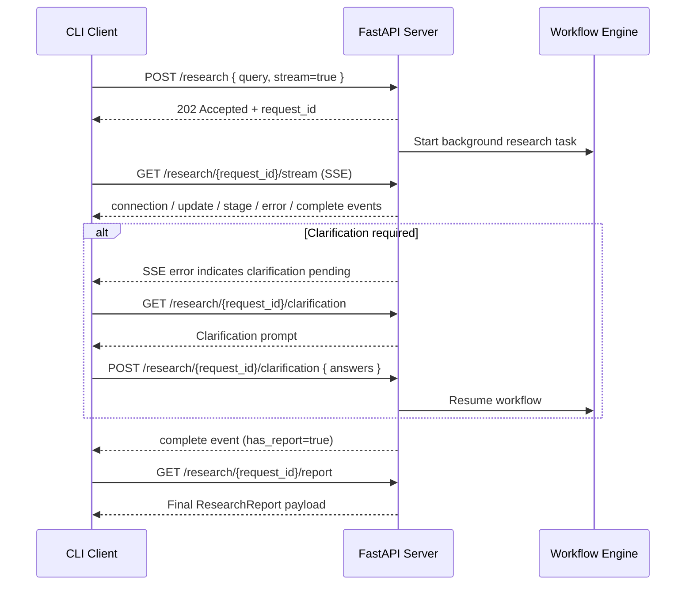

# API Overview

This document summarizes the FastAPI surface exposed by the Deep Research service and explains how client applications (such as `src/cli.py` in HTTP mode) interact with it.

## Base URL and Authentication
- Default server address: `http://localhost:8000`
- All endpoints are namespace-free; append paths directly to the base URL
- API keys are loaded by the server from its environment—clients should **not** send secrets over the network

## Endpoint Summary
| Method | Path | Purpose | Notes |
| --- | --- | --- | --- |
| GET | `/` | Service health probe | Returns name, version, and status |
| POST | `/research` | Start a new research workflow | Streams optionally enabled with `stream=true` |
| GET | `/research/{request_id}` | Poll current workflow status | Includes stage, error, and optional report snapshot |
| GET | `/research/{request_id}/stream` | Server-Sent Events stream | Delivers live updates, stage completions, and completion notice |
| GET | `/research/{request_id}/report` | Fetch the final synthesized report | Returns `400` until the report is ready |
| DELETE | `/research/{request_id}` | Cancel an in-progress workflow | Marks session as failed due to cancellation |
| GET | `/research/{request_id}/clarification` | Retrieve pending clarification prompts | `404` when no clarification is pending |
| POST | `/research/{request_id}/clarification` | Submit clarification answers and resume | Resumes workflow asynchronously |

## Endpoint Details
### GET `/`
Returns a lightweight payload:
```json
{
  "name": "Deep Research API",
  "version": "1.0.0",
  "status": "running"
}
```
Use for readiness/liveness checks.

### POST `/research`
Initiates a workflow.
- **Request body** (`application/json`):
  ```json
  {
    "query": "What are the latest advances in quantum sensing?",
    "stream": true,
    "max_search_results": 5,
    "model": null
  }
  ```
  The `api_keys` field exists for legacy compatibility but is ignored—the server uses its own environment configuration.
- **Response** (`202 Accepted`):
  ```json
  {
    "request_id": "user123:9ef1...",
    "status": "accepted",
    "message": "Research accepted. Streaming updates enabled.",
    "stream_url": "/research/user123:9ef1.../stream",
    "report_url": "/research/user123:9ef1.../report"
  }
  ```
  A background task immediately begins processing the workflow and emitting SSE events.

### GET `/research/{request_id}`
Returns consolidated status for polling clients:
```json
{
  "request_id": "user123:9ef1...",
  "status": "processing",
  "stage": "research_execution",
  "error": null,
  "report": null
}
```
When the workflow ends, `status` becomes `completed`, `stage` transitions to `completed`/`failed`, and `report` is populated when available.

### GET `/research/{request_id}/stream`
Opens a Server-Sent Events channel. Payload types:
- `connection` – initial handshake
- `ping` – heartbeat keep-alive
- `update` – streaming text updates (`stage`, `content`, `is_partial`)
- `stage` – stage completion summaries
- `error` – unrecoverable errors, including clarification requests
- `complete` – overall completion (success flag, duration, report availability)

The stream closes once completion is emitted or the client disconnects.

### GET `/research/{request_id}/report`
Returns the final `ResearchReport` model once synthesis is complete. Expect `400` until `complete` has been emitted via SSE or the status endpoint indicates completion.

### DELETE `/research/{request_id}`
Cancels an active workflow. The server records an error state (`"Cancelled by user"`). If no session exists, a `404` response is returned.

### GET `/research/{request_id}/clarification`
Fetches pending clarification questions when the workflow requires user input. Successful responses include:
```json
{
  "request_id": "user123:9ef1...",
  "state": "awaiting_clarification",
  "awaiting_response": true,
  "clarification_request": { ... },
  "original_query": "Initial user prompt"
}
```
`404` indicates that no clarification is outstanding.

### POST `/research/{request_id}/clarification`
Submits answers and resumes the workflow asynchronously. Payload shape matches the `ClarificationResponse` model, e.g.:
```json
{
  "answers": [
    {"question_id": "q1", "answer": "Focus on medical imaging", "skipped": false}
  ]
}
```
Returns a confirmation payload:
```json
{
  "request_id": "user123:9ef1...",
  "status": "resumed",
  "message": "Clarification received, research resumed",
  "current_stage": "research_execution"
}
```
If the clarification has already been processed, the endpoint returns `409 Conflict`.

## SSE Event Payload Reference
| Event | Data `type` | Description |
| --- | --- | --- |
| `connection` | `connected` | Initial acknowledgement that the stream is active |
| `update` | `update` | Incremental narrative text for the current stage |
| `stage` | `stage_completed` | Stage transition summaries with `success`, `result`, or `error` details |
| `error` | `error` / `stream_error` | Fatal errors or stream errors; `recoverable` indicates if retry is possible |
| `complete` | `completed` | Research workflow finished; includes `success`, `duration`, and `has_report` |
| `ping` | `heartbeat` / `ping` | Keep-alive signals during idle periods |

## Timing Diagram: CLI HTTP Mode Interaction


Use the SSE stream to drive real-time progress updates; fall back to the status endpoint if SSE is unavailable.
