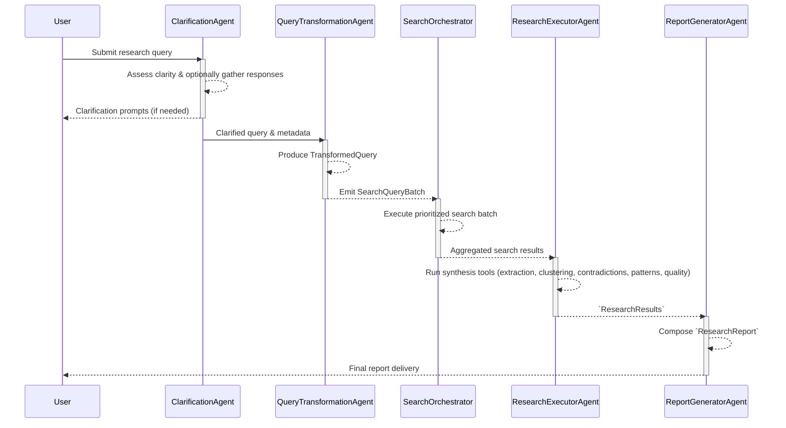

# Open Source ChatGPT Deep Research: Build Your Own Research Agent

If you've tried using ChatGPT's or Claude's research, you've probably noticed something: they're convenient to do a deep dive into a specific topic. But you can't feed them your proprietary data if you have privacy concerns, you have limited control over how they structure their findings, and you definitely can't run them locally with your own fine-tuned models.

This is where building your own AI agent-based research workflow becomes game-changing.

## The Problem with Generalized AI Assistants Doing Your Research

If you use ChatGPT or its equivalent, you would have felt that moment when ChatGPT confidently explains something you know is wrong about your domain. Or when Claude can't access your proprietary data. Or when you realize your sensitive queries are training someone else's model.

When you're conducting domain-specific research that matters, whether for business intelligence, academic work, or technical analysis, you need:

- **Access to your private data sources** (internal APIs, proprietary databases, confidential documents)
- **Control over output formatting** to match your audience's expectations
- **Privacy guarantees** that your sensitive queries aren't logged by third parties
- **Customizable reasoning patterns** that align with your domain expertise

Using generalized AI assistants like ChatGPT falls short on all these fronts.

### Who This Is For / Build vs Buy

- You need to research against private data sources and keep queries in your infrastructure.
- You want control over prompts, workflows, eport formats, and LLM models.
- You prefer typed models and predictable pipelines over opaque agent hierarchies.
- Choose buy/hosted if you only need ad‑hoc Q&A, can’t maintain infra, or don’t need customization.

## Introducing Open Deep Research with Pydantic AI

My learning journey towards solving these limitations led to building **Open Deep Research with Pydantic AI**; an open-source framework for creating production-ready research agents that you fully own and control.

This isn't another "hello world" chatbot example. It's a comprehensive system designed around real-world requirements: reliability, scalability, static type validation and observability.

### Credit Where It's Due

Before diving into the technical details, I want to acknowledge the pioneering work of the LangChain team on their [Open Deep Research](https://github.com/langchain-ai/open_deep_research) project. Their implementation with LangGraph demonstrated that sophisticated multi-agent research workflows could be both practical and powerful.

This Pydantic AI implementation takes inspiration from their architectural insights while exploring a different path: event-driven coordination instead of supervisor patterns, linear pipelines over cyclical graphs, and Pydantic's type system for safety. It's less about competition and more about offering developers alternative approaches that might better fit specific use cases or preferences.

### Get Your Research Agent Running (5 Minutes to First Result)

Let's cut to the chase. Here's how to get your own research agent running:

```bash
# Clone and enter the project
git clone https://github.com/lionkeng/open_deep_research_pydantic_ai.git
cd open_deep_research_pydantic_ai

# Install uv if you haven't (faster than pip, better than poetry)
curl -LsSf https://astral.sh/uv/install.sh | sh

# Install dependencies
uv sync

# Set your API key (or configure local models)
export OPENAI_API_KEY="your-key-here"
export TAVILY_API_KEY="your-tavily-key" # ootb, we use tavily
export LOGFIRE_TOKEN="your-logfire-token" # for observability

# Run your first research query
uv run deep-research research "What are the latest breakthroughs in quantum error correction?"
```

**Watch what happens:** The CLI springs to life with Rich formatting, showing each agent's decision-making in real-time. You'll see clarification analysis, query transformation, parallel searches firing off, and synthesis happening before your eyes.

That feeling when it just... works? That's not magic. It's architecture. Let me show you how four specialized agents just collaborated to deliver exactly what you asked for.

Prefer to tweak flags or run via HTTP? See docs/API_REFERENCE.md for CLI/HTTP usage and options, and docs/system_architecture.md for how events stream to the UI.

### Built for Production from Day One

I know what you're thinking—"another toy that breaks in production." Not this time.

The framework includes:

**Event-Driven Architecture**

- Async event bus with immutable events and lock‑free deadlock prevention
- Thread-safe coordination between agents
- Clean separation between research stages
- No more prayer-based debugging—every decision is logged, every event traceable

**Type Safety Throughout**

- Built with Pydantic AI for type safety
- Pydantic models validate all data structures
- Strict typing catches errors at development time, not runtime

**Resilience Patterns**

- Circuit breaker patterns with intelligent fallbacks
- Comprehensive error handling and automatic recovery
- Deterministic query execution with caching and retry logic
  Because your research shouldn't fail at 99% complete.

## The Four-Stage Research Workflow

The system follows a linear pipeline that mirrors how human researchers actually work. Here is a diagram depicting the message flow of the four-stage pipeline with explicit inputs/outputs, agent boundaries and streaming update points.



### 1. Clarification Agent

The agent identifies ambiguous aspects of your research question and asks targeted follow-ups. No more generic responses to vague queries.

### 2. Query Transformation Agent

Your research intent gets broken down into specific, executable search queries. The system understands context and generates queries that actually find relevant information.

### 3. Research Execution Agent

A search orchestrator manages parallel information gathering from multiple sources. This is where you can plug in your private APIs, internal databases, or specialized data sources.

### 4. Report Generation Agent

The final synthesis respects your specified format, audience, and depth requirements. Want executive summaries? Technical deep-dives? Academic papers? You can customize the report generation agent to produce different formats for your specific needs.

## Why This Architecture Works

**Linear Pipeline vs Hierarchical Chaos**
Instead of complex agent hierarchies that are hard to debug, the system uses a clean linear pipeline. Each stage has clear inputs, outputs, and responsibilities. Remember debugging that 10-service microservices mess at 3 AM? This isn't that. Every decision is traceable. Observability is built-in and can be extended if you want more debugging data.

**Shared Dependencies Container**
All agents receive the same `ResearchDependencies` container instance. This centralizes shared resources like API keys, HTTP clients, and accumulated state. This pattern significantly reduces configuration complexity compared to typical multi-agent systems, though it doesn't eliminate all configuration challenges. Agents in the workflow maintain individual configurations for prompts, retry policies, and circuit breaker thresholds.

**Memory-Safe Design**
[Automatic cleanup mechanisms](https://github.com/lionkeng/open_deep_research_pydantic_ai/blob/main/docs/caching_and_memory_management.md) prevent memory leaks during long-running research sessions. Run it for days. Watch it not leak. Feel that? That's peace of mind in production.

## The Ownership Advantage

This is where it gets addictive—you're not just using agents, you're crafting them.

### Tinkering with Primary Sources

You can integrate any data source you have access to. Internal APIs, proprietary databases, specialized search engines—if you can code against it, your research agent can use it.

### Custom Report Formatting

Different audiences need different presentations. Your sales team wants executive summaries; your engineering team needs technical specifications. You can customize the output format for each use case. That moment when your CEO asks for "something different" and you deliver in 10 minutes, not 10 hours? That's ownership.

### Local LLM and Fine-tuned Model Support

The framework is built on Pydantic AI which is model-agnostic. It supports local models through Ollama integration. Add your fine-tuned domain models, privacy-focused local deployments, or cost-optimized open-source alternatives—you're not locked into any vendor.

### True Privacy

If you run the research through your local LLMs or your own LLM-hosting private cloud, your research queries and findings never leave your infrastructure. Essential for sensitive business intelligence or confidential research projects. Your competitors' queries aren't training someone else's model. Your proprietary analysis stays proprietary.

## Technical Implementation Highlights

**Multiple Interfaces**

- CLI with real-time streaming for development work
- FastAPI with Server-Sent Events for web integration
- Both support concurrent research sessions with user isolation

**Observability**

- Comprehensive Logfire instrumentation throughout the system
- Structured logging for debugging and monitoring
- Performance metrics and error tracking built-in

**Production Monitoring**

- Circuit breaker status monitoring
- Resource usage tracking
- Comprehensive observability through Logfire

## Contribution

This isn't a one-way street. The framework is open source! Feel free to [open an issue](https://github.com/lionkeng/open_deep_research_pydantic_ai/issues) or a PR.

## Looking Forward

The code is there. The [documentation](https://github.com/lionkeng/open_deep_research_pydantic_ai/tree/main/docs) is real. Your first research workflow is one `git clone` away.

---

_Open Deep Research with Pydantic AI is MIT licensed and actively maintained. The framework gives you the foundation—and the addiction—to build research workflows that work the way you think, not the way some vendor decided you should think._

_[GitHub](https://github.com/lionkeng/open_deep_research_pydantic_ai) | [Star it, fork it, break it, fix it—make it yours](https://github.com/lionkeng/open_deep_research_pydantic_ai)_
