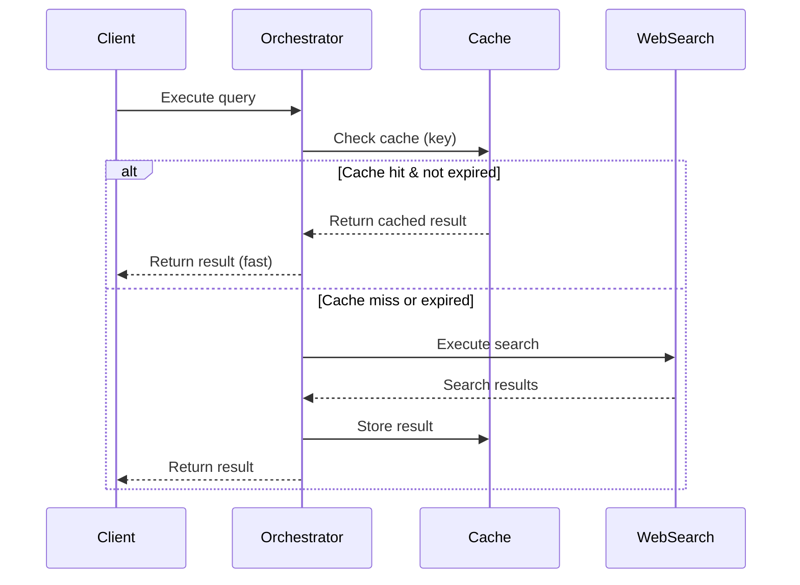

# Caching and Memory Management Design

## Overview

This document describes the caching and memory management strategies implemented in the Open Deep Research with Pydantic AI system. These mechanisms ensure the application remains performant and stable during long-running research sessions while preventing memory leaks and resource exhaustion.

## Architecture Components

### 1. Search Result Caching

The `SearchOrchestrator` (`src/services/search_orchestrator.py`) implements a sophisticated caching layer for web search results to optimize performance and reduce external API calls.

#### Cache Storage Structure

```python
# In-memory cache structure
self._cache: dict[str, tuple[SearchResult, float]] = {}
self._cache_order: list[str] = []  # For LRU tracking
```

#### What is Cached

Each cache entry contains:

1. **Key**: SHA256 hash generated from:
   - Query text
   - Query context metadata
   - Query priority level

2. **Value**: Tuple containing:
   - `SearchResult` object with:
     - Original query text
     - List of search results (title, URL, snippet, relevance score)
     - Metadata (source provider, total results count)
     - Execution timestamp
   - Unix timestamp of cache insertion

#### Example Cache Entry

```python
# Cache key generation
cache_key = hashlib.sha256(json.dumps({
    "text": "quantum computing applications 2024",
    "context": {"domain": "research"},
    "priority": 1  # High priority
}, sort_keys=True).encode()).hexdigest()

# Cache value
cache_value = (
    SearchResult(
        query="quantum computing applications 2024",
        results=[
            {
                "title": "Quantum Computing Breakthroughs",
                "url": "https://example.com/quantum",
                "snippet": "Recent advances in quantum...",
                "score": 0.95,
                "metadata": {"source": "academic"}
            }
        ],
        metadata={
            "source": "Tavily",
            "total_results": 127
        },
        timestamp=datetime(2024, 1, 15, 10, 30, 45)
    ),
    1705316445.123  # Unix timestamp
)
```

### 2. Cache Configuration

```python
class CacheConfig(BaseModel):
    enabled: bool = Field(default=True)
    ttl_seconds: int = Field(default=3600)  # 1 hour TTL
    max_size: int = Field(default=1000)     # Maximum entries
    cache_dir: Path | None = Field(default=None)  # For future persistence
```

### 3. Cache Lifecycle Management

#### Cache Hit Flow



#### LRU Eviction Strategy

When cache reaches `max_size`:
1. Identify oldest entry from `_cache_order` list
2. Remove entry from both `_cache` dict and `_cache_order` list
3. Add new entry to end of `_cache_order` (most recent)

#### TTL-Based Expiration

- Each cache check validates timestamp
- Expired entries (older than `ttl_seconds`) are removed immediately
- Prevents stale data from being served

### 4. Memory Safety Mechanisms

#### Event Bus Memory Management (`src/core/events.py`)

The event bus implements comprehensive memory protection:

##### Automatic Cleanup Triggers

```python
self._last_cleanup: float = time.time()
self._cleanup_interval: float = 300.0  # 5 minutes
self._max_total_events: int = 10000    # Event history limit
```

##### Cleanup Operations

1. **Periodic Cleanup** (every 5 minutes):
   - Triggered on each event emission via `_maybe_cleanup()`
   - Runs asynchronously to avoid blocking

2. **Event History Pruning**:
   ```python
   # Two levels of limits:
   self._max_history_per_request: int = 1000  # Per-request limit
   self._max_total_events: int = 10000        # Global limit

   if total_events > self._max_total_events:
       target_events = self._max_total_events // 2  # Reduce to 50%
       # Remove oldest events first (by timestamp)
   ```

3. **Inactive User Cleanup**:
   - Removes users with no activity in last hour
   - Cleans up associated event histories and counters

4. **Task Management**:
   ```python
   # Self-cleaning task tracking
   self._background_tasks.add(task)
   task.add_done_callback(lambda t: asyncio.create_task(self._remove_task(t)))
   ```

#### Memory Leak Prevention Strategies

1. **Bounded Data Structures**:
   - Event history: Maximum 10,000 total events, 1,000 per request
   - Cache: Maximum 1,000 entries
   - Automatic pruning when limits exceeded

2. **Resource Cleanup**:
   - Background tasks self-remove on completion
   - Expired cache entries removed on access
   - Empty event histories deleted automatically

3. **Isolation and Scoping**:
   - Events scoped by user/session
   - Prevents cross-contamination
   - Enables targeted cleanup

## Why This Implementation

### Performance Benefits

1. **Reduced API Calls**: Cache eliminates redundant searches
2. **Lower Latency**: Cached results served instantly
3. **Cost Savings**: Fewer calls to paid search APIs
4. **Scalability**: Supports concurrent research sessions

### Memory Safety Benefits

1. **Predictable Memory Usage**: Bounded structures prevent unbounded growth
2. **Long-Running Stability**: Automatic cleanup enables 24/7 operation
3. **No Manual Intervention**: Self-managing memory lifecycle
4. **Graceful Degradation**: System continues operating even at limits

### Production Readiness

The implementation demonstrates production-grade patterns:

1. **Thread-Safe Operations**: Async locks protect shared state
2. **Configurable Limits**: Tunable for different deployment scenarios
3. **Monitoring Hooks**: Statistics available for observability
4. **Error Recovery**: Cleanup failures don't crash the system

## Configuration Guidelines

### Development Environment

```python
# Aggressive caching for faster iteration
cache_config = CacheConfig(
    enabled=True,
    ttl_seconds=7200,  # 2 hours
    max_size=2000      # More cache space
)

# Frequent cleanup for testing
event_bus._cleanup_interval = 60.0  # 1 minute
```

### Production Environment

```python
# Balanced for reliability
cache_config = CacheConfig(
    enabled=True,
    ttl_seconds=3600,  # 1 hour
    max_size=1000      # Conservative memory usage
)

# Standard cleanup interval
event_bus._cleanup_interval = 300.0  # 5 minutes
```

### High-Volume Deployment

```python
# Optimized for scale
cache_config = CacheConfig(
    enabled=True,
    ttl_seconds=1800,  # 30 minutes (fresher data)
    max_size=5000      # Larger cache for more queries
)

# More aggressive cleanup
event_bus._cleanup_interval = 120.0  # 2 minutes
event_bus._max_total_events = 50000  # Higher limit
```

## Monitoring and Observability

### Key Metrics to Track

1. **Cache Performance**:
   - Hit rate: `cached_queries / total_queries`
   - Eviction rate: Track LRU evictions
   - Average TTL utilization

2. **Memory Usage**:
   - Event history size: `sum(len(events) for events in _event_history.values())`
   - Cache size: `len(self._cache)`
   - Background tasks: `len(self._background_tasks)`

3. **Cleanup Effectiveness**:
   - Events removed per cleanup cycle
   - Inactive users cleaned up
   - Memory reclaimed

### Available Statistics

```python
# Get event bus statistics
stats = await research_event_bus.get_stats()
# Returns: handler_count, event_history_size, background_tasks, etc.

# Get cache statistics from orchestrator
stats = orchestrator.get_execution_stats()
# Returns: total_executions, success_rate, cache_hit_rate, average_execution_time_ms

# Or get detailed ExecutionReport from execute() method
results, report = await orchestrator.execute(plan)
# report contains: total_queries, cached_queries, execution_rate, traces, etc.
```

## Future Enhancements

### Planned Improvements

1. **Persistent Cache**:
   - Disk-based cache for cross-session persistence
   - SQLite or Redis backend option
   - Configurable via `cache_dir` parameter

2. **Distributed Caching**:
   - Redis/Memcached support for multi-instance deployments
   - Shared cache across research workers

3. **Adaptive Cleanup**:
   - Dynamic cleanup intervals based on memory pressure
   - Predictive eviction based on usage patterns

4. **Advanced Eviction Policies**:
   - LFU (Least Frequently Used) option
   - Weighted eviction based on query cost
   - Priority-aware caching

### Experimental Features

1. **Query Deduplication**:
   - Detect semantically similar queries
   - Reuse results for near-duplicates

2. **Preemptive Caching**:
   - Predict likely follow-up queries
   - Background pre-fetch for common patterns

3. **Cache Warming**:
   - Load common queries on startup
   - Transfer cache between deployments

## Implementation Code References

### Key Files

- **Cache Implementation**: `src/services/search_orchestrator.py` (cache operations in lines 156-217, 280-297)
- **Event Bus Cleanup**: `src/core/events.py` (cleanup logic in lines 398-496)
- **Memory Management**: `src/core/events.py` (task management in lines 381-396)
- **Cache Configuration**: `src/services/search_orchestrator.py` (CacheConfig class at lines 118-124)

### Critical Functions

```python
# Cache operations
_generate_cache_key()    # Hash-based key generation
_get_from_cache()        # TTL validation and LRU update
_save_to_cache()         # Size enforcement and storage

# Memory management
_maybe_cleanup()         # Periodic cleanup trigger
_perform_cleanup()       # Actual cleanup operations
_remove_task()          # Task lifecycle management
```

## Conclusion

The caching and memory management implementation provides a robust foundation for production deployment. Through bounded data structures, automatic cleanup, and configurable limits, the system maintains predictable resource usage while delivering significant performance benefits. The design balances performance, reliability, and resource efficiency, making it suitable for both development iterations and production workloads.
