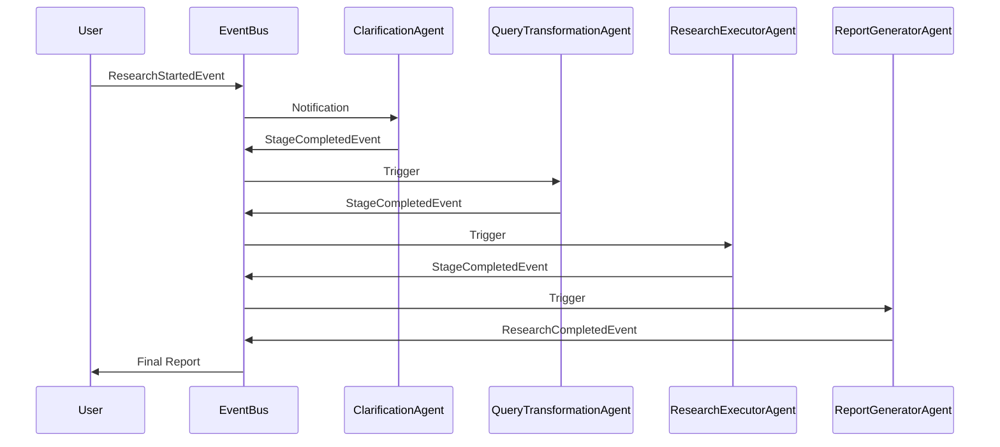

# Event Bus and Inter-Agent Communication Architecture

## Overview

This document describes the event-driven communication architecture used in the Deep Research system and compares it with Pydantic AI's native inter-agent communication patterns. The system implements a sophisticated event bus that extends beyond Pydantic AI's built-in capabilities to provide scalable, loosely-coupled coordination between research agents.

## Event Bus Architecture

### What is the Event Bus?

The **ResearchEventBus** (`src/core/events.py:240-632`) is a central asynchronous event dispatcher that coordinates communication between different parts of the multi-agent research workflow. It implements a **publish-subscribe pattern** for loose coupling between components.

### Core Purpose

The event bus serves three main purposes:

1. **Workflow Coordination** - Enables different agents and stages to communicate without direct dependencies
2. **Progress Streaming** - Provides real-time updates to CLI and HTTP interfaces about research progress
3. **Observability** - Tracks the lifecycle of research operations for monitoring and debugging

### Event Types

The system defines several immutable event types (`src/core/events.py:26-233`):

- `ResearchStartedEvent` - Emitted when research begins
- `StageStartedEvent/StageCompletedEvent` - Stage lifecycle events
- `StreamingUpdateEvent` - Real-time progress updates
- `ClarificationRequestedEvent` - Interactive clarification needed
- `ResearchCompletedEvent` - Final completion event
- `ErrorEvent` - Error notifications
- Additional clarification-specific events for session management

### Key Features

1. **Memory-safe Design** - Implements cleanup mechanisms to prevent memory leaks (`src/core/events.py:398-496`)
2. **User Isolation** - Events are scoped by user/session for multi-tenant safety (`src/core/events.py:333-353`)
3. **Async Processing** - Non-blocking event dispatch with concurrent handler execution
4. **Automatic Cleanup** - Periodic removal of old events and inactive users
5. **Thread-safe** - Uses asyncio locks for concurrent access protection

### Implementation Details

#### Publishers
Components emit events through the global `research_event_bus` instance:
- **ResearchWorkflow** (`src/core/workflow.py:612-641`) emits completion events
- **Agents** emit stage and streaming updates via helper functions
- **Clarification flows** emit clarification-specific events

#### Subscribers
Interfaces subscribe to receive events:
- **CLI** (`src/cli/runner.py:78-82`) subscribes to display progress in Rich panels
- **HTTP API** (`src/api/main.py`) uses SSE handler for server-sent events
- **Session managers** track state changes

#### Example Usage
```python
# Workflow emits event
await research_event_bus.emit(
    ResearchCompletedEvent(
        _request_id=request_id,
        report=report,
        success=True
    )
)

# CLI handler receives it
async def handle_research_completed(event):
    display_report(event.report)
```

## Pydantic AI Inter-Agent Communication

### Framework Native Capabilities

Pydantic AI provides inter-agent communication mechanisms, though not as a built-in messaging bus. The framework offers:

1. **Agent Delegation Pattern** - Primary method where one agent delegates work to another via tool calls
2. **Shared Dependencies** - Agents share state through dependency injection
3. **Message History Passing** - Agents share conversation context

### Communication Patterns in Pydantic AI

#### 1. Tool-Based Delegation (Most Common)
```python
@parent_agent.tool
async def delegate_to_child(ctx: RunContext[Deps], query: str):
    result = await child_agent.run(
        query,
        deps=ctx.deps,  # Pass shared dependencies
        usage=ctx.usage  # Track combined token usage
    )
    return result.output
```

#### 2. Shared State via Dependencies
```python
@dataclass
class SharedDeps:
    http_client: httpx.AsyncClient
    shared_state: dict  # Agents can read/write shared state

# Both agents use same deps instance
deps = SharedDeps(...)
await agent1.run(deps=deps)
await agent2.run(deps=deps)  # Can access state from agent1
```

#### 3. Sequential Message Passing
```python
result1 = await agent1.run("query")
# Pass agent1's conversation to agent2
result2 = await agent2.run(
    "follow-up",
    message_history=result1.new_messages()
)
```

### Pydantic AI Best Practices

1. **Use Tool Delegation for Hierarchical Workflows** - Parent agents orchestrate child agents through tool calls
2. **Share Dependencies, Not Agents** - Pass `ctx.deps` and `ctx.usage` to delegated agents
3. **Avoid Deep Nesting** - Keep agent hierarchies shallow for maintainability
4. **Use Typed Dependencies** - Define clear `deps_type` for type-safe communication

## Current Implementation Analysis

### Architecture Comparison

| Aspect | Pydantic AI Native | Our Event Bus Implementation |
|--------|-------------------|------------------------------|
| Communication Style | Direct delegation via tools | Event-driven publish-subscribe |
| State Sharing | Shared dependencies | ResearchState + EventBus |
| Orchestration | Parent-child hierarchies | Linear workflow pipeline |
| Coupling | Tighter (direct references) | Looser (event-based) |
| Scalability | Limited by call depth | Highly scalable |
| Observability | Via usage tracking | Comprehensive event history |

### Our Workflow Pattern

The Deep Research system uses a **linear pipeline** architecture:



### Key Differences from Pydantic AI Examples

1. **No Direct Agent-to-Agent Calls** - Agents communicate through the workflow orchestrator
2. **Shared Dependencies Container** - `ResearchDependencies` bundles all shared resources
3. **Event-Driven Progress** - Real-time updates without polling
4. **Stage-Based Execution** - Clear pipeline stages vs. dynamic delegation

## Advantages of Our Approach

### Benefits of Event Bus Architecture

1. **Loose Coupling** - Agents don't need to know about each other
2. **Dynamic Subscription** - Interfaces can subscribe/unsubscribe at runtime
3. **Broadcast Capability** - Multiple subscribers can react to the same event
4. **Audit Trail** - Event history provides complete execution trace
5. **Error Isolation** - Failed handlers don't affect other subscribers
6. **Testing** - Easy to mock events for unit testing

### Trade-offs

**Pros:**
- More scalable for complex workflows
- Better separation of concerns
- Easier to add new agents or interfaces
- Built-in progress monitoring

**Cons:**
- More complex than direct delegation
- Potential for event ordering issues
- Memory overhead for event history
- Requires careful cleanup management

## Recommendations

### Hybrid Approach Opportunities

1. **Use Tool Delegation for Tight Coupling** - When agents need direct, synchronous responses
2. **Keep Event Bus for System Coordination** - For progress updates and loose coupling
3. **Leverage Pydantic AI Toolsets** - Organize agent capabilities using the `Toolset` abstraction

### Future Enhancements

1. **Event Replay** - Add ability to replay events for debugging
2. **Event Persistence** - Store critical events for audit/recovery
3. **Metrics Integration** - Connect event bus to monitoring systems
4. **Circuit Breaker Integration** - Use events to trigger circuit breakers

### Best Practices for Development

1. **Define Clear Event Contracts** - Use Pydantic models for all events
2. **Document Event Flows** - Maintain sequence diagrams for complex flows
3. **Implement Event Versioning** - Plan for event schema evolution
4. **Monitor Event Bus Health** - Track metrics like queue depth and processing time
5. **Test Event Handlers Independently** - Each handler should be unit testable

## Conclusion

The Deep Research system's event bus extends Pydantic AI's capabilities to provide a sophisticated, scalable communication architecture. While Pydantic AI offers direct agent delegation patterns suitable for simple hierarchies, our event-driven approach better supports complex, multi-stage research workflows with multiple interfaces and observers.

The event bus pattern is particularly well-suited for:
- Systems requiring real-time progress updates
- Workflows with multiple parallel observers
- Applications needing audit trails
- Microservice-style agent architectures

This architecture represents a mature extension of Pydantic AI's framework, demonstrating how the library's flexibility allows for advanced patterns while maintaining type safety and clean abstractions.
