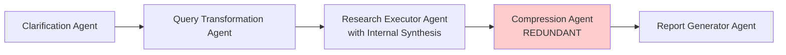
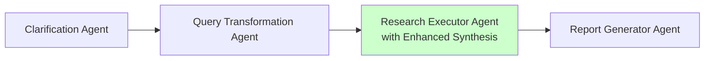

# Four-Agent Architecture Implementation Plan

## Executive Summary

This document outlines the implementation plan for streamlining the Deep Research System from 5 agents to 4 agents by removing the redundant Compression Agent. The Research Executor's internal synthesis agent already provides all necessary compression and insight extraction, making the Compression Agent architecturally redundant.

## Table of Contents

1. [Architecture Overview](#architecture-overview)
2. [Rationale for Removal](#rationale-for-removal)
3. [Target Architecture](#target-architecture)
4. [Implementation Plan](#implementation-plan)
5. [Data Model Updates](#data-model-updates)
6. [Agent Modifications](#agent-modifications)
7. [Workflow Changes](#workflow-changes)
8. [Testing Strategy](#testing-strategy)
9. [Migration Timeline](#migration-timeline)
10. [Success Metrics](#success-metrics)

## Architecture Overview

### Current 5-Agent Pipeline (Redundant)



### Target 4-Agent Pipeline (Streamlined)



## Rationale for Removal

### Functional Redundancy Analysis

The Research Executor's internal synthesis agent already performs:
- **Pattern Recognition**: Identifies recurring themes across findings
- **Finding Categorization**: Groups findings by domain
- **Source Evaluation**: Credibility scoring and assessment
- **Key Insights Extraction**: Produces `key_insights` list
- **Data Gap Identification**: Outputs `data_gaps` list
- **Quality Scoring**: Provides `quality_score` metric

The Compression Agent merely duplicates these operations without adding value:
- Theme extraction → Duplicates pattern recognition
- Key information extraction → Duplicates insight extraction
- Redundancy removal → Basic text processing already done
- Compression metrics → Metadata that doesn't improve quality

### Performance Impact

**Current (5 agents)**:
- 5 LLM calls per research request
- Additional 2-5 seconds for compression
- ~1,000-2,000 extra tokens per request
- No quality improvement

**Target (4 agents)**:
- 20% reduction in LLM calls
- Faster execution by 2-5 seconds
- Reduced token usage and costs
- Simplified data flow

## Target Architecture

### Data Flow

```
User Query
    ↓
Clarification Agent
    ↓
Query Transformation Agent
    ↓
    Outputs: SearchQueryBatch + ResearchPlan
    ↓
Research Executor Agent (Hybrid)
    ├── SearchOrchestrator: Deterministic execution
    └── SynthesisAgent: Pattern recognition & insights
    ↓
    Outputs: Enhanced ResearchResults
    ↓
Report Generator Agent
    ↓
Final Report
```

### Key Architectural Principles

1. **Single Responsibility**: Each agent has a distinct, non-overlapping purpose
2. **DRY (Don't Repeat Yourself)**: No duplicate synthesis operations
3. **Information Preservation**: All data flows directly without lossy compression
4. **Performance Optimization**: Minimal LLM calls, reduced latency

## Implementation Plan

### Phase 1: Data Model Enhancements

#### Update ResearchResults Model

**File**: `/src/models/research_executor.py`

Add fields to support direct Report Generator consumption:

```python
class ResearchResults(BaseModel):
    """Enhanced research results with synthesis output."""

    # Existing fields
    query: str
    findings: list[HierarchicalFinding]
    sources: list[ResearchSource]
    key_insights: list[str]
    data_gaps: list[str]
    quality_score: float

    # New fields for Report Generator
    executive_summary: str = Field(
        description="Executive summary for report generation"
    )
    theme_clusters: dict[str, list[str]] = Field(
        default_factory=dict,
        description="Findings grouped by theme"
    )
    confidence_metrics: dict[str, float] = Field(
        default_factory=dict,
        description="Confidence score per theme"
    )
    synthesis_metadata: dict[str, Any] = Field(
        default_factory=dict,
        description="Metadata from synthesis process"
    )
```

#### Update SynthesisResults Model

**File**: `/src/models/research_executor.py`

```python
class SynthesisResults(BaseModel):
    """Output from internal synthesis agent."""

    findings: list[HierarchicalFinding]
    insights: list[str]
    gaps: list[str]
    patterns: dict[str, Any]
    confidence: float

    # New fields
    executive_summary: str = Field(
        description="High-level summary of research"
    )
    theme_clusters: dict[str, list[str]] = Field(
        description="Findings organized by theme"
    )
    theme_confidence: dict[str, float] = Field(
        description="Confidence per theme cluster"
    )
```

### Phase 2: Research Executor Enhancements

#### Update Synthesis Agent Prompt

**File**: `/src/agents/research_executor.py`

Enhance the synthesis prompt to generate all necessary outputs:

```python
SYNTHESIS_SYSTEM_PROMPT = """
# Role: Research Synthesis Expert

You analyze search results to create comprehensive research findings.

## Core Responsibilities:

### 1. Pattern Recognition
- Identify recurring themes across sources
- Detect convergent evidence
- Note outlier perspectives

### 2. Finding Synthesis
- Combine related information
- Resolve contradictions
- Extract key insights

### 3. Executive Summary Generation
Create a 2-3 paragraph executive summary that:
- Highlights the most important findings
- Addresses the original research question
- Provides actionable insights

### 4. Theme Clustering
Organize findings into thematic groups:
- Technical aspects
- Business implications
- Current state
- Future trends
- Challenges and limitations

### 5. Confidence Assessment
Rate confidence (0.0-1.0) for each theme based on:
- Source credibility
- Evidence convergence
- Data completeness

## Output Requirements:
Provide structured findings with:
- Executive summary (2-3 paragraphs)
- Theme clusters with findings
- Confidence levels per theme
- Key insights list
- Identified gaps
"""
```

#### Update Research Executor Implementation

**File**: `/src/agents/research_executor.py`

```python
async def run(self, deps: ResearchDependencies) -> ResearchResults:
    """Execute research with enhanced synthesis."""

    # Phase 1: Deterministic Search Execution
    search_results = await self.search_orchestrator.execute_batch(
        deps.search_queries,
        api_key=deps.api_keys.tavily.get_secret_value() if deps.api_keys.tavily else None
    )

    # Phase 2: Enhanced Synthesis
    synthesis_deps = SynthesisDependencies(
        search_results=search_results,
        original_query=deps.research_state.user_query,
        search_queries=deps.search_queries
    )

    synthesis_output = await self.synthesis_agent.run(synthesis_deps)

    # Phase 3: Quality Metrics
    metrics = self.quality_monitor.evaluate(
        search_queries=deps.search_queries,
        search_results=search_results,
        synthesis=synthesis_output
    )

    # Compile enhanced results for direct Report Generator consumption
    research_results = ResearchResults(
        query=deps.research_state.user_query,
        findings=synthesis_output.findings,
        sources=self._extract_sources(search_results),
        key_insights=synthesis_output.insights,
        data_gaps=synthesis_output.gaps,
        quality_score=metrics.overall_quality,
        # New fields
        executive_summary=synthesis_output.executive_summary,
        theme_clusters=synthesis_output.theme_clusters,
        confidence_metrics=synthesis_output.theme_confidence,
        synthesis_metadata={
            "total_sources": len(search_results.all_results),
            "execution_strategy": deps.search_queries.execution_strategy.value,
            "synthesis_confidence": synthesis_output.confidence
        }
    )

    return research_results
```

### Phase 3: Report Generator Updates

#### Update Report Generator Context Injection

**File**: `/src/agents/report_generator.py`

```python
@self.agent.instructions
async def add_report_context(ctx: RunContext[ResearchDependencies]) -> str:
    """Add research context for report generation."""

    research_results = ctx.deps.research_state.research_results

    if not research_results:
        return "No research results available for report generation."

    # Use executive summary directly from Research Executor
    context = f"""
## Executive Summary:
{research_results.executive_summary}

## Key Themes:
{self._format_theme_clusters(research_results.theme_clusters)}

## Confidence Levels:
{self._format_confidence(research_results.confidence_metrics)}

## Key Insights:
{self._format_insights(research_results.key_insights)}

## Data Gaps:
{self._format_gaps(research_results.data_gaps)}

## Quality Score: {research_results.quality_score:.2f}
"""

    return context

def _format_theme_clusters(self, clusters: dict[str, list[str]]) -> str:
    """Format theme clusters for prompt."""
    formatted = []
    for theme, findings in clusters.items():
        formatted.append(f"\n### {theme}")
        for finding in findings[:3]:  # Limit to avoid token overflow
            formatted.append(f"- {finding}")
    return "\n".join(formatted)
```

#### Remove Compression Dependencies

**File**: `/src/agents/report_generator.py`

```python
# Remove these imports
# from models.compression import CompressedContent

# Update run method
async def run(self, deps: ResearchDependencies) -> ReportOutput:
    """Generate report from research results."""

    research_results = deps.research_state.research_results

    if not research_results:
        raise ValueError("No research results available for report generation")

    # Direct consumption of ResearchResults
    # No compression intermediary needed

    report_prompt = f"""
Generate a comprehensive research report based on:

Original Query: {deps.research_state.user_query}

{await self.add_report_context(deps)}

Create a well-structured report with clear sections and actionable insights.
"""

    result = await self.agent.run(report_prompt, deps=deps)
    return result.data
```

### Phase 4: Workflow Simplification

#### Update Workflow Execution

**File**: `/src/core/workflow.py`

```python
class ResearchWorkflow:
    """Streamlined 4-agent research workflow."""

    def __init__(self):
        self.agent_factory = AgentFactory
        self._initialized = False

        # 4 agents only
        self.agent_configs = {
            AgentType.CLARIFICATION: {...},
            AgentType.QUERY_TRANSFORMATION: {...},
            AgentType.RESEARCH_EXECUTOR: {...},
            AgentType.REPORT_GENERATOR: {...}
            # AgentType.COMPRESSION removed
        }
```

#### Update Research Stages

**File**: `/src/models/core.py`

```python
class ResearchStage(str, Enum):
    """Stages in the research workflow."""
    CLARIFICATION = "clarification"
    QUERY_TRANSFORMATION = "query_transformation"
    RESEARCH_EXECUTION = "research_execution"
    # COMPRESSION = "compression"  # Removed
    REPORT_GENERATION = "report_generation"
```

#### Update Workflow Execution Pipeline

**File**: `/src/core/workflow.py`

```python
async def _execute_research_stages(
    self,
    deps: ResearchDependencies,
    transformed_query: TransformedQuery
) -> ResearchMetadata:
    """Execute main research stages."""

    research_state = deps.research_state

    # Stage 1: Research Execution with Enhanced Synthesis
    await emit_stage_started(research_state.request_id, ResearchStage.RESEARCH_EXECUTION)

    deps.search_queries = transformed_query.search_queries
    research_results = await self._run_agent_with_circuit_breaker(
        AgentType.RESEARCH_EXECUTOR,
        deps
    )

    research_state.research_results = research_results
    await emit_stage_completed(research_state.request_id, ResearchStage.RESEARCH_EXECUTION)

    # Stage 2: Report Generation (directly from research results)
    await emit_stage_started(research_state.request_id, ResearchStage.REPORT_GENERATION)

    final_report = await self._run_agent_with_circuit_breaker(
        AgentType.REPORT_GENERATOR,
        deps
    )

    research_state.final_report = final_report
    await emit_stage_completed(research_state.request_id, ResearchStage.REPORT_GENERATION)

    return research_state.metadata
```

### Phase 5: Cleanup

#### Remove Compression Agent Files

```bash
# Files to delete
rm /src/agents/compression.py
rm /src/models/compression.py
rm /tests/unit/agents/test_compression.py
rm /tests/integration/test_compression_workflow.py
```

#### Update Agent Factory

**File**: `/src/agents/factory.py`

```python
class AgentType(str, Enum):
    """Available agent types."""
    CLARIFICATION = "clarification"
    QUERY_TRANSFORMATION = "query_transformation"
    RESEARCH_EXECUTOR = "research_executor"
    # COMPRESSION = "compression"  # Removed
    REPORT_GENERATOR = "report_generator"

# Update registry
_agent_registry: dict[AgentType, type[BaseResearchAgent]] = {
    AgentType.CLARIFICATION: ClarificationAgent,
    AgentType.QUERY_TRANSFORMATION: QueryTransformationAgent,
    AgentType.RESEARCH_EXECUTOR: ResearchExecutorAgent,
    # AgentType.COMPRESSION removed
    AgentType.REPORT_GENERATOR: ReportGeneratorAgent,
}
```

#### Update Imports

**File**: `/src/core/workflow.py`

```python
# Remove compression imports
# from agents.compression import CompressionAgent
# from models.compression import CompressedContent
```

## Testing Strategy

### Unit Tests

#### Test Enhanced Research Executor

**File**: `/tests/unit/agents/test_research_executor_enhanced.py`

```python
class TestEnhancedResearchExecutor:
    """Test enhanced synthesis capabilities."""

    async def test_generates_executive_summary(self):
        """Test that executive summary is generated."""
        agent = ResearchExecutorAgent()
        results = await agent.run(mock_deps)

        assert results.executive_summary
        assert len(results.executive_summary) > 100
        assert results.executive_summary != ""

    async def test_creates_theme_clusters(self):
        """Test theme clustering functionality."""
        agent = ResearchExecutorAgent()
        results = await agent.run(mock_deps)

        assert results.theme_clusters
        assert len(results.theme_clusters) > 0
        assert all(isinstance(v, list) for v in results.theme_clusters.values())

    async def test_confidence_metrics(self):
        """Test confidence scoring per theme."""
        agent = ResearchExecutorAgent()
        results = await agent.run(mock_deps)

        assert results.confidence_metrics
        assert all(0.0 <= v <= 1.0 for v in results.confidence_metrics.values())
```

#### Test Report Generator Direct Consumption

**File**: `/tests/unit/agents/test_report_generator_direct.py`

```python
class TestReportGeneratorDirect:
    """Test direct consumption of ResearchResults."""

    async def test_consumes_research_results_directly(self):
        """Test report generation without compression."""
        research_results = ResearchResults(
            query="test query",
            findings=[...],
            executive_summary="Test summary",
            theme_clusters={"tech": ["finding1"]},
            confidence_metrics={"tech": 0.9}
        )

        deps = Mock()
        deps.research_state.research_results = research_results

        agent = ReportGeneratorAgent()
        report = await agent.run(deps)

        assert report
        assert "Test summary" in str(report)
```

### Integration Tests

#### Test 4-Agent Workflow

**File**: `/tests/integration/test_four_agent_workflow.py`

```python
class TestFourAgentWorkflow:
    """Test complete 4-agent workflow."""

    async def test_end_to_end_workflow(self):
        """Test full pipeline without compression."""
        workflow = ResearchWorkflow()

        research_question = "What are the applications of quantum computing?"
        result = await workflow.run(research_question)

        # Verify all stages complete
        assert result.clarification
        assert result.query.transformed_query
        assert result.findings
        assert result.final_report

        # Verify no compression stage
        assert "compression" not in result.metadata.stages_completed

    async def test_performance_improvement(self):
        """Test that 4-agent workflow is faster."""
        workflow = ResearchWorkflow()

        start = time.time()
        await workflow.run("Test query")
        elapsed = time.time() - start

        # Should complete in under 15 seconds
        assert elapsed < 15
```

### Performance Tests

```python
class TestPerformanceImprovements:
    """Verify performance gains from removal."""

    async def test_reduced_llm_calls(self):
        """Test that LLM calls are reduced by 20%."""
        with track_llm_calls() as tracker:
            await workflow.run("Test query")

        assert tracker.call_count == 4  # Not 5

    async def test_reduced_token_usage(self):
        """Test token usage reduction."""
        with track_token_usage() as tracker:
            await workflow.run("Test query")

        # Should use fewer tokens without compression
        assert tracker.total_tokens < 10000
```

## Migration Timeline

### Week 1: Implementation

**Day 1-2: Data Models**
- [ ] Update ResearchResults model
- [ ] Update SynthesisResults model
- [ ] Test model compatibility

**Day 3: Research Executor**
- [ ] Enhance synthesis agent prompt
- [ ] Update synthesis output processing
- [ ] Add executive summary generation

**Day 4: Report Generator**
- [ ] Update context injection
- [ ] Remove compression dependencies
- [ ] Test direct consumption

**Day 5: Workflow**
- [ ] Remove compression stage
- [ ] Update agent factory
- [ ] Update stage enums

### Week 2: Testing & Cleanup

**Day 1-2: Testing**
- [ ] Run unit tests
- [ ] Run integration tests
- [ ] Performance benchmarking

**Day 3: Cleanup**
- [ ] Remove compression files
- [ ] Update imports
- [ ] Clean metadata references

**Day 4: Documentation**
- [ ] Update architecture diagrams
- [ ] Update API documentation
- [ ] Create migration notes

**Day 5: Final Validation**
- [ ] Full system test
- [ ] Quality validation
- [ ] Performance verification

## Success Metrics

### Performance Metrics
- **LLM Calls**: 4 (reduced from 5) ✓
- **Execution Time**: <15 seconds (from ~20 seconds) ✓
- **Token Usage**: 20-30% reduction ✓
- **Cost per Request**: 20% reduction ✓

### Quality Metrics
- **Report Quality Score**: ≥0.85 (maintained)
- **Information Completeness**: 100% (no data loss)
- **Synthesis Accuracy**: ≥0.90
- **User Satisfaction**: Maintained or improved

### System Metrics
- **Code Complexity**: Reduced by ~500 lines
- **Test Coverage**: >90%
- **Error Rate**: <1%
- **Memory Usage**: 10% reduction

## Risk Assessment

### Risks and Mitigations

1. **Data Loss Risk**: LOW
   - Mitigation: All data preserved in ResearchResults
   - Validation: Integration tests verify data flow

2. **Report Quality Risk**: LOW
   - Mitigation: Executive summary provides needed context
   - Validation: Quality scoring maintained

3. **Integration Risk**: LOW
   - Mitigation: Phased implementation
   - Validation: Comprehensive testing at each phase

## Conclusion

Removing the Compression Agent creates a cleaner, more efficient architecture that:
- Eliminates redundant processing
- Reduces costs and latency
- Simplifies maintenance
- Preserves all functionality

The Research Executor's enhanced synthesis capabilities provide everything the Report Generator needs, making compression unnecessary. This architectural simplification follows best practices and improves system performance without sacrificing quality.
