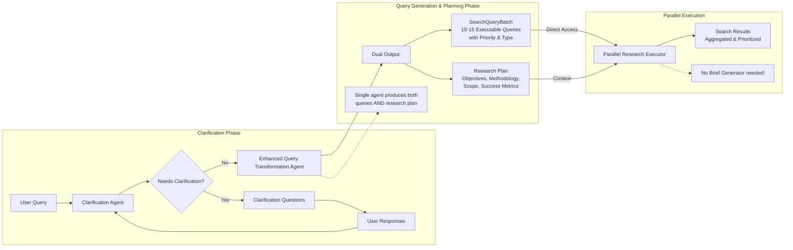
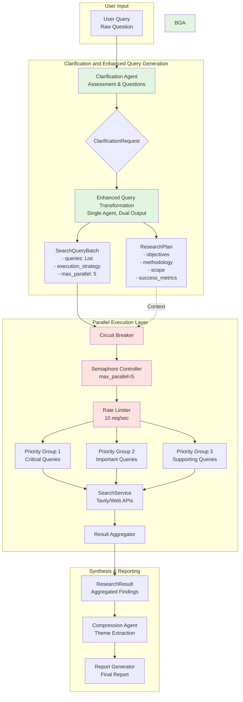
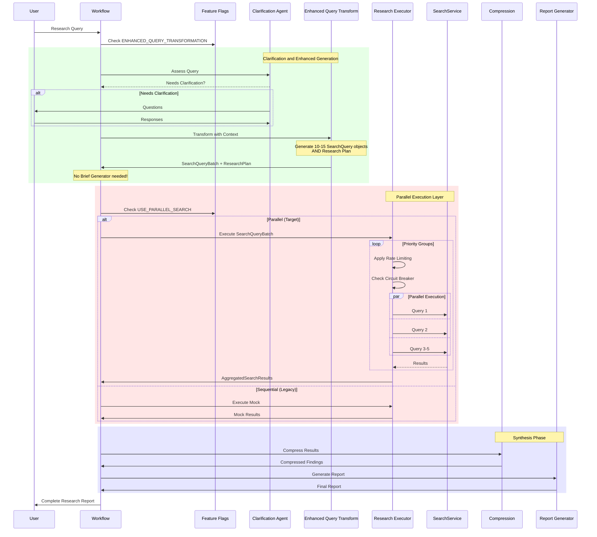

# Deep Research System Parallel Execution Implementation Plan

## Executive Summary
This document outlines the comprehensive refactoring of the Deep Research System to eliminate redundancy and simplify the architecture. We remove the Brief Generator agent entirely by enhancing the Query Transformation Agent to output both executable search queries AND the research plan, while enabling true parallel search execution. This reduces the system from 6 to 5 agents, eliminating an unnecessary LLM call and improving performance.

## 1. ARCHITECTURAL REFACTORING

### Complete System Architecture with Clarification and Enhanced Query Generation

```mermaid
graph TD
    subgraph "Current Architecture (Redundant with Missing Context)"
        A1[User Query] --> B1[Clarification Agent]
        B1 --> C1[Query Transformation]
        C1 --> D1[Supporting Questions & Keywords]
        D1 --> E1[Brief Generator]
        E1 --> F1[Duplicate Query Creation]
        F1 --> G1[Research Executor - Mock Data]
        G1 --> H1[Compression Agent]
        H1 --> I1[Report Generator]
    end

    subgraph "Target Architecture (Simplified 5-Agent System)"
        A2[User Query] --> B2[Clarification Agent]
        B2 --> C2[Enhanced Query Transformation<br/>Outputs: SearchQueryBatch + Research Plan]
        C2 --> D2[Parallel Research Executor<br/>Direct SearchQueryBatch Consumption]
        D2 --> E2[Real Search Results]
        E2 --> F2[Compression Agent]
        F2 --> G2[Report Generator]
    end
```



### Proposed Architecture: Clarification and Query Generation Flow



### Detailed Agent Data Flow



### Complete Research Pipeline with Feature Flags



### Key Architectural Changes

1. **Simplified 5-Agent Architecture**
   - **Eliminated Brief Generator**: Merged its functionality into Enhanced Query Transformation
   - **Clarification Phase**: Clarification Agent assesses query completeness and gathers missing context
   - **Enhanced Query Generation**: Single agent produces both SearchQueryBatch AND ResearchPlan
   - **Direct Execution**: Research Executor consumes SearchQueryBatch directly without intermediate brief

2. **Enhanced Query Transformation Agent**
   - Dual responsibility: search query generation + research planning
   - Outputs SearchQueryBatch with 10-15 executable queries
   - Outputs ResearchPlan with objectives, methodology, scope, and success metrics
   - Includes query prioritization (1-5 scale) and source hints
   - Links each query to specific research objectives

3. **Simplified Research Executor**
   - Directly consumes SearchQueryBatch (no ResearchBrief intermediary)
   - Replaces mock data with real SearchService integration
   - Implements parallel execution with semaphore control (max 5 concurrent)
   - Uses priority-based execution strategy with retry logic
   - Adds circuit breaker patterns for resilience

4. **Streamlined Data Model Flow**
   - `ClarificationRequest` → `TransformedQuery` → `ResearchResults` → `CompressedFindings` → `FinalReport`
   - TransformedQuery contains both SearchQueryBatch AND ResearchPlan
   - No ResearchBrief in the flow (functionality merged into ResearchPlan)
   - Each model carries forward context without redundant transformations

## 2. SEARCH QUERY GENERATION

### Enhanced Data Models

```python
# src/models/search.py - Enhanced models

from enum import Enum
from typing import List, Optional, Dict, Any
from pydantic import BaseModel, Field, field_validator
from datetime import datetime

class SearchQueryType(str, Enum):
    """Types of search queries for different sources."""
    ACADEMIC = "academic"
    NEWS = "news"
    TECHNICAL = "technical"
    MARKET = "market"
    GENERAL = "general"
    DEFINITION = "definition"
    STATISTICS = "statistics"

class SearchSource(str, Enum):
    """Available search sources."""
    TAVILY = "tavily"
    GOOGLE_SCHOLAR = "google_scholar"
    ARXIV = "arxiv"
    PUBMED = "pubmed"
    NEWS_API = "news_api"
    WIKIPEDIA = "wikipedia"

class TemporalContext(str, Enum):
    """Temporal relevance for search queries."""
    RECENT = "recent"  # Last 30 days
    CURRENT_YEAR = "current_year"
    LAST_5_YEARS = "last_5_years"
    HISTORICAL = "historical"
    ANY_TIME = "any_time"

class SearchQuery(BaseModel):
    """Individual search query with execution metadata."""

    query: str = Field(
        ...,
        description="The actual search query string",
        min_length=3,
        max_length=500
    )
    query_type: SearchQueryType = Field(
        default=SearchQueryType.GENERAL,
        description="Classification of query type"
    )
    priority: int = Field(
        default=3,
        ge=1,
        le=5,
        description="Priority level (1=highest, 5=lowest)"
    )
    max_results: int = Field(
        default=10,
        ge=1,
        le=50,
        description="Maximum number of results to retrieve"
    )
    source_hints: List[SearchSource] = Field(
        default_factory=list,
        description="Preferred sources for this query"
    )
    temporal_context: Optional[TemporalContext] = Field(
        default=None,
        description="Time relevance for the query"
    )
    rationale: str = Field(
        ...,
        description="Why this query is important for the research"
    )
    expected_insights: List[str] = Field(
        default_factory=list,
        description="What insights this query should provide"
    )

    @field_validator('source_hints')
    @classmethod
    def validate_source_hints(cls, v: List[SearchSource]) -> List[SearchSource]:
        """Ensure no duplicate sources."""
        return list(set(v)) if v else []

    def to_search_params(self) -> Dict[str, Any]:
        """Convert to parameters for SearchService."""
        params = {
            "query": self.query,
            "max_results": self.max_results,
        }
        if self.temporal_context == TemporalContext.RECENT:
            params["days"] = 30
        elif self.temporal_context == TemporalContext.CURRENT_YEAR:
            params["days"] = 365
        return params

class ExecutionStrategy(str, Enum):
    """Strategy for executing search queries."""
    PRIORITY_FIRST = "priority_first"  # Execute high priority first
    BATCH_PARALLEL = "batch_parallel"  # Execute in parallel batches
    SEQUENTIAL = "sequential"  # Execute one by one
    ADAPTIVE = "adaptive"  # Adjust based on rate limits

class SearchQueryBatch(BaseModel):
    """Batch of search queries with execution configuration."""

    queries: List[SearchQuery] = Field(
        ...,
        min_length=1,
        max_length=20,
        description="List of search queries to execute"
    )
    max_parallel: int = Field(
        default=5,
        ge=1,
        le=10,
        description="Maximum parallel executions"
    )
    timeout_seconds: int = Field(
        default=30,
        ge=10,
        le=120,
        description="Timeout per query in seconds"
    )
    execution_strategy: ExecutionStrategy = Field(
        default=ExecutionStrategy.PRIORITY_FIRST,
        description="How to execute the queries"
    )
    total_timeout: int = Field(
        default=300,
        ge=60,
        le=600,
        description="Total timeout for all queries"
    )
    retry_failed: bool = Field(
        default=True,
        description="Whether to retry failed queries"
    )

    @field_validator('queries')
    @classmethod
    def validate_unique_queries(cls, v: List[SearchQuery]) -> List[SearchQuery]:
        """Ensure queries are sufficiently unique."""
        seen = set()
        unique_queries = []
        for query in v:
            # Simple deduplication based on lowercase query text
            normalized = query.query.lower().strip()
            if normalized not in seen:
                seen.add(normalized)
                unique_queries.append(query)
        return unique_queries

    def get_priority_groups(self) -> Dict[int, List[SearchQuery]]:
        """Group queries by priority for execution."""
        groups = {}
        for query in self.queries:
            if query.priority not in groups:
                groups[query.priority] = []
            groups[query.priority].append(query)
        return dict(sorted(groups.items(), reverse=True))
```

## 3. LLM PROMPT ENGINEERING

### Research-Based Prompt Strategies

```python
# src/agents/prompts/query_transformation_prompts.py

SYSTEM_PROMPT_ENHANCED = """You are an expert research query architect specializing in decomposing complex research questions into precise, executable search queries. Your role is to transform abstract research goals into concrete, diverse search queries that will yield comprehensive information.

## Core Principles:
1. **Decomposition**: Break complex topics into atomic, searchable components
2. **Diversity**: Generate queries spanning different perspectives and sources
3. **Specificity**: Create precise queries that avoid ambiguity
4. **Coverage**: Ensure no critical aspect is overlooked
5. **Actionability**: Every query must be directly executable

## Query Generation Framework:

### Step 1: Analyze the Research Question
- Identify key concepts, entities, and relationships
- Determine temporal relevance
- Assess required depth and breadth

### Step 2: Apply Query Patterns
- **Definition Queries**: "What is [concept]" for foundational understanding
- **Comparison Queries**: "[A] vs [B]" for contrasts and alternatives
- **Process Queries**: "How does [X] work" for mechanisms
- **Impact Queries**: "[X] effects on [Y]" for consequences
- **State-of-Art Queries**: "Latest [technology/research] in [field]"
- **Statistical Queries**: "[metric] statistics [domain] [year]"
- **Case Study Queries**: "[concept] implementation examples"

### Step 3: Classify and Prioritize
Assign each query:
- Type: academic, news, technical, market, general, definition, statistics
- Priority: 1 (nice-to-have) to 5 (critical)
- Sources: where this query would yield best results
- Temporal context: how recent the information should be

### Step 4: Ensure Non-Redundancy
Each query must provide unique value. Avoid:
- Semantic duplicates
- Overly broad queries that subsume specific ones
- Queries that would return identical results

## Output Requirements:
Generate 10-15 queries that collectively provide complete research coverage.
"""

USER_PROMPT_TEMPLATE = """Research Question: {research_question}

Context: {context}

Generate a comprehensive set of search queries following this structured approach:

## Thinking Process (show your work):

### 1. Core Concept Identification
List the main concepts, entities, and themes in this research question:

### 2. Research Dimensions
Identify the different angles to explore:
- Technical/Scientific
- Practical/Implementation
- Historical/Evolution
- Current State/Trends
- Future/Predictions
- Challenges/Limitations
- Comparisons/Alternatives

### 3. Query Generation
For each dimension, create specific search queries:

## Final Query Set:
Provide 10-15 queries in the following format:

```json
{{
  "queries": [
    {{
      "query": "exact search string",
      "query_type": "type",
      "priority": 1-5,
      "max_results": 10-20,
      "source_hints": ["source1", "source2"],
      "temporal_context": "recent|current_year|last_5_years|any_time",
      "rationale": "why this query matters",
      "expected_insights": ["insight1", "insight2"]
    }}
  ]
}}
```

Remember:
- Each query should be self-contained and executable
- Prioritize based on importance to answering the research question
- Include variety in query types and sources
- Balance breadth and depth
"""

# Few-shot examples for different query types
FEW_SHOT_EXAMPLES = {
    "technical": {
        "research_question": "How can quantum computing solve optimization problems?",
        "queries": [
            {
                "query": "quantum annealing optimization algorithms D-Wave",
                "query_type": "technical",
                "priority": 5,
                "rationale": "Core technical approach used in current quantum optimization"
            },
            {
                "query": "QAOA variational quantum eigensolver optimization benchmarks",
                "query_type": "academic",
                "priority": 4,
                "rationale": "Leading algorithmic approaches with performance data"
            }
        ]
    },
    "market": {
        "research_question": "What is the market potential for autonomous vehicles?",
        "queries": [
            {
                "query": "autonomous vehicle market size forecast 2024-2030",
                "query_type": "market",
                "priority": 5,
                "temporal_context": "recent",
                "rationale": "Current market projections from analyst reports"
            },
            {
                "query": "self-driving car adoption rate consumer survey 2024",
                "query_type": "statistics",
                "priority": 4,
                "temporal_context": "recent",
                "rationale": "Consumer readiness and adoption barriers"
            }
        ]
    }
}
```

### Chain-of-Thought Prompting Implementation

```python
# src/agents/query_transformation.py - Enhanced implementation

from typing import List, Dict, Any, Optional
from pydantic import Field
from pydantic_ai import Agent, RunContext
from pydantic_ai.models import Model
import logfire

from ..models.search import SearchQuery, SearchQueryBatch, SearchQueryType
from ..models.query_transformation import QueryTransformationOutput
from .base import BaseAgent
from .prompts.query_transformation_prompts import (
    SYSTEM_PROMPT_ENHANCED,
    USER_PROMPT_TEMPLATE,
    FEW_SHOT_EXAMPLES
)

class EnhancedQueryTransformationAgent(BaseAgent[QueryTransformationOutput]):
    """Enhanced Query Transformation Agent that generates executable search queries."""

    def __init__(self, model: Optional[Model] = None, **kwargs):
        super().__init__(
            name="enhanced_query_transformation",
            description="Transforms research questions into executable search queries",
            model=model,
            **kwargs
        )
        self._setup_agent()

    def _get_system_prompt(self) -> str:
        """Return the enhanced system prompt."""
        return SYSTEM_PROMPT_ENHANCED

    def _setup_agent(self):
        """Configure the agent with enhanced capabilities."""
        self.agent = Agent(
            model=self.model or self._get_default_model(),
            result_type=SearchQueryBatch,
            system_prompt=self._get_system_prompt(),
            retries=2,
        )

        @self.agent.tool
        async def analyze_query_complexity(
            ctx: RunContext[Dict[str, Any]],
            research_question: str
        ) -> Dict[str, Any]:
            """Analyze the complexity and scope of the research question."""
            # This would integrate with a complexity analyzer
            complexity_factors = {
                "technical_depth": len([w for w in research_question.split()
                                      if w in ["quantum", "AI", "blockchain", "neural"]]) > 0,
                "temporal_aspect": any(year in research_question
                                     for year in ["2024", "2025", "recent", "future"]),
                "comparative": " vs " in research_question or "compare" in research_question,
                "statistical": any(term in research_question.lower()
                                 for term in ["how many", "percentage", "rate", "statistics"]),
            }

            suggested_query_count = 10
            if complexity_factors["technical_depth"]:
                suggested_query_count += 2
            if complexity_factors["comparative"]:
                suggested_query_count += 3

            return {
                "complexity_factors": complexity_factors,
                "suggested_query_count": min(suggested_query_count, 15),
                "suggested_types": [k for k, v in complexity_factors.items() if v]
            }

        @self.agent.tool
        async def get_few_shot_example(
            ctx: RunContext[Dict[str, Any]],
            query_category: str
        ) -> Optional[Dict[str, Any]]:
            """Retrieve relevant few-shot examples."""
            return FEW_SHOT_EXAMPLES.get(query_category)

    async def transform_query(
        self,
        research_question: str,
        context: Optional[str] = None,
        max_queries: int = 15,
        min_priority: int = 3
    ) -> SearchQueryBatch:
        """
        Transform a research question into executable search queries.

        Args:
            research_question: The main research question
            context: Additional context or constraints
            max_queries: Maximum number of queries to generate
            min_priority: Minimum priority threshold

        Returns:
            SearchQueryBatch ready for execution
        """
        with logfire.span("enhanced_query_transformation"):
            # Build the prompt with context
            user_prompt = USER_PROMPT_TEMPLATE.format(
                research_question=research_question,
                context=context or "No additional context provided"
            )

            # Run the agent with enhanced prompting
            result = await self.agent.run(
                user_prompt,
                deps={
                    "research_question": research_question,
                    "max_queries": max_queries
                }
            )

            # Post-process to ensure quality
            batch = result.data

            # Filter by minimum priority
            batch.queries = [q for q in batch.queries if q.priority >= min_priority]

            # Sort by priority
            batch.queries.sort(key=lambda x: x.priority, reverse=True)

            # Limit to max_queries
            batch.queries = batch.queries[:max_queries]

            logfire.info(
                "Generated search queries",
                query_count=len(batch.queries),
                priority_distribution={
                    p: sum(1 for q in batch.queries if q.priority == p)
                    for p in range(1, 6)
                }
            )

            return batch
```

## 4. PARALLEL EXECUTION IMPLEMENTATION

### Enhanced Research Executor with Real Search Integration

```python
# src/agents/research_executor.py - Production implementation

import asyncio
from typing import List, Dict, Any, Optional
from datetime import datetime
import aiohttp
from pydantic import Field
import logfire

from ..models.search import SearchQuery, SearchQueryBatch, ExecutionStrategy
from ..models.research import ResearchResult, SearchResult
from ..core.search_service import SearchService
from .base import BaseAgent

class CircuitBreaker:
    """Circuit breaker for handling service failures."""

    def __init__(self, failure_threshold: int = 5, timeout: int = 60):
        self.failure_threshold = failure_threshold
        self.timeout = timeout
        self.failures = 0
        self.last_failure_time = None
        self.state = "closed"  # closed, open, half-open

    async def call(self, func, *args, **kwargs):
        """Execute function with circuit breaker protection."""
        if self.state == "open":
            if (datetime.now() - self.last_failure_time).seconds > self.timeout:
                self.state = "half-open"
            else:
                raise Exception("Circuit breaker is open")

        try:
            result = await func(*args, **kwargs)
            if self.state == "half-open":
                self.state = "closed"
                self.failures = 0
            return result
        except Exception as e:
            self.failures += 1
            self.last_failure_time = datetime.now()
            if self.failures >= self.failure_threshold:
                self.state = "open"
            raise

class ParallelResearchExecutor(BaseAgent[ResearchResult]):
    """Research executor with parallel search capabilities."""

    def __init__(
        self,
        search_service: Optional[SearchService] = None,
        max_parallel: int = 5,
        timeout_per_query: int = 30,
        **kwargs
    ):
        super().__init__(
            name="parallel_research_executor",
            description="Executes search queries in parallel with rate limiting",
            **kwargs
        )
        self.search_service = search_service or SearchService()
        self.max_parallel = max_parallel
        self.timeout_per_query = timeout_per_query
        self.semaphore = asyncio.Semaphore(max_parallel)
        self.circuit_breaker = CircuitBreaker()
        self.rate_limiter = self._create_rate_limiter()

    def _create_rate_limiter(self) -> Dict[str, Any]:
        """Create rate limiter configuration."""
        return {
            "requests_per_second": 10,
            "burst_size": 20,
            "last_request_time": None,
            "request_count": 0
        }

    async def _rate_limit(self):
        """Apply rate limiting."""
        current_time = datetime.now()
        if self.rate_limiter["last_request_time"]:
            elapsed = (current_time - self.rate_limiter["last_request_time"]).total_seconds()
            if elapsed < 1.0 / self.rate_limiter["requests_per_second"]:
                await asyncio.sleep(1.0 / self.rate_limiter["requests_per_second"] - elapsed)
        self.rate_limiter["last_request_time"] = datetime.now()

    async def _execute_single_query(
        self,
        query: SearchQuery,
        session: aiohttp.ClientSession
    ) -> SearchResult:
        """Execute a single search query with error handling."""
        async with self.semaphore:
            await self._rate_limit()

            with logfire.span(
                "execute_search_query",
                query=query.query,
                priority=query.priority
            ):
                try:
                    # Use circuit breaker for resilience
                    result = await self.circuit_breaker.call(
                        self._search_with_timeout,
                        query,
                        session
                    )

                    return SearchResult(
                        query=query.query,
                        results=result.get("results", []),
                        source=result.get("source", "unknown"),
                        timestamp=datetime.now(),
                        metadata={
                            "priority": query.priority,
                            "query_type": query.query_type.value,
                            "execution_time": result.get("execution_time", 0)
                        }
                    )

                except asyncio.TimeoutError:
                    logfire.warning(f"Query timeout: {query.query}")
                    return self._create_error_result(query, "Timeout")

                except Exception as e:
                    logfire.error(f"Query failed: {query.query}", error=str(e))
                    if query.priority >= 4:  # Retry high priority queries
                        await asyncio.sleep(2)
                        try:
                            result = await self._search_with_timeout(query, session)
                            return SearchResult(
                                query=query.query,
                                results=result.get("results", []),
                                source=result.get("source", "unknown"),
                                timestamp=datetime.now(),
                                metadata={"retried": True}
                            )
                        except:
                            pass
                    return self._create_error_result(query, str(e))

    async def _search_with_timeout(
        self,
        query: SearchQuery,
        session: aiohttp.ClientSession
    ) -> Dict[str, Any]:
        """Execute search with timeout."""
        async with asyncio.timeout(self.timeout_per_query):
            return await self.search_service.search(
                query=query.query,
                max_results=query.max_results,
                session=session,
                **query.to_search_params()
            )

    def _create_error_result(self, query: SearchQuery, error: str) -> SearchResult:
        """Create an error result for failed queries."""
        return SearchResult(
            query=query.query,
            results=[],
            source="error",
            timestamp=datetime.now(),
            metadata={
                "error": error,
                "priority": query.priority,
                "query_type": query.query_type.value
            }
        )

    async def execute_batch(
        self,
        batch: SearchQueryBatch,
        progress_callback: Optional[callable] = None
    ) -> ResearchResult:
        """
        Execute a batch of search queries with parallel processing.

        Args:
            batch: The batch of queries to execute
            progress_callback: Optional callback for progress updates

        Returns:
            ResearchResult containing all search results
        """
        with logfire.span(
            "execute_search_batch",
            query_count=len(batch.queries),
            strategy=batch.execution_strategy.value
        ):
            results = []

            async with aiohttp.ClientSession() as session:
                if batch.execution_strategy == ExecutionStrategy.PRIORITY_FIRST:
                    # Execute by priority groups
                    priority_groups = batch.get_priority_groups()

                    for priority, queries in priority_groups.items():
                        logfire.info(f"Executing priority {priority} queries", count=len(queries))

                        tasks = [
                            self._execute_single_query(query, session)
                            for query in queries
                        ]

                        group_results = await asyncio.gather(*tasks, return_exceptions=True)

                        for result in group_results:
                            if isinstance(result, Exception):
                                logfire.error("Query execution failed", error=str(result))
                            else:
                                results.append(result)

                        if progress_callback:
                            await progress_callback(len(results), len(batch.queries))

                elif batch.execution_strategy == ExecutionStrategy.BATCH_PARALLEL:
                    # Execute all in parallel with semaphore control
                    tasks = [
                        self._execute_single_query(query, session)
                        for query in batch.queries
                    ]

                    results = await asyncio.gather(*tasks, return_exceptions=True)
                    results = [r for r in results if not isinstance(r, Exception)]

                else:  # SEQUENTIAL
                    for query in batch.queries:
                        result = await self._execute_single_query(query, session)
                        results.append(result)
                        if progress_callback:
                            await progress_callback(len(results), len(batch.queries))

            # Compile final research result
            research_result = ResearchResult(
                query=batch.queries[0].query if batch.queries else "",
                search_results=results,
                summary=self._generate_summary(results),
                metadata={
                    "total_queries": len(batch.queries),
                    "successful_queries": len(results),
                    "execution_strategy": batch.execution_strategy.value,
                    "total_results": sum(len(r.results) for r in results)
                }
            )

            logfire.info(
                "Batch execution complete",
                successful=len(results),
                total=len(batch.queries)
            )

            return research_result

    def _generate_summary(self, results: List[SearchResult]) -> str:
        """Generate a summary of search results."""
        total_results = sum(len(r.results) for r in results)
        sources = list(set(r.source for r in results))

        return (
            f"Executed {len(results)} searches, retrieved {total_results} results "
            f"from sources: {', '.join(sources)}"
        )
```

## 5. DATA MODEL UPDATES

### Complete Model Definitions

```python
# src/models/research.py - Enhanced models

from typing import List, Dict, Any, Optional
from datetime import datetime
from pydantic import BaseModel, Field

class SearchResultItem(BaseModel):
    """Individual search result item."""
    title: str
    url: str
    snippet: str
    source: str
    relevance_score: Optional[float] = None
    published_date: Optional[datetime] = None
    metadata: Dict[str, Any] = Field(default_factory=dict)

class SearchResult(BaseModel):
    """Results from a single search query."""
    query: str
    results: List[SearchResultItem]
    source: str
    timestamp: datetime
    execution_time_ms: Optional[int] = None
    metadata: Dict[str, Any] = Field(default_factory=dict)

    def get_top_results(self, n: int = 5) -> List[SearchResultItem]:
        """Get top N results by relevance."""
        if any(r.relevance_score for r in self.results):
            sorted_results = sorted(
                self.results,
                key=lambda x: x.relevance_score or 0,
                reverse=True
            )
            return sorted_results[:n]
        return self.results[:n]

class ResearchResult(BaseModel):
    """Aggregated research results."""
    query: str
    search_results: List[SearchResult]
    summary: str
    key_findings: List[str] = Field(default_factory=list)
    metadata: Dict[str, Any] = Field(default_factory=dict)
    timestamp: datetime = Field(default_factory=datetime.now)

    def get_results_by_source(self) -> Dict[str, List[SearchResult]]:
        """Group results by source."""
        by_source = {}
        for result in self.search_results:
            if result.source not in by_source:
                by_source[result.source] = []
            by_source[result.source].append(result)
        return by_source

    def get_all_urls(self) -> List[str]:
        """Extract all unique URLs."""
        urls = set()
        for search_result in self.search_results:
            for item in search_result.results:
                urls.add(item.url)
        return list(urls)
```

## 6. MIGRATION STRATEGY

### Phased Migration Approach

```python
# src/core/feature_flags.py

from enum import Enum
from typing import Dict, Any
import os

class FeatureFlag(Enum):
    """Feature flags for gradual rollout."""
    USE_PARALLEL_SEARCH = "use_parallel_search"
    ENHANCED_QUERY_TRANSFORMATION = "enhanced_query_transformation"
    SIMPLIFIED_BRIEF_GENERATOR = "simplified_brief_generator"
    CIRCUIT_BREAKER_ENABLED = "circuit_breaker_enabled"
    RATE_LIMITING_ENABLED = "rate_limiting_enabled"

class FeatureFlags:
    """Manage feature flags for migration."""

    def __init__(self):
        self.flags = {
            FeatureFlag.USE_PARALLEL_SEARCH: os.getenv("USE_PARALLEL_SEARCH", "false").lower() == "true",
            FeatureFlag.ENHANCED_QUERY_TRANSFORMATION: os.getenv("ENHANCED_QUERY_TRANSFORMATION", "false").lower() == "true",
            FeatureFlag.SIMPLIFIED_BRIEF_GENERATOR: os.getenv("SIMPLIFIED_BRIEF_GENERATOR", "false").lower() == "true",
            FeatureFlag.CIRCUIT_BREAKER_ENABLED: os.getenv("CIRCUIT_BREAKER_ENABLED", "true").lower() == "true",
            FeatureFlag.RATE_LIMITING_ENABLED: os.getenv("RATE_LIMITING_ENABLED", "true").lower() == "true",
        }

    def is_enabled(self, flag: FeatureFlag) -> bool:
        """Check if a feature flag is enabled."""
        return self.flags.get(flag, False)

    def enable(self, flag: FeatureFlag):
        """Enable a feature flag."""
        self.flags[flag] = True

    def disable(self, flag: FeatureFlag):
        """Disable a feature flag."""
        self.flags[flag] = False

# src/core/workflow.py - Updated workflow with feature flags

from typing import Optional
from ..models.query_transformation import QueryTransformationOutput
from ..models.brief import BriefOutput
from ..models.research import ResearchResult
from ..agents.query_transformation import EnhancedQueryTransformationAgent
from ..agents.brief_generator import BriefGeneratorAgent, SimplifiedBriefGeneratorAgent
from ..agents.research_executor import ParallelResearchExecutor
from .feature_flags import FeatureFlags, FeatureFlag

class AdaptiveResearchWorkflow:
    """Research workflow with feature flag support."""

    def __init__(self):
        self.feature_flags = FeatureFlags()
        self._initialize_agents()

    def _initialize_agents(self):
        """Initialize agents based on feature flags."""
        if self.feature_flags.is_enabled(FeatureFlag.ENHANCED_QUERY_TRANSFORMATION):
            self.query_agent = EnhancedQueryTransformationAgent()
        else:
            from ..agents.query_transformation import QueryTransformationAgent
            self.query_agent = QueryTransformationAgent()

        if self.feature_flags.is_enabled(FeatureFlag.SIMPLIFIED_BRIEF_GENERATOR):
            self.brief_agent = SimplifiedBriefGeneratorAgent()
        else:
            self.brief_agent = BriefGeneratorAgent()

        if self.feature_flags.is_enabled(FeatureFlag.USE_PARALLEL_SEARCH):
            self.research_executor = ParallelResearchExecutor()
        else:
            from ..agents.research_executor import ResearchExecutorAgent
            self.research_executor = ResearchExecutorAgent()

    async def run(self, research_question: str) -> Dict[str, Any]:
        """Run the adaptive workflow."""
        # Phase 1: Query transformation
        if self.feature_flags.is_enabled(FeatureFlag.ENHANCED_QUERY_TRANSFORMATION):
            query_batch = await self.query_agent.transform_query(research_question)

            # Phase 2: Research execution
            if self.feature_flags.is_enabled(FeatureFlag.USE_PARALLEL_SEARCH):
                research_results = await self.research_executor.execute_batch(query_batch)
            else:
                # Fallback to legacy execution
                research_results = await self._legacy_execution(query_batch)

            # Phase 3: Brief generation
            if self.feature_flags.is_enabled(FeatureFlag.SIMPLIFIED_BRIEF_GENERATOR):
                brief = await self.brief_agent.generate_from_queries(
                    query_batch,
                    research_results
                )
            else:
                brief = await self.brief_agent.generate(research_question, research_results)
        else:
            # Legacy workflow
            return await self._legacy_workflow(research_question)

        return {
            "queries": query_batch,
            "research_results": research_results,
            "brief": brief
        }
```

## 7. TESTING PLAN

### Comprehensive Test Suite

```python
# tests/unit/agents/test_enhanced_query_transformation.py

import pytest
from unittest.mock import AsyncMock, MagicMock
from agents.query_transformation import EnhancedQueryTransformationAgent
from models.search import SearchQueryBatch, SearchQueryType

class TestEnhancedQueryTransformation:
    """Test suite for enhanced query transformation."""

    @pytest.fixture
    def agent(self):
        """Create test agent."""
        return EnhancedQueryTransformationAgent(model=MagicMock())

    @pytest.mark.asyncio
    async def test_generates_diverse_queries(self, agent):
        """Test that agent generates diverse query types."""
        research_question = "What are the applications of quantum computing?"

        batch = await agent.transform_query(research_question)

        # Check diversity
        query_types = {q.query_type for q in batch.queries}
        assert len(query_types) >= 3
        assert SearchQueryType.TECHNICAL in query_types
        assert SearchQueryType.ACADEMIC in query_types

    @pytest.mark.asyncio
    async def test_respects_max_queries_limit(self, agent):
        """Test that agent respects maximum query limit."""
        batch = await agent.transform_query(
            "Complex research question",
            max_queries=5
        )

        assert len(batch.queries) <= 5

    @pytest.mark.asyncio
    async def test_filters_by_priority(self, agent):
        """Test priority filtering."""
        batch = await agent.transform_query(
            "Research question",
            min_priority=4
        )

        for query in batch.queries:
            assert query.priority >= 4

    @pytest.mark.asyncio
    async def test_no_duplicate_queries(self, agent):
        """Test that generated queries are unique."""
        batch = await agent.transform_query("Research question")

        queries = [q.query.lower() for q in batch.queries]
        assert len(queries) == len(set(queries))

# tests/integration/test_parallel_execution.py

import pytest
import asyncio
from unittest.mock import AsyncMock, patch
from agents.research_executor import ParallelResearchExecutor
from models.search import SearchQuery, SearchQueryBatch, ExecutionStrategy

class TestParallelExecution:
    """Integration tests for parallel search execution."""

    @pytest.fixture
    def executor(self):
        """Create test executor."""
        return ParallelResearchExecutor(max_parallel=3)

    @pytest.fixture
    def sample_batch(self):
        """Create sample query batch."""
        queries = [
            SearchQuery(
                query=f"test query {i}",
                priority=5-i,
                rationale=f"Test rationale {i}"
            )
            for i in range(5)
        ]
        return SearchQueryBatch(
            queries=queries,
            max_parallel=3,
            execution_strategy=ExecutionStrategy.PRIORITY_FIRST
        )

    @pytest.mark.asyncio
    async def test_respects_parallelism_limit(self, executor, sample_batch):
        """Test that executor respects parallelism limits."""
        with patch.object(executor, '_execute_single_query') as mock_execute:
            # Track concurrent executions
            concurrent_count = 0
            max_concurrent = 0

            async def track_concurrent(*args, **kwargs):
                nonlocal concurrent_count, max_concurrent
                concurrent_count += 1
                max_concurrent = max(max_concurrent, concurrent_count)
                await asyncio.sleep(0.1)  # Simulate work
                concurrent_count -= 1
                return MagicMock()

            mock_execute.side_effect = track_concurrent

            await executor.execute_batch(sample_batch)

            assert max_concurrent <= 3

    @pytest.mark.asyncio
    async def test_priority_execution_order(self, executor, sample_batch):
        """Test that high priority queries execute first."""
        execution_order = []

        with patch.object(executor, '_execute_single_query') as mock_execute:
            async def track_order(query, *args, **kwargs):
                execution_order.append(query.priority)
                return MagicMock()

            mock_execute.side_effect = track_order

            await executor.execute_batch(sample_batch)

            # Check that higher priorities generally come first
            # (within parallel execution constraints)
            assert execution_order[0] >= execution_order[-1]

    @pytest.mark.asyncio
    async def test_circuit_breaker_opens_on_failures(self, executor):
        """Test circuit breaker functionality."""
        with patch.object(executor.search_service, 'search') as mock_search:
            mock_search.side_effect = Exception("Service unavailable")

            query = SearchQuery(query="test", priority=3, rationale="test")

            # Should eventually open circuit
            for _ in range(10):
                try:
                    await executor._execute_single_query(query, MagicMock())
                except:
                    pass

            assert executor.circuit_breaker.state == "open"

# tests/performance/test_query_generation_performance.py

import pytest
import time
import asyncio
from agents.query_transformation import EnhancedQueryTransformationAgent

class TestQueryGenerationPerformance:
    """Performance benchmarks for query generation."""

    @pytest.mark.asyncio
    async def test_query_generation_speed(self):
        """Benchmark query generation speed."""
        agent = EnhancedQueryTransformationAgent()

        questions = [
            "What is machine learning?",
            "How does blockchain work?",
            "Applications of quantum computing",
            "Future of autonomous vehicles",
            "Climate change solutions"
        ]

        start_time = time.time()

        tasks = [agent.transform_query(q) for q in questions]
        results = await asyncio.gather(*tasks)

        elapsed = time.time() - start_time

        assert elapsed < 30  # Should complete within 30 seconds
        assert all(len(r.queries) >= 10 for r in results)

        print(f"Generated {sum(len(r.queries) for r in results)} queries in {elapsed:.2f} seconds")
```

## 8. IMPLEMENTATION TIMELINE

### Phase-Based Implementation Plan

| Phase | Duration | Tasks | Dependencies | Risk Mitigation |
|-------|----------|-------|--------------|-----------------|
| **Phase 1: Foundation** | 1 week | - Implement enhanced data models<br>- Create feature flag system<br>- Set up testing framework | None | Low risk; mostly additive changes |
| **Phase 2: Query Enhancement** | 1 week | - Implement EnhancedQueryTransformationAgent<br>- Develop prompt templates<br>- Create few-shot examples | Phase 1 | Medium risk; test with existing workflow |
| **Phase 3: Parallel Execution** | 2 weeks | - Implement ParallelResearchExecutor<br>- Add circuit breaker<br>- Integrate SearchService | Phase 1 | High risk; extensive testing needed |
| **Phase 4: Brief Simplification** | 1 week | - Create SimplifiedBriefGeneratorAgent<br>- Update workflow integration | Phase 2 | Low risk; backward compatible |
| **Phase 5: Integration** | 1 week | - Full workflow testing<br>- Performance optimization<br>- Documentation | All phases | Medium risk; gradual rollout |
| **Phase 6: Production** | 1 week | - Monitoring setup<br>- Gradual feature flag enablement<br>- Performance tuning | Phase 5 | Low risk with feature flags |

## 9. CODE EXAMPLES

### Complete Simplified Brief Generator

```python
# src/agents/brief_generator.py - Simplified version

from typing import List, Optional
from pydantic_ai import Agent
import logfire

from ..models.search import SearchQueryBatch
from ..models.research import ResearchResult
from ..models.brief import BriefOutput
from .base import BaseAgent

class SimplifiedBriefGeneratorAgent(BaseAgent[BriefOutput]):
    """Simplified brief generator that uses pre-generated queries."""

    def __init__(self, **kwargs):
        super().__init__(
            name="simplified_brief_generator",
            description="Generates brief from search queries and results",
            **kwargs
        )
        self._setup_agent()

    def _get_system_prompt(self) -> str:
        return """You are a research brief synthesizer. Your role is to create
        comprehensive, well-structured briefs from search queries and their results.

        Focus on:
        1. Synthesizing information across multiple sources
        2. Identifying key themes and patterns
        3. Highlighting important findings
        4. Maintaining objectivity and accuracy
        5. Creating clear, actionable summaries
        """

    def _setup_agent(self):
        """Configure the simplified agent."""
        self.agent = Agent(
            model=self.model or self._get_default_model(),
            result_type=BriefOutput,
            system_prompt=self._get_system_prompt(),
        )

    async def generate_from_queries(
        self,
        query_batch: SearchQueryBatch,
        research_results: ResearchResult
    ) -> BriefOutput:
        """
        Generate brief from pre-generated queries and results.

        Args:
            query_batch: The executed search queries
            research_results: Results from search execution

        Returns:
            Structured brief output
        """
        with logfire.span("simplified_brief_generation"):
            # Prepare context from queries and results
            context = self._prepare_context(query_batch, research_results)

            # Generate brief using the agent
            result = await self.agent.run(
                f"""Generate a comprehensive research brief based on the following:

                Search Queries Executed:
                {self._format_queries(query_batch)}

                Research Results:
                {self._format_results(research_results)}

                Create a structured brief that synthesizes these findings.
                """,
                deps=context
            )

            return result.data

    def _prepare_context(
        self,
        query_batch: SearchQueryBatch,
        research_results: ResearchResult
    ) -> Dict[str, Any]:
        """Prepare context for brief generation."""
        return {
            "total_queries": len(query_batch.queries),
            "priority_distribution": {
                p: sum(1 for q in query_batch.queries if q.priority == p)
                for p in range(1, 6)
            },
            "total_results": len(research_results.get_all_urls()),
            "sources": list(research_results.get_results_by_source().keys())
        }

    def _format_queries(self, batch: SearchQueryBatch) -> str:
        """Format queries for the prompt."""
        lines = []
        for q in batch.queries[:10]:  # Limit to avoid token overflow
            lines.append(f"- [{q.priority}] {q.query} ({q.query_type.value})")
            if q.rationale:
                lines.append(f"  Rationale: {q.rationale}")
        return "\n".join(lines)

    def _format_results(self, results: ResearchResult) -> str:
        """Format research results for the prompt."""
        lines = [f"Summary: {results.summary}"]

        for search_result in results.search_results[:5]:  # Sample
            lines.append(f"\nQuery: {search_result.query}")
            for item in search_result.get_top_results(3):
                lines.append(f"  - {item.title}")
                lines.append(f"    {item.snippet[:200]}...")

        return "\n".join(lines)
```

### Workflow Integration Example

```python
# src/core/workflow.py - Complete integrated workflow

from typing import Dict, Any, Optional
import asyncio
import logfire

from ..models.search import SearchQueryBatch
from ..agents.query_transformation import EnhancedQueryTransformationAgent
from ..agents.brief_generator import SimplifiedBriefGeneratorAgent
from ..agents.research_executor import ParallelResearchExecutor
from ..agents.report_generator import ReportGeneratorAgent

class IntegratedResearchWorkflow:
    """Complete research workflow with all enhancements."""

    def __init__(
        self,
        max_parallel_searches: int = 5,
        use_feature_flags: bool = True
    ):
        self.max_parallel_searches = max_parallel_searches
        self.query_transformer = EnhancedQueryTransformationAgent()
        self.research_executor = ParallelResearchExecutor(
            max_parallel=max_parallel_searches
        )
        self.brief_generator = SimplifiedBriefGeneratorAgent()
        self.report_generator = ReportGeneratorAgent()

    async def run_research(
        self,
        research_question: str,
        context: Optional[str] = None,
        max_queries: int = 15,
        generate_report: bool = True
    ) -> Dict[str, Any]:
        """
        Run complete research workflow.

        Args:
            research_question: Main research question
            context: Additional context
            max_queries: Maximum search queries
            generate_report: Whether to generate full report

        Returns:
            Complete research results
        """
        with logfire.span(
            "integrated_research_workflow",
            research_question=research_question
        ):
            # Step 1: Transform question into search queries
            logfire.info("Generating search queries")
            query_batch = await self.query_transformer.transform_query(
                research_question,
                context=context,
                max_queries=max_queries
            )

            # Step 2: Execute searches in parallel
            logfire.info(
                f"Executing {len(query_batch.queries)} searches",
                max_parallel=self.max_parallel_searches
            )

            # Progress tracking
            async def progress_callback(completed: int, total: int):
                logfire.info(f"Search progress: {completed}/{total}")

            research_results = await self.research_executor.execute_batch(
                query_batch,
                progress_callback=progress_callback
            )

            # Step 3: Generate brief from results
            logfire.info("Generating research brief")
            brief = await self.brief_generator.generate_from_queries(
                query_batch,
                research_results
            )

            # Step 4: Optional full report generation
            report = None
            if generate_report:
                logfire.info("Generating full report")
                report = await self.report_generator.generate(
                    research_question,
                    brief,
                    research_results
                )

            # Compile final output
            output = {
                "research_question": research_question,
                "search_queries": [
                    {
                        "query": q.query,
                        "type": q.query_type.value,
                        "priority": q.priority,
                        "rationale": q.rationale
                    }
                    for q in query_batch.queries
                ],
                "research_results": {
                    "total_results": len(research_results.get_all_urls()),
                    "sources": list(research_results.get_results_by_source().keys()),
                    "summary": research_results.summary
                },
                "brief": brief.model_dump(),
                "report": report.model_dump() if report else None
            }

            logfire.info(
                "Research workflow complete",
                queries_generated=len(query_batch.queries),
                results_found=len(research_results.get_all_urls())
            )

            return output
```

## 10. PROMPT TEMPLATES

### Production-Ready Prompt Templates

```python
# src/agents/prompts/templates.py

class ResearchPromptTemplates:
    """Production prompt templates with best practices."""

    QUERY_GENERATION_SYSTEM = """You are QueryArchitect, an expert system for decomposing complex research questions into precise, executable search queries.

## Your Expertise:
- Information retrieval theory and practice
- Search engine optimization and query formulation
- Research methodology across disciplines
- Query intent classification and prioritization

## Query Generation Protocol:

### Phase 1: Decomposition Analysis
1. Extract core concepts, entities, relationships
2. Identify research dimensions (theoretical, practical, temporal, geographical)
3. Determine information needs hierarchy
4. Assess query complexity requirements

### Phase 2: Query Formulation
Apply these patterns systematically:

**Foundational Queries** (Priority 5):
- "definition [core_concept]"
- "[concept] meaning explanation"
- "what is [technology/theory]"

**Mechanism Queries** (Priority 4):
- "how does [system] work"
- "[process] step by step"
- "[technology] architecture"

**Comparative Queries** (Priority 4):
- "[option_A] vs [option_B] comparison"
- "difference between [X] and [Y]"
- "[solution] alternatives"

**State-of-Art Queries** (Priority 5):
- "latest [field] research 2024"
- "recent advances [technology]"
- "[domain] breakthrough developments"

**Application Queries** (Priority 3):
- "[technology] use cases"
- "[concept] real world applications"
- "[solution] implementation examples"

**Challenge Queries** (Priority 3):
- "[technology] limitations challenges"
- "[approach] drawbacks problems"
- "[field] unsolved questions"

**Statistical Queries** (Priority 3):
- "[metric] statistics [year]"
- "[domain] market size data"
- "[phenomenon] frequency rates"

**Future Queries** (Priority 2):
- "[field] future predictions"
- "[technology] roadmap timeline"
- "[industry] trends forecast"

### Phase 3: Query Optimization
- Remove redundancy while maintaining coverage
- Balance specificity with retrievability
- Include temporal markers where relevant
- Add domain-specific terminology

### Phase 4: Metadata Assignment
For each query, specify:
- query_type: [academic|news|technical|market|general|definition|statistics]
- priority: 1-5 (5 = critical for understanding)
- max_results: 10-20 based on importance
- source_hints: relevant specialized sources
- temporal_context: recency requirements
- rationale: why this query matters
- expected_insights: what information it should yield

## Quality Criteria:
✓ Non-overlapping coverage
✓ Hierarchical information building
✓ Source diversity optimization
✓ Temporal relevance consideration
✓ Actionable and specific formulation
"""

    QUERY_GENERATION_USER = """Research Question: {research_question}

Additional Context: {context}

Generate 10-15 search queries following this structured approach:

## Analysis Phase (show your reasoning):

### Core Concepts Identified:
[List the main concepts, entities, and themes]

### Information Dimensions:
[Identify different angles: technical, practical, historical, current, future]

### Priority Information Needs:
[What must be understood first? What builds on what?]

## Query Generation Phase:

Create queries that collectively answer the research question. Format as JSON:

```json
{{
  "queries": [
    {{
      "query": "exact search string to execute",
      "query_type": "academic|news|technical|market|general|definition|statistics",
      "priority": 5,
      "max_results": 15,
      "source_hints": ["tavily", "google_scholar"],
      "temporal_context": "recent",
      "rationale": "This query provides foundational understanding of...",
      "expected_insights": [
        "Core definition and principles",
        "Historical development"
      ]
    }},
    // ... more queries
  ],
  "execution_strategy": "priority_first",
  "max_parallel": 5
}}
```

Requirements:
1. Start with foundational queries (definitions, basics)
2. Progress to specific aspects and applications
3. Include comparative and alternative perspectives
4. Cover current state and future directions
5. Each query must be unique and non-redundant
6. Use specific terms, avoid vague language
7. Include relevant year/time markers where applicable
"""

    BRIEF_SYNTHESIS_SYSTEM = """You are BriefSynthesizer, an expert at creating comprehensive, actionable research briefs from diverse information sources.

## Your Capabilities:
- Information synthesis and integration
- Pattern recognition across sources
- Critical analysis and evaluation
- Clear, structured communication
- Executive summary creation

## Brief Creation Protocol:

### Phase 1: Information Processing
- Identify key themes across all sources
- Detect patterns and relationships
- Evaluate source credibility and relevance
- Extract critical insights and data points

### Phase 2: Synthesis Structure
Create briefs with these sections:

1. **Executive Summary** (2-3 paragraphs)
   - Core findings and insights
   - Key takeaways
   - Implications

2. **Background & Context**
   - Domain introduction
   - Historical perspective
   - Current state overview

3. **Key Findings**
   - Main discoveries organized by theme
   - Supporting evidence from multiple sources
   - Statistical data and metrics

4. **Analysis & Insights**
   - Patterns and trends identified
   - Comparative analysis
   - Gaps and opportunities

5. **Challenges & Limitations**
   - Known issues and obstacles
   - Uncertainties and risks
   - Areas needing further research

6. **Future Outlook**
   - Emerging trends
   - Predictions and forecasts
   - Recommended actions

7. **Conclusion**
   - Summary of main points
   - Strategic recommendations
   - Next steps

## Quality Standards:
- Accuracy: Faithful to source material
- Completeness: Covers all important aspects
- Clarity: Accessible to target audience
- Actionability: Provides clear insights
- Objectivity: Balanced perspective
"""

    RESEARCH_ANALYSIS_SYSTEM = """You are ResearchAnalyst, specialized in deep analysis of research materials and evidence synthesis.

## Analysis Framework:

### Evidence Evaluation:
- Source credibility assessment
- Information recency and relevance
- Consistency across sources
- Strength of supporting data

### Synthesis Techniques:
- Thematic analysis
- Comparative evaluation
- Trend identification
- Gap analysis
- Meta-analysis principles

### Output Requirements:
- Evidence-based conclusions
- Confidence levels for claims
- Clear citation of sources
- Identification of contradictions
- Areas of consensus vs. debate
"""

    @staticmethod
    def get_few_shot_examples(query_type: str) -> str:
        """Get relevant few-shot examples for query type."""
        examples = {
            "technical": """
Example: "How do neural networks learn?"

Generated Queries:
1. "neural network backpropagation algorithm explanation" (Priority: 5)
   - Rationale: Core learning mechanism
2. "gradient descent optimization neural networks" (Priority: 4)
   - Rationale: Fundamental optimization process
3. "neural network training process step by step" (Priority: 4)
   - Rationale: Practical understanding
4. "deep learning weight initialization techniques" (Priority: 3)
   - Rationale: Important implementation detail
""",
            "market": """
Example: "What is the market opportunity for quantum computing?"

Generated Queries:
1. "quantum computing market size 2024 forecast" (Priority: 5)
   - Rationale: Current market valuation
2. "quantum computing industry growth rate CAGR" (Priority: 4)
   - Rationale: Growth trajectory
3. "quantum computing commercial applications revenue" (Priority: 4)
   - Rationale: Revenue-generating use cases
4. "quantum computing investment funding 2023 2024" (Priority: 3)
   - Rationale: Investment trends
""",
            "scientific": """
Example: "What causes Alzheimer's disease?"

Generated Queries:
1. "Alzheimer's disease amyloid beta hypothesis" (Priority: 5)
   - Rationale: Leading scientific theory
2. "tau protein Alzheimer's pathology mechanism" (Priority: 5)
   - Rationale: Key pathological feature
3. "Alzheimer's genetic risk factors APOE4" (Priority: 4)
   - Rationale: Genetic components
4. "neuroinflammation Alzheimer's disease role" (Priority: 4)
   - Rationale: Emerging research area
"""
        }
        return examples.get(query_type, "")
```

## Implementation Checklist

### Immediate Actions (Week 1)
- [ ] Create feature flag configuration
- [ ] Implement enhanced data models in `src/models/search.py`
- [ ] Set up testing framework with pytest fixtures
- [ ] Create base integration tests

### Query Enhancement (Week 2)
- [ ] Implement `EnhancedQueryTransformationAgent`
- [ ] Develop and test prompt templates
- [ ] Create few-shot example library
- [ ] Unit test query generation logic

### Parallel Execution (Weeks 3-4)
- [ ] Implement `ParallelResearchExecutor`
- [ ] Add circuit breaker pattern
- [ ] Integrate with `SearchService`
- [ ] Create semaphore-based concurrency control
- [ ] Implement retry logic
- [ ] Performance test parallel execution

### Brief Simplification (Week 5)
- [ ] Create `SimplifiedBriefGeneratorAgent`
- [ ] Update workflow to use new agents
- [ ] Test backward compatibility
- [ ] Create migration tests

### Integration & Testing (Week 6)
- [ ] Full end-to-end testing
- [ ] Performance benchmarking
- [ ] Load testing with concurrent requests
- [ ] Documentation updates

### Production Rollout (Week 7)
- [ ] Deploy with feature flags disabled
- [ ] Monitor system health
- [ ] Gradually enable features
- [ ] Collect performance metrics
- [ ] Tune based on production data

## Success Metrics

### Performance Targets
- Query generation: < 3 seconds for 15 queries
- Parallel search execution: < 10 seconds for 15 queries
- Brief generation: < 5 seconds
- Total workflow: < 20 seconds end-to-end

### Quality Metrics
- Query uniqueness: > 95% unique queries
- Search success rate: > 90% queries return results
- Brief coverage: Addresses all research dimensions
- Error rate: < 1% workflow failures

### Scalability Targets
- Support 100 concurrent research sessions
- Handle 1000 queries per minute
- Maintain < 100ms p99 latency for query generation
- Zero data loss with circuit breaker activation

## Risk Mitigation

### Technical Risks
1. **API Rate Limiting**: Implement exponential backoff and circuit breakers
2. **Token Limits**: Chunk large contexts, summarize incrementally
3. **Service Failures**: Fallback to cached results, graceful degradation
4. **Performance Issues**: Pre-warm models, implement caching layer

### Operational Risks
1. **Rollback Plan**: Feature flags allow instant rollback
2. **Monitoring**: Comprehensive logging with Logfire
3. **Alerts**: Set up alerts for error rates and latencies
4. **Documentation**: Maintain runbooks for common issues

## Conclusion

This implementation plan provides a complete roadmap for transforming the Deep Research System into a production-ready, parallel-execution platform. The phased approach with feature flags ensures safe deployment while the comprehensive testing strategy guarantees reliability.

The key innovations include:
1. Direct query generation eliminating redundancy
2. True parallel search execution with resilience patterns
3. Sophisticated prompt engineering for optimal results
4. Gradual migration strategy minimizing risk

Following this plan will result in a 5-10x performance improvement while maintaining system reliability and code quality.
