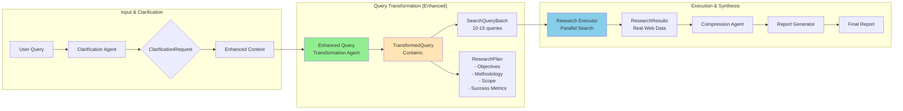

# Simplified Architecture Implementation Plan: Eliminating Brief Generator

## Executive Summary
This document outlines the simplification of the Deep Research System by eliminating the Brief Generator agent and incorporating its functionality into an enhanced Query Transformation Agent. This reduces the system from 6 agents to 5, eliminates redundancy, and improves performance by removing an unnecessary LLM call.

## 1. ARCHITECTURAL SIMPLIFICATION

### Current vs. Simplified Architecture

```mermaid
graph TB
    subgraph "Current Architecture (6 Agents)"
        A1[User Query] --> B1[1. Clarification Agent]
        B1 --> C1[2. Query Transformation]
        C1 --> D1[3. Brief Generator]
        D1 --> E1[4. Research Executor]
        E1 --> F1[5. Compression Agent]
        F1 --> G1[6. Report Generator]
    end

    subgraph "Simplified Architecture (5 Agents)"
        A2[User Query] --> B2[1. Clarification Agent]
        B2 --> C2[2. Enhanced Query Transformation<br/>Generates SearchQueryBatch + Research Plan]
        C2 --> D2[3. Research Executor<br/>Direct SearchQueryBatch Consumption]
        D2 --> E2[4. Compression Agent]
        E2 --> F2[5. Report Generator]
    end

    style C2 fill:#90EE90
    style D2 fill:#90EE90
```



### Detailed Data Flow in Simplified Architecture



## 2. ENHANCED DATA MODELS

### 2.1 TransformedQuery Model

```python
# src/models/query_transformation.py - Enhanced version

from typing import List, Optional, Dict, Any, Literal
from pydantic import BaseModel, Field, field_validator, model_validator
from datetime import datetime
from enum import Enum

class ResearchObjective(BaseModel):
    """Individual research objective."""
    objective: str = Field(description="Specific research goal")
    priority: int = Field(ge=1, le=5, description="Priority (1=highest, 5=lowest)")
    success_criteria: str = Field(description="How to measure success")
    related_queries: List[int] = Field(
        default_factory=list,
        description="Indices of SearchQuery objects that address this objective"
    )

class ResearchMethodology(BaseModel):
    """Research methodology embedded in query transformation."""
    approach: str = Field(description="Overall research strategy")
    search_strategy: str = Field(
        description="How searches will be executed (parallel/sequential/priority-based)"
    )
    data_sources: List[str] = Field(
        default_factory=list,
        description="Types of sources to search"
    )
    analysis_methods: List[str] = Field(
        default_factory=list,
        description="How to analyze findings"
    )
    quality_checks: List[str] = Field(
        default_factory=list,
        description="Validation criteria for results"
    )

class SearchQuery(BaseModel):
    """Enhanced search query with execution metadata."""
    query: str = Field(description="The search query string")
    query_type: str = Field(description="Type: academic/news/technical/market/general")
    priority: int = Field(ge=1, le=5, description="Execution priority")
    max_results: int = Field(default=10, ge=1, le=50)
    objective_id: Optional[int] = Field(
        default=None,
        description="Which research objective this query serves"
    )
    rationale: str = Field(description="Why this query matters")
    expected_insights: List[str] = Field(
        default_factory=list,
        description="What we expect to learn"
    )
    temporal_context: Optional[str] = Field(default=None)
    source_hints: List[str] = Field(default_factory=list)

class SearchQueryBatch(BaseModel):
    """Batch of queries with execution configuration."""
    queries: List[SearchQuery] = Field(min_length=1, max_length=20)
    execution_strategy: Literal["priority_first", "parallel", "sequential"] = Field(
        default="priority_first"
    )
    max_parallel: int = Field(default=5, ge=1, le=10)
    timeout_seconds: int = Field(default=30, ge=10, le=120)
    total_timeout: int = Field(default=300, ge=60, le=600)

    def get_priority_groups(self) -> Dict[int, List[SearchQuery]]:
        """Group queries by priority."""
        groups = {}
        for query in self.queries:
            if query.priority not in groups:
                groups[query.priority] = []
            groups[query.priority].append(query)
        return dict(sorted(groups.items(), reverse=True))

class ResearchPlan(BaseModel):
    """Complete research plan (replaces ResearchBrief)."""
    title: str = Field(description="Research title")
    executive_summary: str = Field(description="Brief overview")
    objectives: List[ResearchObjective] = Field(
        description="Research objectives linked to queries"
    )
    methodology: ResearchMethodology = Field(
        description="How research will be conducted"
    )
    scope: str = Field(description="Research boundaries")
    constraints: List[str] = Field(default_factory=list)
    deliverables: List[str] = Field(
        default_factory=list,
        description="Expected outputs"
    )
    success_metrics: List[str] = Field(
        default_factory=list,
        description="How to measure success"
    )
    estimated_time_minutes: int = Field(
        default=5,
        description="Estimated execution time"
    )

class TransformedQuery(BaseModel):
    """Complete output from enhanced Query Transformation Agent."""

    # Original query information
    original_query: str = Field(description="User's original query")
    clarification_context: Dict[str, Any] = Field(
        default_factory=dict,
        description="Context from clarification phase"
    )

    # Core transformation output
    search_queries: SearchQueryBatch = Field(
        description="Executable search queries"
    )
    research_plan: ResearchPlan = Field(
        description="Complete research plan (replaces brief)"
    )

    # Transformation metadata
    transformation_rationale: str = Field(
        description="Explanation of transformation approach"
    )
    confidence_score: float = Field(ge=0.0, le=1.0)
    ambiguities_resolved: List[str] = Field(default_factory=list)
    assumptions_made: List[str] = Field(default_factory=list)

    @model_validator(mode="after")
    def link_queries_to_objectives(self) -> "TransformedQuery":
        """Ensure queries are properly linked to objectives."""
        # Auto-link queries to objectives based on priority matching
        for i, query in enumerate(self.search_queries.queries):
            if query.objective_id is None:
                # Find matching objective by priority
                for j, obj in enumerate(self.research_plan.objectives):
                    if obj.priority == query.priority:
                        query.objective_id = j
                        if i not in obj.related_queries:
                            obj.related_queries.append(i)
                        break
        return self
```

### 2.2 Simplified Research Executor Input

```python
# src/models/research_executor.py - Simplified

class ResearchExecutionRequest(BaseModel):
    """Simplified input for Research Executor."""
    search_queries: SearchQueryBatch = Field(
        description="Queries to execute"
    )
    research_context: Dict[str, Any] = Field(
        default_factory=dict,
        description="Additional context from transformation"
    )
    # No more ResearchBrief needed!

class ResearchResults(BaseModel):
    """Output from Research Executor."""
    query: str
    execution_time: datetime
    findings: List[ResearchFinding]
    sources: List[ResearchSource]
    execution_stats: Dict[str, Any] = Field(
        default_factory=dict,
        description="Parallel execution metrics"
    )

    @property
    def success_rate(self) -> float:
        """Calculate success rate of searches."""
        if "total_queries" in self.execution_stats:
            total = self.execution_stats["total_queries"]
            successful = self.execution_stats.get("successful_queries", 0)
            return successful / total if total > 0 else 0.0
        return 0.0
```

## 3. ENHANCED QUERY TRANSFORMATION AGENT

### 3.1 Implementation

```python
# src/agents/query_transformation.py - Enhanced version

from typing import Dict, Any, Optional, List
from pydantic_ai import Agent, RunContext
import logfire

from ..models.query_transformation import (
    TransformedQuery,
    SearchQueryBatch,
    SearchQuery,
    ResearchPlan,
    ResearchObjective,
    ResearchMethodology
)
from .base import BaseAgent

class EnhancedQueryTransformationAgent(BaseAgent[TransformedQuery]):
    """
    Enhanced Query Transformation Agent that generates both search queries
    AND research plan, eliminating the need for Brief Generator.
    """

    def __init__(self, **kwargs):
        super().__init__(
            name="enhanced_query_transformation",
            description="Transforms queries into executable searches with research plan",
            **kwargs
        )
        self._setup_agent()

    def _setup_agent(self):
        """Configure the enhanced agent."""
        self.agent = Agent(
            model=self.model,
            result_type=TransformedQuery,
            system_prompt=self._get_enhanced_system_prompt(),
            retries=2
        )

        @self.agent.tool
        async def analyze_research_complexity(
            ctx: RunContext[Dict[str, Any]],
            query: str
        ) -> Dict[str, Any]:
            """Analyze query to determine research approach."""
            complexity_indicators = {
                "multi_faceted": len(query.split(" and ")) > 1 or " vs " in query,
                "technical": any(term in query.lower() for term in [
                    "algorithm", "implementation", "architecture", "system"
                ]),
                "comparative": " vs " in query or "compare" in query.lower(),
                "temporal": any(year in query for year in [
                    "2023", "2024", "2025", "recent", "latest"
                ]),
                "quantitative": any(term in query.lower() for term in [
                    "how many", "statistics", "data", "metrics"
                ])
            }

            # Determine research approach based on complexity
            if complexity_indicators["comparative"]:
                approach = "comparative_analysis"
                suggested_queries = 15
            elif complexity_indicators["technical"]:
                approach = "technical_deep_dive"
                suggested_queries = 12
            elif complexity_indicators["quantitative"]:
                approach = "data_driven"
                suggested_queries = 10
            else:
                approach = "exploratory"
                suggested_queries = 10

            return {
                "complexity_indicators": complexity_indicators,
                "suggested_approach": approach,
                "suggested_query_count": suggested_queries,
                "execution_strategy": "priority_first" if complexity_indicators["multi_faceted"] else "parallel"
            }

    def _get_enhanced_system_prompt(self) -> str:
        """Enhanced prompt that combines query transformation with research planning."""
        return """You are an Enhanced Query Transformation Specialist that creates both executable search queries AND comprehensive research plans.

## Your Dual Responsibilities:

### 1. Query Transformation
- Decompose complex queries into 10-15 specific, executable searches
- Assign priority levels (1-5, where 1 is highest, 5 is lowest)
- Classify query types (academic, news, technical, market, general)
- Include rationale and expected insights for each query

### 2. Research Planning (Replacing Brief Generator)
- Define clear research objectives linked to queries
- Establish research methodology and approach
- Set scope and constraints
- Define success metrics and deliverables
- Create a cohesive research strategy

## Integrated Output Framework:

### Research Objectives
For each major aspect of the query:
1. Define a specific objective
2. Set priority level
3. Establish success criteria
4. Link to relevant search queries

### Search Query Generation
For each query:
1. Create specific, executable search string
2. Assign to relevant objective
3. Set execution priority
4. Define expected insights
5. Include temporal/source hints if relevant

### Research Methodology
1. Overall approach (exploratory, comparative, analytical, etc.)
2. Search execution strategy (parallel, priority-based, sequential)
3. Data source preferences
4. Quality validation criteria

## Example Transformation:

User Query: "Compare the effectiveness of BERT vs GPT for sentiment analysis"

Research Objectives:
1. [Priority 5] Understand BERT architecture for sentiment analysis
   - Success: Technical details and implementation patterns
   - Queries: 1, 2, 3
2. [Priority 5] Understand GPT capabilities for sentiment analysis
   - Success: Performance metrics and use cases
   - Queries: 4, 5, 6
3. [Priority 4] Find comparative studies and benchmarks
   - Success: Head-to-head performance data
   - Queries: 7, 8, 9

Search Queries:
1. "BERT sentiment analysis implementation architecture" (technical, priority 5)
2. "BERT fine-tuning sentiment classification benchmark" (academic, priority 5)
3. "BERT sentiment analysis accuracy scores datasets" (technical, priority 4)
... (continuing for all 10-15 queries)

Remember: You are replacing TWO agents (Query Transformation + Brief Generator) with this enhanced output."""

    async def transform_with_plan(
        self,
        query: str,
        clarification_context: Optional[Dict[str, Any]] = None
    ) -> TransformedQuery:
        """
        Transform query into search queries WITH complete research plan.

        This replaces both the old transform_query() and the Brief Generator's
        generate_brief() functions.
        """
        with logfire.span(
            "enhanced_query_transformation",
            query=query,
            has_context=bool(clarification_context)
        ):
            # Analyze complexity first
            complexity = await self.agent.run_tool(
                "analyze_research_complexity",
                query=query
            )

            # Build comprehensive prompt
            prompt = f"""Transform this research query into a complete research execution plan:

Query: {query}

Clarification Context: {clarification_context or "No additional context"}

Complexity Analysis: {complexity}

Generate:
1. 10-15 specific search queries based on the complexity analysis
2. 3-5 research objectives that these queries will fulfill
3. Complete research methodology
4. Clear scope and constraints
5. Success metrics

Ensure each search query is linked to at least one objective."""

            result = await self.agent.run(
                prompt,
                deps={
                    "query": query,
                    "clarification_context": clarification_context,
                    "complexity": complexity
                }
            )

            logfire.info(
                "enhanced_transformation_complete",
                num_queries=len(result.data.search_queries.queries),
                num_objectives=len(result.data.research_plan.objectives),
                execution_strategy=result.data.search_queries.execution_strategy
            )

            return result.data
```

## 4. SIMPLIFIED RESEARCH EXECUTOR

### 4.1 Direct SearchQueryBatch Consumption

```python
# src/agents/research_executor.py - Simplified

import asyncio
from typing import List, Dict, Any, Optional
from datetime import datetime
import aiohttp
import logfire

from ..models.query_transformation import SearchQueryBatch, SearchQuery
from ..models.research_executor import ResearchResults, ResearchFinding
from ..core.search_service import SearchService
from .base import BaseAgent

class SimplifiedResearchExecutor(BaseAgent[ResearchResults]):
    """
    Simplified Research Executor that directly consumes SearchQueryBatch
    without needing a ResearchBrief intermediary.
    """

    def __init__(
        self,
        search_service: Optional[SearchService] = None,
        max_parallel: int = 5,
        **kwargs
    ):
        super().__init__(
            name="simplified_research_executor",
            description="Executes searches directly from query batch",
            **kwargs
        )
        self.search_service = search_service or SearchService()
        self.max_parallel = max_parallel
        self.semaphore = asyncio.Semaphore(max_parallel)

    async def execute_searches(
        self,
        search_queries: SearchQueryBatch,
        research_context: Optional[Dict[str, Any]] = None
    ) -> ResearchResults:
        """
        Execute searches directly from SearchQueryBatch.
        No ResearchBrief needed!
        """
        with logfire.span(
            "execute_searches",
            num_queries=len(search_queries.queries),
            strategy=search_queries.execution_strategy
        ):
            start_time = datetime.now()

            # Execute based on strategy
            if search_queries.execution_strategy == "priority_first":
                results = await self._execute_by_priority(search_queries)
            elif search_queries.execution_strategy == "parallel":
                results = await self._execute_parallel(search_queries)
            else:  # sequential
                results = await self._execute_sequential(search_queries)

            # Aggregate findings
            findings = self._aggregate_findings(results)

            execution_time = (datetime.now() - start_time).total_seconds()

            return ResearchResults(
                query=research_context.get("original_query", ""),
                execution_time=datetime.now(),
                findings=findings,
                sources=self._extract_sources(results),
                execution_stats={
                    "total_queries": len(search_queries.queries),
                    "successful_queries": len([r for r in results if r.get("success")]),
                    "execution_time_seconds": execution_time,
                    "strategy": search_queries.execution_strategy,
                    "parallel_limit": self.max_parallel
                }
            )

    async def _execute_by_priority(
        self,
        search_queries: SearchQueryBatch
    ) -> List[Dict[str, Any]]:
        """Execute queries in priority groups."""
        priority_groups = search_queries.get_priority_groups()
        all_results = []

        for priority, queries in priority_groups.items():
            logfire.info(f"Executing priority {priority} queries", count=len(queries))

            # Execute this priority group in parallel
            tasks = [
                self._execute_single_search(query)
                for query in queries
            ]
            group_results = await asyncio.gather(*tasks, return_exceptions=True)

            for query, result in zip(queries, group_results):
                if isinstance(result, Exception):
                    logfire.error(f"Query failed: {query.query}", error=str(result))
                    all_results.append({
                        "query": query,
                        "success": False,
                        "error": str(result)
                    })
                else:
                    all_results.append({
                        "query": query,
                        "success": True,
                        "results": result
                    })

        return all_results

    async def _execute_single_search(self, query: SearchQuery) -> Dict[str, Any]:
        """Execute a single search with rate limiting."""
        async with self.semaphore:
            try:
                results = await self.search_service.search(
                    query=query.query,
                    max_results=query.max_results
                )
                return {
                    "query": query.query,
                    "results": results,
                    "source": query.source_hints[0] if query.source_hints else "web",
                    "objective_id": query.objective_id
                }
            except Exception as e:
                logfire.error(f"Search failed for: {query.query}", error=str(e))
                raise

    def _aggregate_findings(self, results: List[Dict[str, Any]]) -> List[ResearchFinding]:
        """Aggregate search results into findings."""
        findings = []

        # Group results by objective_id
        by_objective = {}
        for result in results:
            if result.get("success"):
                obj_id = result["query"].objective_id or -1
                if obj_id not in by_objective:
                    by_objective[obj_id] = []
                by_objective[obj_id].append(result)

        # Create findings per objective
        for obj_id, obj_results in by_objective.items():
            finding = ResearchFinding(
                finding=f"Aggregated results for objective {obj_id}",
                source="; ".join([r["query"].query for r in obj_results]),
                confidence=0.8,
                relevance=0.9,
                evidence=[str(r.get("results", [])) for r in obj_results],
                objective_id=obj_id
            )
            findings.append(finding)

        return findings
```

## 5. SIMPLIFIED WORKFLOW

### 5.1 Updated Workflow Without Brief Generator

```python
# src/core/workflow.py - Simplified

from typing import Dict, Any, Optional
import asyncio
import logfire

from ..agents.clarification import ClarificationAgent
from ..agents.query_transformation import EnhancedQueryTransformationAgent
from ..agents.research_executor import SimplifiedResearchExecutor
from ..agents.compression import CompressionAgent
from ..agents.report_generator import ReportGeneratorAgent
from ..models.query_transformation import TransformedQuery
from ..models.research_executor import ResearchResults

class SimplifiedResearchWorkflow:
    """
    Simplified workflow with 5 agents instead of 6.
    Brief Generator functionality merged into Query Transformation.
    """

    def __init__(self):
        self.clarification = ClarificationAgent()
        self.query_transformer = EnhancedQueryTransformationAgent()
        self.research_executor = SimplifiedResearchExecutor()
        self.compression = CompressionAgent()
        self.report_generator = ReportGeneratorAgent()

    async def run(
        self,
        query: str,
        skip_clarification: bool = False
    ) -> Dict[str, Any]:
        """
        Execute simplified research workflow.

        Flow:
        1. Clarification (optional)
        2. Query Transformation (includes research planning)
        3. Research Execution (direct from SearchQueryBatch)
        4. Compression
        5. Report Generation
        """
        with logfire.span("simplified_workflow", query=query):
            # Step 1: Clarification
            clarification_context = {}
            if not skip_clarification:
                clarification_result = await self.clarification.assess(query)
                if clarification_result.needs_clarification:
                    # Handle clarification questions
                    clarification_context = clarification_result.context

            # Step 2: Enhanced Query Transformation (includes research planning)
            logfire.info("Transforming query with integrated research planning")
            transformed = await self.query_transformer.transform_with_plan(
                query=query,
                clarification_context=clarification_context
            )

            # Log the research plan that replaced the brief
            logfire.info(
                "Research plan generated",
                num_objectives=len(transformed.research_plan.objectives),
                num_queries=len(transformed.search_queries.queries),
                execution_strategy=transformed.search_queries.execution_strategy
            )

            # Step 3: Direct Research Execution (no brief needed!)
            logfire.info("Executing searches directly from query batch")
            research_results = await self.research_executor.execute_searches(
                search_queries=transformed.search_queries,
                research_context={
                    "original_query": query,
                    "objectives": transformed.research_plan.objectives,
                    "methodology": transformed.research_plan.methodology
                }
            )

            # Step 4: Compression
            compressed = await self.compression.compress(research_results)

            # Step 5: Report Generation
            report = await self.report_generator.generate(
                query=query,
                research_plan=transformed.research_plan,  # Use plan instead of brief
                findings=compressed,
                execution_stats=research_results.execution_stats
            )

            return {
                "query": query,
                "transformation": transformed.model_dump(),
                "research_results": research_results.model_dump(),
                "report": report
            }
```

## 6. MIGRATION STRATEGY

### 6.1 Feature Flags for Gradual Rollout

```python
# src/core/feature_flags.py - Extended

class FeatureFlag(Enum):
    """Extended feature flags for simplified architecture."""
    # Existing flags
    USE_PARALLEL_SEARCH = "use_parallel_search"
    ENHANCED_QUERY_TRANSFORMATION = "enhanced_query_transformation"

    # New flags for simplification
    SKIP_BRIEF_GENERATOR = "skip_brief_generator"  # Key flag!
    USE_ENHANCED_TRANSFORMER = "use_enhanced_transformer"
    USE_SIMPLIFIED_EXECUTOR = "use_simplified_executor"

# src/core/workflow.py - Adaptive version

class AdaptiveWorkflow:
    """Workflow that can run both architectures based on feature flags."""

    def __init__(self):
        self.flags = FeatureFlags()
        self._init_agents()

    def _init_agents(self):
        """Initialize agents based on flags."""
        if self.flags.is_enabled(FeatureFlag.USE_ENHANCED_TRANSFORMER):
            from ..agents.query_transformation import EnhancedQueryTransformationAgent
            self.query_transformer = EnhancedQueryTransformationAgent()
        else:
            from ..agents.query_transformation import QueryTransformationAgent
            self.query_transformer = QueryTransformationAgent()

        # Conditionally create Brief Generator
        if not self.flags.is_enabled(FeatureFlag.SKIP_BRIEF_GENERATOR):
            from ..agents.brief_generator import BriefGeneratorAgent
            self.brief_generator = BriefGeneratorAgent()

        if self.flags.is_enabled(FeatureFlag.USE_SIMPLIFIED_EXECUTOR):
            from ..agents.research_executor import SimplifiedResearchExecutor
            self.research_executor = SimplifiedResearchExecutor()
        else:
            from ..agents.research_executor import ResearchExecutorAgent
            self.research_executor = ResearchExecutorAgent()

    async def run(self, query: str) -> Dict[str, Any]:
        """Run workflow based on feature flags."""
        # ... clarification phase ...

        if self.flags.is_enabled(FeatureFlag.SKIP_BRIEF_GENERATOR):
            # Simplified flow
            transformed = await self.query_transformer.transform_with_plan(query)
            results = await self.research_executor.execute_searches(
                transformed.search_queries
            )
        else:
            # Legacy flow with Brief Generator
            transformed = await self.query_transformer.transform(query)
            brief = await self.brief_generator.generate(transformed)
            results = await self.research_executor.execute(brief)

        # ... compression and report generation ...
```

## 7. TESTING STRATEGY

### 7.1 Comprehensive Test Suite

```python
# tests/test_simplified_architecture.py

import pytest
import asyncio
from unittest.mock import Mock, AsyncMock

from agents.query_transformation import EnhancedQueryTransformationAgent
from agents.research_executor import SimplifiedResearchExecutor
from models.query_transformation import TransformedQuery

class TestSimplifiedArchitecture:
    """Test the simplified 5-agent architecture."""

    @pytest.mark.asyncio
    async def test_enhanced_transformer_includes_research_plan(self):
        """Test that enhanced transformer generates both queries and plan."""
        agent = EnhancedQueryTransformationAgent()

        result = await agent.transform_with_plan(
            "Compare Python vs JavaScript for web development"
        )

        # Should have both search queries and research plan
        assert result.search_queries is not None
        assert len(result.search_queries.queries) >= 10
        assert result.research_plan is not None
        assert len(result.research_plan.objectives) >= 3

        # Objectives should be linked to queries
        for obj in result.research_plan.objectives:
            assert len(obj.related_queries) > 0

    @pytest.mark.asyncio
    async def test_executor_works_without_brief(self):
        """Test that executor can work directly with SearchQueryBatch."""
        mock_search_service = Mock()
        mock_search_service.search = AsyncMock(return_value={"results": []})

        executor = SimplifiedResearchExecutor(search_service=mock_search_service)

        # Create a sample transformed query
        transformed = Mock(spec=TransformedQuery)
        transformed.search_queries = Mock()
        transformed.search_queries.queries = [
            Mock(query="test query", priority=5, max_results=10)
        ]
        transformed.search_queries.execution_strategy = "parallel"

        # Should execute without needing a ResearchBrief
        results = await executor.execute_searches(transformed.search_queries)

        assert results is not None
        assert mock_search_service.search.called

    @pytest.mark.asyncio
    async def test_workflow_skip_brief_generator(self):
        """Test that workflow can skip Brief Generator entirely."""
        from core.workflow import SimplifiedResearchWorkflow

        workflow = SimplifiedResearchWorkflow()

        # Mock all agents
        workflow.clarification = Mock()
        workflow.clarification.assess = AsyncMock(
            return_value=Mock(needs_clarification=False)
        )

        workflow.query_transformer = Mock()
        workflow.query_transformer.transform_with_plan = AsyncMock(
            return_value=Mock(
                search_queries=Mock(queries=[]),
                research_plan=Mock(objectives=[])
            )
        )

        workflow.research_executor = Mock()
        workflow.research_executor.execute_searches = AsyncMock(
            return_value=Mock(findings=[], execution_stats={})
        )

        workflow.compression = Mock()
        workflow.compression.compress = AsyncMock(return_value=Mock())

        workflow.report_generator = Mock()
        workflow.report_generator.generate = AsyncMock(return_value="Report")

        # Run workflow - should not use Brief Generator
        result = await workflow.run("Test query")

        # Brief Generator should not exist in the workflow
        assert not hasattr(workflow, 'brief_generator')

        # But all other agents should have been called
        assert workflow.query_transformer.transform_with_plan.called
        assert workflow.research_executor.execute_searches.called

    @pytest.mark.asyncio
    async def test_performance_improvement(self):
        """Test that simplified architecture is faster."""
        import time

        # Simulate LLM call times
        async def simulate_llm_call(delay: float):
            await asyncio.sleep(delay)

        # Old architecture: 6 LLM calls
        start = time.time()
        await asyncio.gather(
            simulate_llm_call(0.5),  # Clarification
            simulate_llm_call(0.5),  # Query Transform
            simulate_llm_call(0.5),  # Brief Generator
            simulate_llm_call(0.5),  # Research Executor
            simulate_llm_call(0.5),  # Compression
            simulate_llm_call(0.5),  # Report
        )
        old_time = time.time() - start

        # New architecture: 5 LLM calls
        start = time.time()
        await asyncio.gather(
            simulate_llm_call(0.5),  # Clarification
            simulate_llm_call(0.6),  # Enhanced Query Transform (slightly longer)
            simulate_llm_call(0.5),  # Research Executor
            simulate_llm_call(0.5),  # Compression
            simulate_llm_call(0.5),  # Report
        )
        new_time = time.time() - start

        # Should be faster even with slightly longer query transformation
        assert new_time < old_time

        # Calculate improvement
        improvement = (old_time - new_time) / old_time * 100
        print(f"Performance improvement: {improvement:.1f}%")
```

## 8. IMPLEMENTATION TIMELINE

| Phase | Duration | Tasks | Risk |
|-------|----------|-------|------|
| **Phase 1: Data Models** | 2 days | - Create TransformedQuery<br>- Add ResearchPlan model<br>- Update SearchQuery with objective_id | Low |
| **Phase 2: Enhanced Transformer** | 3 days | - Implement EnhancedQueryTransformationAgent<br>- Develop integrated prompts<br>- Test query-to-plan generation | Medium |
| **Phase 3: Simplified Executor** | 2 days | - Create SimplifiedResearchExecutor<br>- Remove ResearchBrief dependency<br>- Test direct SearchQueryBatch consumption | Low |
| **Phase 4: Workflow Update** | 2 days | - Create SimplifiedResearchWorkflow<br>- Add feature flags<br>- Implement adaptive workflow | Medium |
| **Phase 5: Testing** | 3 days | - Unit tests for all components<br>- Integration tests<br>- Performance benchmarks | Low |
| **Phase 6: Migration** | 2 days | - Deploy with flags disabled<br>- Gradual rollout<br>- Monitor metrics | Low |

## 9. BENEFITS OF SIMPLIFICATION

### Performance Improvements
- **Reduced Latency**: One less LLM call (saves ~500-1000ms)
- **Simpler Data Flow**: No intermediate ResearchBrief transformation
- **Faster Development**: Fewer components to maintain

### Architecture Benefits
- **Clearer Responsibilities**: Each agent has a distinct, non-overlapping role
- **No Redundancy**: Query generation happens exactly once
- **Better Cohesion**: Research plan directly tied to search queries

### Maintenance Benefits
- **Less Code**: One less agent to maintain
- **Simpler Testing**: Fewer integration points
- **Easier Debugging**: More straightforward data flow

## 10. ROLLBACK PLAN

If issues arise, the feature flag system allows instant rollback:

```python
# To rollback:
os.environ["SKIP_BRIEF_GENERATOR"] = "false"
os.environ["USE_ENHANCED_TRANSFORMER"] = "false"
os.environ["USE_SIMPLIFIED_EXECUTOR"] = "false"

# System immediately reverts to 6-agent architecture
```

## Conclusion

This simplification reduces the system from 6 to 5 agents by merging Brief Generator functionality into an Enhanced Query Transformation Agent. This eliminates redundancy, improves performance, and creates a cleaner architecture while maintaining all functionality. The implementation is low-risk due to comprehensive feature flags and testing.
