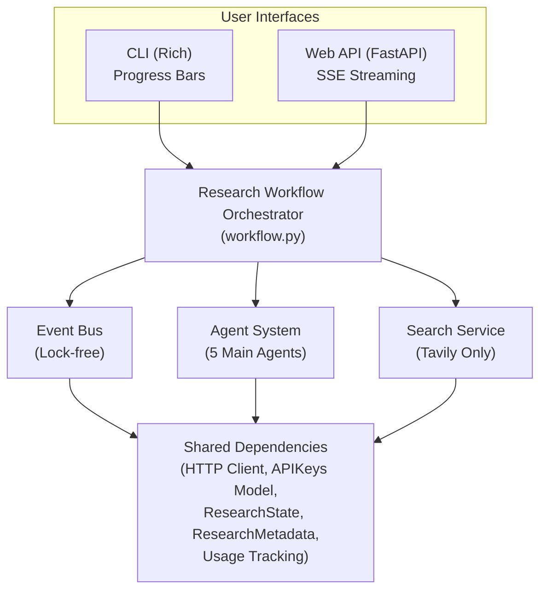
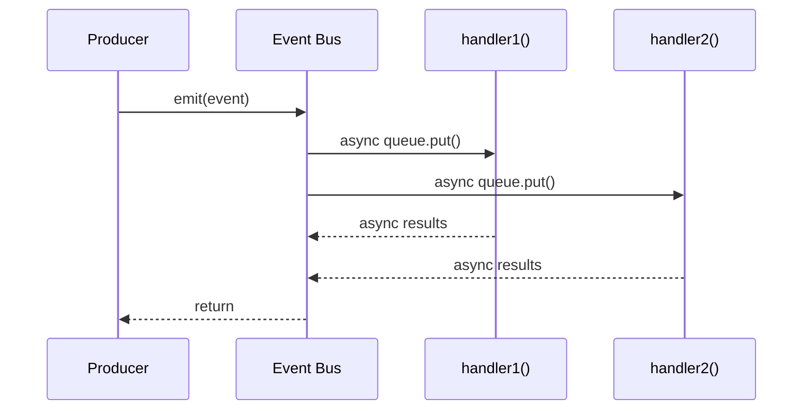
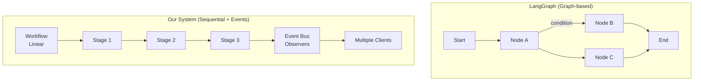
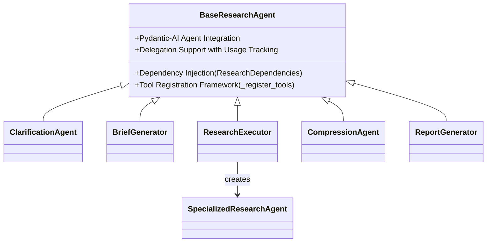
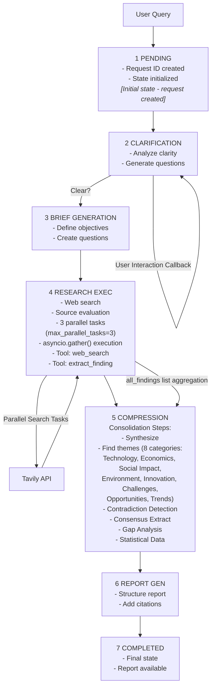
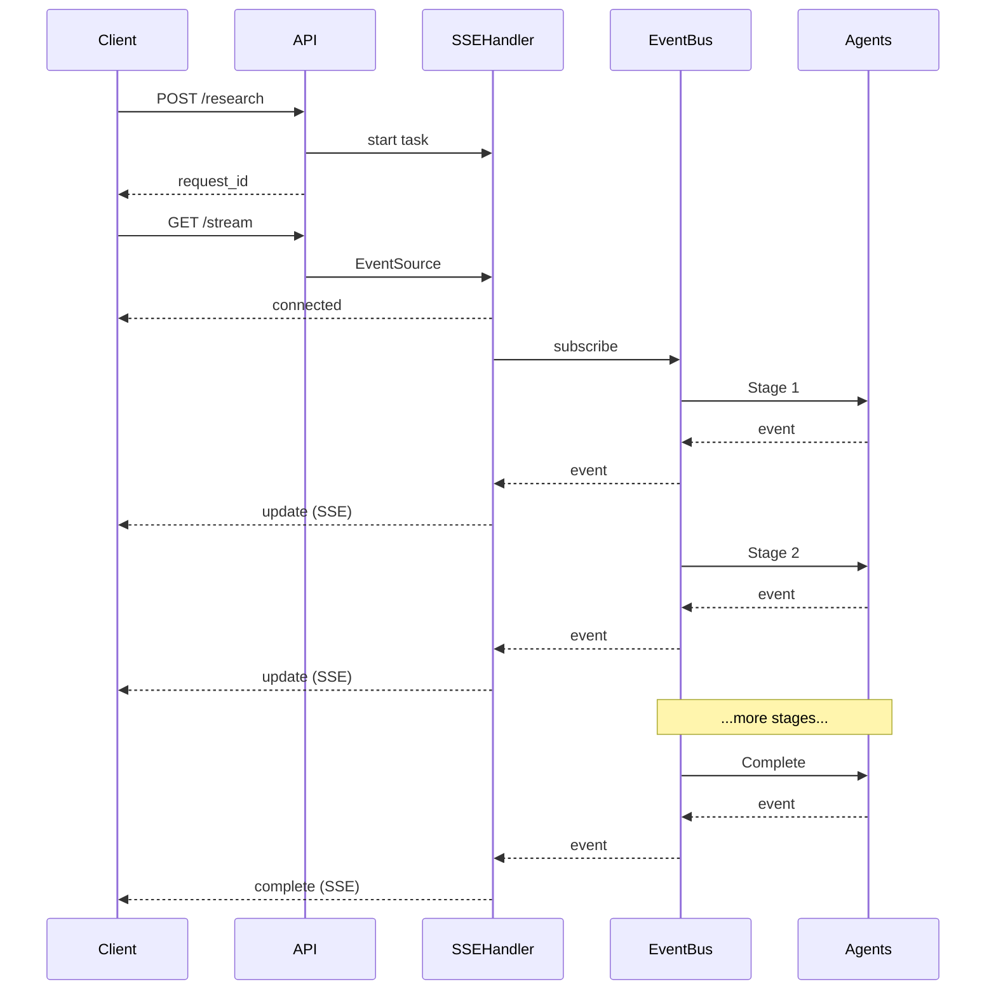
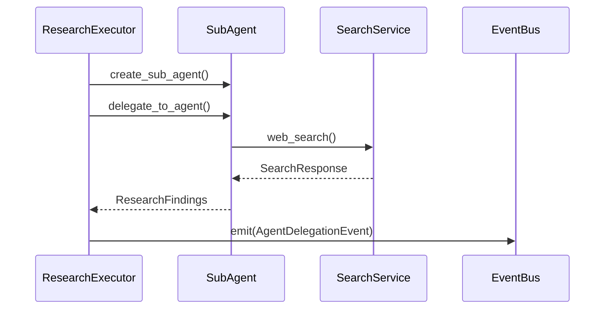
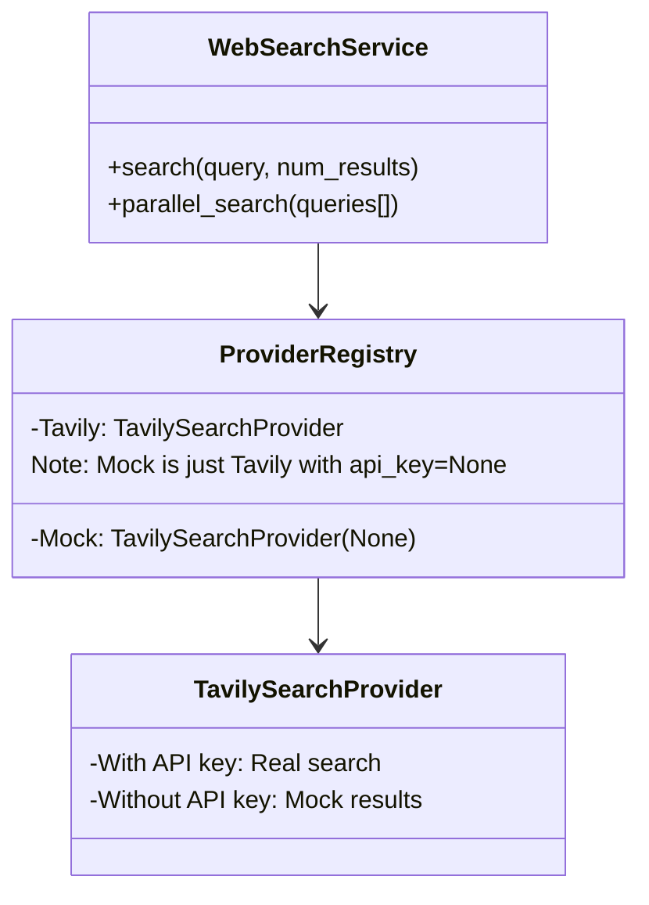
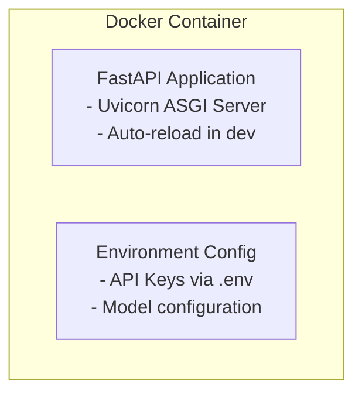

# Deep Research System Architecture

## Executive Summary

The Deep Research System is an AI-powered research automation platform reimplemented using Pydantic-AI instead of LangGraph. It orchestrates multiple specialized AI agents through a sequential pipeline with event-driven progress notifications to conduct comprehensive research on user queries. The system features a 7-stage pipeline (Pending → Clarification → Brief Generation → Research Execution → Compression → Report Generation → Completed) with support for both web (SSE) and CLI interfaces (direct mode and HTTP client mode).

## Architecture Overview

### Core Design Principles

1. **Sequential Pipeline**: Deterministic stage-by-stage agent execution
2. **Event-Driven Notifications**: Lock-free event bus for progress updates and observability (not flow control)
3. **Multi-Agent Delegation**: Specialized agents with clear responsibilities
4. **Dependency Injection**: Shared context and resources across agents
5. **Stream-First Design**: Real-time updates via SSE and CLI progress indicators
6. **Provider Abstraction**: Pluggable search and LLM providers

### System Component Overview



## Component Architecture

### 1. Event Bus System (`core/events.py`)

The event bus provides lock-free, asynchronous coordination between components:

```python
Key Events:
- ResearchStartedEvent
- StageCompletedEvent
- AgentDelegationEvent
- FindingDiscoveredEvent
- StreamingUpdateEvent
- ResearchCompletedEvent
- ErrorEvent
```

**Event Flow Pattern:**



⚠️ **Architecture Clarification - Comparison with LangGraph**:

**Important Context on Graph Usage:**

- **LangGraph**: Uses explicit `StateGraph` with nodes and edges for orchestration
- **Our Implementation**: Uses Pydantic-AI's `Agent` class but **NOT** pydantic-graph; orchestration is purely sequential via `workflow.py`
- Both Pydantic-AI and LangGraph have graph capabilities, but we chose sequential orchestration for simplicity

**LangGraph's Orchestration Model:**
In the original LangGraph implementation (`/Users/keng/work/learning/open_deep_research`), the workflow is defined as an explicit graph:

```python
# LangGraph uses StateGraph for explicit workflow definition
supervisor_builder = StateGraph(SupervisorState, config_schema=Configuration)
supervisor_builder.add_node("supervisor", supervisor)
supervisor_builder.add_node("supervisor_tools", supervisor_tools)
supervisor_builder.add_edge(START, "supervisor")

# Streaming is part of graph execution
async for event in graph.astream({"topic": query}, config, stream_mode="updates"):
    handle_update(event)  # Must consume stream for execution to continue
```

**LangGraph Strengths:**

- **Dynamic Routing**: Conditional edges allow branching based on state
- **Parallel Execution**: Multiple nodes can run simultaneously
- **Human-in-the-Loop**: Built-in interruption and resumption patterns
- **State Checkpointing**: Can rollback to previous states
- **Workflow Visualization**: Auto-generates Mermaid diagrams
- **Backpressure Handling**: Stream consumer controls processing rate
- **Guaranteed Ordering**: Events arrive in execution order

**Our Sequential + Event Bus Approach:**

```python
# Sequential orchestration with decoupled events
async def execute_research(self, user_query: str, ...):
    # Linear execution
    clarification_result = await clarification_agent.clarify_query(...)
    brief = await brief_generator_agent.generate_brief(...)
    findings = await research_executor_agent.execute_research(...)

    # Events for observability (not control flow)
    await emit(ResearchEvent(...))  # Fire-and-forget
```

**Our Approach Strengths:**

- **Simplicity**: Linear flow is easier to understand and debug
- **Client Resilience**: Clients can disconnect/reconnect anytime
- **Multiple Consumers**: Unlimited concurrent observers
- **Test Isolation**: Can test workflow without event infrastructure
- **Production Robustness**: Server crashes don't lose progress
- **Lock-free Concurrency**: No deadlock risks

**Architectural Trade-offs:**

| Aspect                  | LangGraph                                     | Our Approach                                  |
| ----------------------- | --------------------------------------------- | --------------------------------------------- |
| **Orchestration**       | Graph with conditional routing                | Sequential with fixed stages                  |
| **Complexity Handling** | Excellent for complex, branching workflows    | Better for linear pipelines                   |
| **Streaming Model**     | Coupled `.astream()` (backpressure, ordering) | Decoupled events (resilience, multi-consumer) |
| **State Management**    | Explicit graph state transitions              | Direct state mutation + notifications         |
| **Human Intervention**  | Built-in interruption patterns                | Would require custom implementation           |
| **Debugging**           | Graph visualization but complex execution     | Simple linear trace                           |
| **Testing**             | Must test graph traversal logic               | Straightforward sequential testing            |

**When to Use Each Approach:**

**Use LangGraph when you need:**

- Complex workflows with conditional branching
- Human-in-the-loop decision points
- State rollback capabilities
- Dynamic workflow modification
- Built-in workflow visualization

**Use Our Event Bus approach when you need:**

- Simple, predictable linear pipelines
- Maximum client resilience (disconnect/reconnect)
- Multiple simultaneous consumers
- Clear separation of execution and observability
- Simpler testing and debugging

**Visual Architecture Comparison:**



### 2. Agent System Architecture

The system implements 5 main specialized agents plus 1 sub-agent, all inheriting from `BaseResearchAgent`:



### 3. Research Pipeline Flow



```
User Query
    │
    ▼
┌─────────────────────┐
│ 0. PENDING          │  [Initial state - request created]
│ - Request ID created│
│ - State initialized │
└─────────────────────┘
    │
    ▼
┌─────────────────────┐
│ 1. CLARIFICATION    │◄──────[User Interaction Callback]
│ - Analyze clarity   │
│ - Generate questions│
└─────────────────────┘
    │ Clear?
    ▼
┌─────────────────────┐
│ 2. BRIEF GENERATION │
│ - Define objectives │
│ - Create questions  │
└─────────────────────┘
    │
    ▼
┌─────────────────────┐
│ 3. RESEARCH EXEC    │◄──────[Parallel Search Tasks]
│ - Web search        │        ┌─────────────┐
│ - Source evaluation │◄───────│Tavily API   │
│ - 3 parallel tasks  │        └─────────────┘
│   (max_parallel_tasks=3)
│ - asyncio.gather() execution
│ - Tool: web_search  │
│ - Tool: extract_finding│
└─────────────────────┘
    │
    ▼ [all_findings list aggregation]
┌─────────────────────┐
│ 4. COMPRESSION      │
│ Consolidation Steps:│
│ - Synthesize        │
│ - Find themes       │
│   (8 categories:    │
│    Technology,      │
│    Economics,       │
│    Social Impact,   │
│    Environment,     │
│    Innovation,      │
│    Challenges,      │
│    Opportunities,   │
│    Trends)          │
│ - Contradiction     │
│   Detection         │
│ - Consensus Extract │
│ - Gap Analysis      │
│ - Statistical Data  │
└─────────────────────┘
    │
    ▼
┌─────────────────────┐
│ 5. REPORT GEN       │
│ - Structure report  │
│ - Add citations     │
└─────────────────────┘
    │
    ▼
┌─────────────────────┐
│ 6. COMPLETED        │
│ - Final state       │
│ - Report available  │
└─────────────────────┘
```

### Orchestration Model: Sequential Pipeline with Event Notifications

The system uses a **hybrid orchestration approach**:

#### Sequential Agent Pipeline

The core workflow (`workflow.py`) executes agents in a strict linear sequence:

```python
1. await clarification_agent.clarify_query()
2. await brief_generator_agent.generate_brief()
3. await research_executor_agent.execute_research(max_parallel_tasks=3)
   # Spawns 3 parallel research tasks using asyncio.gather()
4. await compression_agent.compress_findings()
   # Consolidates all_findings into CompressedFindings object
5. await report_generator_agent.generate_report()
   # Generates final ResearchReport in Markdown format
```

Each stage must complete before the next begins. This ensures:

- **Deterministic execution order**: No race conditions or timing issues
- **Clear data dependencies**: Each stage builds on previous results
- **Simplified error handling**: Failures stop the pipeline immediately
- **Easy debugging**: Linear execution trace

#### Event Bus for Observability

While agents execute sequentially, the event bus provides:

- **Progress Notifications**: `StreamingUpdateEvent`, `StageCompletedEvent`
- **Error Propagation**: `ErrorEvent` for failure handling
- **Audit Trail**: Complete event history for debugging
- **UI Updates**: Real-time progress for CLI and web interfaces

**Important**: The event bus does NOT control workflow execution. Events are emitted to notify observers about what has happened, not to trigger what should happen next. This differs from fully event-driven systems where events determine control flow.

### 4. State Management

Research state flows through the pipeline with incremental updates:

```python
ResearchState {
    request_id: str
    user_query: str
    current_stage: ResearchStage  # PENDING → CLARIFICATION → ... → COMPLETED
    clarified_query: Optional[str]
    research_brief: Optional[ResearchBrief]
    findings: List[ResearchFinding]
    compressed_findings: Optional[str]  # Summary text
    final_report: Optional[ResearchReport]
    metadata: Dict[str, Any]  # Stores full compressed_findings_full object
    error_message: Optional[str]
}

ResearchStage(Enum):
    PENDING = "pending"
    CLARIFICATION = "clarification"
    BRIEF_GENERATION = "brief_generation"
    RESEARCH_EXECUTION = "research_execution"
    COMPRESSION = "compression"
    REPORT_GENERATION = "report_generation"
    COMPLETED = "completed"
```

## Data Flow & Timing Diagrams

### Streaming Implementation

All agents use `stream=True` parameter when calling `run()` to enable real-time token streaming:

- `compression_agent.run(prompt, deps, stream=True)` (compression.py:339)
- `report_generator_agent.run(context, deps, stream=True)` (report_generator.py:331)
- Research executor tasks use `stream=True` for parallel execution (research_executor.py:361)

This enables real-time progress updates through the event bus to connected clients.

### SSE Streaming Timeline



### Agent Delegation Flow



## Client Communication & Result Delivery

### How Clients Know Results Are Ready

The system uses different mechanisms for CLI and Web applications to track research progress and receive results:

#### Web Application (SSE Streaming)

```
1. Initial Connection:
   POST /research → returns request_id
   GET /research/{request_id}/stream → establishes SSE connection

2. Event Stream:
   - "connection" event: SSE connection established
   - "update" events: Progress updates from StreamingUpdateEvent
   - "stage" events: Stage completion notifications
   - "error" events: Error notifications
   - "complete" event: Research completed (success/failure)
   - "ping" events: Keep-alive heartbeats

3. Result Retrieval:
   GET /research/{request_id}/report → fetch final report
   GET /research/{request_id} → check status
```

**Completion Detection (Web)**:

```javascript
// Client-side EventSource
const eventSource = new EventSource(`/research/${requestId}/stream`)

eventSource.addEventListener('complete', (event) => {
  const data = JSON.parse(event.data)
  if (data.success && data.has_report) {
    // Fetch the complete report
    fetch(`/research/${requestId}/report`)
      .then((res) => res.json())
      .then((report) => displayReport(report))
  }
  eventSource.close()
})
```

#### CLI Application (Two Modes)

**Mode 1: Direct In-Process Execution (default)**
The CLI directly imports and executes the workflow in-process:

**Mode 2: HTTP Client Mode**
The CLI can also connect to a remote FastAPI server using httpx and SSE:

```python
# Mode 1: Direct execution (--mode direct or default)
from open_deep_research_with_pydantic_ai.core.workflow import workflow

# Direct function call - not an API request
state = await workflow.execute_research(
    user_query=query,
    api_keys=api_keys,
    stream_callback=True,
)

# CLI subscribes directly to in-memory event bus
research_event_bus.subscribe(StreamingUpdateEvent, handler.handle_streaming_update)
research_event_bus.subscribe(StageCompletedEvent, handler.handle_stage_completed)

if state.final_report:
    display_report(state.final_report)

# Mode 2: HTTP client mode (--mode http --server-url http://server:8000)
from httpx_sse import aconnect_sse

async with httpx.AsyncClient() as http_client:
    # Start research via API
    response = await http_client.post(f"{server_url}/research", ...)
    request_id = response.json()["request_id"]

    # Connect to SSE stream
    async with aconnect_sse(http_client, "GET",
                           f"{server_url}/research/{request_id}/stream") as event_source:
        async for sse in event_source.aiter_sse():
            # Process SSE events similar to web client
            if sse.event == "complete":
                report = await fetch_report(request_id)
                display_report(report)
```

### Streaming Mechanisms Comparison

```mermaid
flowchart TD
    subgraph "Web (SSE)"
        WebReq[HTTP Request] --> FastAPI[FastAPI Server<br/>Separate Process]
        FastAPI --> EventSourceAPI[EventSource API<br/>Browser/HTTP Client]
        EventSourceAPI --> SSEStream[SSE Text Stream<br/>'data: {...json...}']
        SSEStream --> JSONParse[JSON Parse & Handle<br/>Different event types]
        JSONParse --> WebComplete[On 'complete' event:<br/>- Close EventSource<br/>- Fetch full report]
    end

    subgraph "CLI (Direct Events)"
        DirectCall[Direct Call] --> NoServer[No Server Required<br/>Same Process]
        NoServer --> EventBusSub[Event Bus Subscribe<br/>In-Process]
        EventBusSub --> PythonObj[Python Objects<br/>ResearchEvent types]
        PythonObj --> DirectHandler[Direct Handler Call<br/>Update Progress Bar]
        DirectHandler --> CLIComplete[On completed event:<br/>- Stop progress bar<br/>- Display report]
    end
```

### Event Types and Result Streaming

| Event Type                 | Web (SSE)                                    | CLI                  | Content                |
| -------------------------- | -------------------------------------------- | -------------------- | ---------------------- |
| **StreamingUpdateEvent**   | `data: {"type": "update", "content": "..."}` | Progress bar update  | Partial results/status |
| **StageCompletedEvent**    | `data: {"type": "stage_completed", ...}`     | Stage checkbox ✓     | Stage results          |
| **FindingDiscoveredEvent** | Not sent                                     | Not displayed        | Internal only          |
| **ResearchCompletedEvent** | `data: {"type": "complete", ...}`            | Final report display | Complete results       |
| **ErrorEvent**             | `data: {"type": "error", ...}`               | Error panel          | Error details          |

### Result Delivery Patterns

#### Progressive Updates (Streaming)

Both interfaces receive progressive updates during research:

```mermaid
gantt
    title Progressive Updates Timeline
    dateFormat X
    axisFormat %s

    section Web SSE
    Start           :0, 1
    Stage 1 update  :1, 2
    Stage 2 update  :3, 2
    Stage 3 update  :5, 2
    Stage 4 update  :7, 2
    Stage 5 update  :9, 2
    Complete        :11, 1

    section CLI
    Start           :0, 1
    Stage 1 progress:1, 2
    Stage 2 progress:3, 2
    Stage 3 progress:5, 2
    Stage 4 progress:7, 2
    Stage 5 progress:9, 2
    Report display  :11, 1
```



#### Final Results

- **Web**: Client must fetch complete report via GET request after receiving 'complete' event
  - Returns JSON via `report.model_dump()` serialization
- **CLI**: Report is immediately displayed from the ResearchCompletedEvent payload
  - Rendered as Markdown with Rich formatting
  - Can be saved to `.md` file with `--output` flag

### Final Report Format

The `ResearchReport` object contains structured data that can be delivered in multiple formats:

```python
ResearchReport:
    title: str                        # Report title
    executive_summary: str            # High-level overview
    introduction: str                 # Context and background
    methodology: str                  # Research approach
    sections: List[ResearchSection]   # Thematically organized findings
    conclusion: str                   # Summary of key findings
    recommendations: List[str]        # Actionable insights
    citations: List[str]              # Source references
    generated_at: datetime            # Timestamp
```

**Output Formats:**

- **CLI Direct Mode**: Markdown rendered with Rich panels in terminal
- **CLI File Output**: Saved as `.md` file with `--output filename.md`
- **API JSON Response**: `report.model_dump()` returns dict for JSON serialization
- **SSE Streaming**: Progressive markdown chunks during generation via `StreamingUpdateEvent`

**Primary Format**: The system uses **Markdown text** as the primary human-readable format, not PDF. This choice enables:

- Easy rendering in terminals (Rich library)
- Simple file saving for documentation
- Web rendering without additional libraries
- Version control friendly output

### Connection Lifecycle

#### Web SSE Connection (Requires FastAPI Server)

```
1. Client initiates: POST /research (start research)
2. Client initiates: GET /research/{id}/stream
3. Server sends: retry:5000 (reconnect after 5s if disconnected)
4. Server sends: event:connection (confirm connected)
5. Server sends: event:update (multiple times during research)
6. Server sends: event:complete (research done)
7. Client closes EventSource
8. Client fetches: GET /research/{id}/report
```

#### CLI Execution Modes

**Direct Mode (No Server Required):**

```
1. CLI imports workflow module directly
2. CLI subscribes to event bus before starting research
3. CLI calls workflow.execute_research() directly (no HTTP)
4. Events flow directly through in-memory bus
5. Handlers update UI components (progress bars, panels)
6. On completion, report displayed directly from state object
7. Event bus cleanup after completion
```

**HTTP Mode (Requires FastAPI Server):**

```
1. CLI uses httpx to connect to remote server
2. CLI posts research request via HTTP
3. CLI connects to SSE stream endpoint
4. CLI processes SSE events (parses JSON from text stream)
5. Updates progress bars based on SSE events
6. On 'complete' event, fetches report via HTTP
7. Displays report in Rich panels
```

### Key Architecture Difference: CLI vs Web

| Aspect              | CLI Direct Mode         | CLI HTTP Mode                       | Web                 |
| ------------------- | ----------------------- | ----------------------------------- | ------------------- |
| **Server Required** | No                      | Yes (FastAPI)                       | Yes (FastAPI)       |
| **Execution Mode**  | In-process              | Client-Server                       | Client-Server       |
| **Communication**   | Direct function calls   | HTTP/SSE                            | HTTP/SSE            |
| **Event Delivery**  | In-memory event bus     | SSE over HTTP                       | SSE over HTTP       |
| **Dependencies**    | Import modules directly | httpx + httpx-sse                   | Browser EventSource |
| **Process Model**   | Single process          | Multi-process                       | Multi-process       |
| **Deployment**      | Standalone              | CLI + Server                        | Server + Browser    |
| **Usage**           | `deep-research "query"` | `deep-research "query" --mode http` | Browser UI          |

### Error Handling & Recovery

**Web SSE**:

- Auto-reconnect with EventSource retry mechanism
- Server sends error events before closing
- Client can poll status endpoint if connection lost

**CLI**:

- Direct exception handling in event handlers
- Errors displayed in Rich panels
- No reconnection needed (in-process)

## Comparison with LangGraph Implementation

### Architectural Differences

| Aspect                   | LangGraph                                  | Our Implementation                          |
| ------------------------ | ------------------------------------------ | ------------------------------------------- |
| **Core Pattern**         | Explicit Graph with StateGraph             | Sequential Pipeline + Event Bus             |
| **Orchestration Model**  | Graph nodes with conditional edges         | Linear stages with fixed order              |
| **State Management**     | Graph state transitions with checkpointing | Direct state mutation + event notifications |
| **Agent Coordination**   | Graph edges define flow                    | Hard-coded sequential awaits                |
| **Workflow Flexibility** | Dynamic routing, branching, parallelism    | Fixed linear progression                    |
| **Human-in-the-Loop**    | Built-in interruption/resumption           | Not implemented (would need custom code)    |
| **Tool Integration**     | LangChain tool format                      | Pydantic-AI's @self.agent.tool              |
| **Type Safety**          | Runtime validation                         | Compile-time + runtime (Pydantic)           |
| **Streaming/Updates**    | Coupled `.astream()` with backpressure     | Decoupled Event Bus (fire-and-forget)       |
| **Error Recovery**       | Graph error nodes, state rollback          | Try/catch with ModelRetry                   |
| **Visualization**        | Auto-generated Mermaid diagrams            | Manual documentation only                   |
| **Best For**             | Complex, conditional workflows             | Simple, linear pipelines                    |
| **Trade-offs**           | More complex but flexible                  | Simpler but less flexible                   |

### Conceptual Mapping

```
LangGraph                    →    Pydantic-AI Implementation
─────────────────────────────────────────────────────────────
StateGraph                   →    ResearchWorkflow class with execute_research()
add_node("clarify")          →    ClarificationAgent instance
add_edge("clarify", "brief") →    Sequential await calls (no explicit edges)
StateChannel                 →    ResearchState + ResearchDependencies
checkpointer                 →    ResearchState.metadata persistence
LangChain Tools              →    @self.agent.tool in _register_tools()
Runnable.invoke()            →    agent.run()
Graph-based flow control     →    Linear await statements in workflow.py
```

### Key Similarities

1. **Multi-Agent Architecture**: Both use specialized agents for different tasks
2. **5-Stage Pipeline**: Same conceptual stages (Clarify → Brief → Research → Compress → Report)
3. **Parallel Research**: Both execute multiple research tasks concurrently
4. **State Persistence**: Both maintain research state throughout execution
5. **Streaming Support**: Both provide real-time updates to clients

### Key Differences & Trade-offs

1. **Orchestration Philosophy**:

   - **LangGraph**: Graph-based with explicit nodes and edges - better for complex, non-linear workflows
   - **Our Approach**: Sequential pipeline - simpler for linear, predictable flows

2. **Flexibility vs Simplicity**:

   - **LangGraph**: Can handle conditional routing, parallel branches, and dynamic flows
   - **Our Approach**: Fixed sequence is limiting but much easier to understand and debug

3. **State Management**:

   - **LangGraph**: Checkpointing allows state persistence and rollback - powerful for long-running workflows
   - **Our Approach**: Direct state mutation is simpler but lacks rollback capabilities

4. **Streaming & Observability**:

   - **LangGraph**: Coupled streaming ensures ordered delivery and backpressure handling
   - **Our Approach**: Decoupled events enable client resilience and multiple consumers

5. **Human Intervention**:

   - **LangGraph**: Built-in patterns for interruption and human-in-the-loop workflows
   - **Our Approach**: Would require significant custom implementation

6. **Development Experience**:

   - **LangGraph**: Steeper learning curve but more powerful abstractions
   - **Our Approach**: Immediately understandable but less extensible

7. **Production Considerations**:
   - **LangGraph**: Better for complex enterprise workflows with audit requirements
   - **Our Approach**: Better for simple, high-throughput research pipelines

### Choosing the Right Architecture

#### When to Choose LangGraph

**Ideal Use Cases:**

- **Complex Decision Trees**: Workflows with multiple conditional branches based on intermediate results
- **Human-in-the-Loop Systems**: Applications requiring manual approval or intervention at specific points
- **Long-Running Workflows**: Multi-day processes that need state persistence and recovery
- **Dynamic Workflows**: Systems where the execution path changes based on external factors
- **Compliance-Heavy Domains**: Financial or healthcare applications needing detailed audit trails

**Example Scenarios:**

- Document approval workflows with multiple reviewers
- Multi-stage data processing with quality gates
- Customer service automation with escalation paths
- Research systems with iterative refinement loops

#### When to Choose Our Approach

**Ideal Use Cases:**

- **High-Volume Processing**: Simple pipelines that need to handle many concurrent requests
- **Real-Time Systems**: Applications requiring immediate streaming updates to multiple clients
- **Microservice Architectures**: When you need clear service boundaries and simple integration
- **Rapid Prototyping**: Getting a working research system up quickly
- **Educational/Demo Systems**: When code clarity and simplicity are paramount

**Example Scenarios:**

- Automated report generation from structured queries
- Real-time research assistants with web interfaces
- Batch processing of research requests
- Simple Q&A systems with research capabilities

#### Migration Considerations

**From LangGraph to Our Approach:**

- Simplify by removing conditional logic
- Replace graph nodes with sequential agent calls
- Convert checkpointing to simple state persistence
- Add Event Bus for observability

**From Our Approach to LangGraph:**

- Model workflow as a state graph
- Convert sequential calls to graph nodes
- Add conditional edges for branching logic
- Implement checkpointing for state recovery

## Design Decisions & Rationale

### 1. Event Bus for Observability (Not Orchestration)

**Decision**: Use event bus for notifications and observability, not workflow control

**Rationale**:

- **Observability**: All state changes emit events for monitoring and debugging
- **UI Updates**: Progress notifications without coupling agents to UI code
- **Audit Trail**: Complete event history of execution for troubleshooting
- **Simplicity**: Linear workflow is easier to understand than event-driven state machines
- **Performance**: Lock-free design prevents blocking on event emission

**Note**: Unlike fully event-driven systems, our events are notifications of what has happened, not triggers for what should happen next. The workflow orchestrator (`workflow.py`) controls execution flow directly through sequential `await` calls. This hybrid approach provides the observability benefits of events while maintaining the simplicity of linear execution.

### 2. Lock-Free Event Bus

**Decision**: Use `asyncio.create_task()` for event handlers instead of locks

**Rationale**:

- **No Deadlocks**: Eliminates possibility of deadlock in async code
- **Better Performance**: No contention on locks
- **Fire-and-Forget**: Event emission doesn't wait for handlers
- **Graceful Degradation**: Failed handlers don't affect other handlers

### 3. SSE over WebSockets

**Decision**: Use Server-Sent Events for streaming

**Rationale**:

- **Simplicity**: Unidirectional communication (server → client)
- **HTTP/2 Compatible**: Works over standard HTTP
- **Auto-Reconnect**: Built-in reconnection with EventSource API
- **Firewall Friendly**: Uses standard HTTP ports

**Implementation Details**:

- Uses `sse-starlette` library for SSE support
- EventSourceResponse from `sse_starlette.sse`
- Heartbeat/ping mechanism for connection keep-alive
- CLI HTTP mode uses `httpx-sse` library for client-side SSE

### 4. Dependency Injection Pattern

**Decision**: Pass ResearchDependencies to all agents

**Rationale**:

- **Shared Context**: All agents access same HTTP client, API keys, state
- **Usage Tracking**: Centralized token usage across delegated agents
- **Testability**: Easy to mock dependencies for testing
- **Configuration**: Single point for API key management

### 5. Provider Abstraction

**Decision**: Abstract search providers behind common interface

**Rationale**:

- **Flexibility**: Easy to switch between Tavily, Serper, etc.
- **Fallback**: Automatic fallback to mock search for testing
- **Cost Optimization**: Can route queries to different providers based on cost
- **Future-Proof**: Easy to add new search providers

## Agent System Details

### Agent Hierarchy

```python
BaseResearchAgent[DepsT, OutputT](ABC):
    - model: str (LLM model identifier)
    - agent: Agent[ResearchDependencies, OutputT]  # Pydantic-AI agent
    - _register_tools() → Tool registration (uses @self.agent.tool)
    - run() → Execute agent with error handling
    - delegate_to_agent() → Delegate to sub-agents

# Tool Registration Example (from ResearchExecutorAgent):
def _register_tools(self) -> None:
    @self.agent.tool
    async def web_search(ctx: RunContext[ResearchDependencies],
                         query: str, num_results: int = 5) -> SearchResult:
        """Perform a web search for information."""
        # Implementation using Tavily

    @self.agent.tool
    async def extract_finding(ctx: RunContext[ResearchDependencies],
                             content: str, source: str,
                             relevance_score: float = 0.5) -> ResearchFinding:
        """Extract and store a research finding."""
        # Implementation
```

### Agent Responsibilities

1. **ClarificationAgent**

   - Analyze query clarity
   - Generate clarifying questions
   - Estimate complexity
   - Support user interaction callbacks

2. **BriefGeneratorAgent**

   - Create research objectives
   - Generate key questions
   - Define scope and constraints
   - Identify priority areas

3. **ResearchExecutorAgent**

   - Execute parallel searches
   - Evaluate source credibility
   - Extract findings
   - Support sub-agent delegation
   - **Has registered tools**: web_search, extract_finding

4. **CompressionAgent**

   - Synthesize findings
   - Identify themes and patterns
   - Find contradictions
   - Extract consensus points

5. **ReportGeneratorAgent**
   - Structure final report
   - Add executive summary
   - Include methodology
   - Generate citations

## Search Service Architecture



## Performance Considerations

### Concurrency Model

- **Event Bus**: Fire-and-forget with background tasks
- **Agent Execution**: Sequential pipeline with parallel research tasks
- **Search Operations**: Parallel execution with `asyncio.gather()`
- **SSE Streaming**: Non-blocking with disconnection detection

### Scalability Points

1. **Horizontal Scaling**: Stateless API can be replicated
2. **Event Bus**: Can be replaced with Redis/RabbitMQ for distributed systems
3. **Search Service**: Provider pool for rate limiting
4. **Agent Models**: Different models for cost/performance optimization

## Security Architecture

### API Key Management

```python
Configuration Hierarchy:
1. Environment Variables (.env file)
2. Runtime API parameters
3. Default test keys

Validation:
- Format checking (sk-, tvly-, anthropic-)
- Never logged or exposed in events
- Injected via dependency injection
```

### Input Validation

- **Pydantic V2**: ConfigDict with validation
- **Field Constraints**: Min/max lengths, regex patterns
- **Type Safety**: Annotated types with Field validators
- **Sanitization**: Strip whitespace, validate assignment

## Deployment Architecture

### Container Structure



### Production Considerations

1. **Reverse Proxy**: Nginx with `X-Accel-Buffering: no` for SSE
2. **Process Manager**: Gunicorn with Uvicorn workers
3. **Monitoring**: Logfire integration for observability
4. **Caching**: Redis for session state (future)
5. **Rate Limiting**: Per-user/IP limits on research requests

## Future Enhancements

### Planned Improvements

1. **WebSocket Support**: Bidirectional communication for interactive research
2. **Checkpoint System**: Save/resume research sessions
3. **Custom Agents**: Plugin system for domain-specific agents
4. **Multi-Model Support**: Route to different models based on task
5. **Caching Layer**: Cache search results and LLM responses
6. **Distributed Events**: Redis pub/sub for multi-instance deployment

### Extension Points

- **Search Providers**: Add new providers by implementing `SearchProvider` interface
- **Event Handlers**: Subscribe to events for custom integrations
- **Agent Tools**: Register new tools with `@self.agent.tool` in the `_register_tools()` method
- **Output Formats**: Extend report generation for different formats (PDF, JSON, etc.)

## Conclusion

The Pydantic-AI implementation provides a cleaner, more maintainable architecture compared to LangGraph while preserving the core multi-agent research capabilities. The hybrid approach—sequential pipeline for orchestration with event bus for observability—offers simplicity in control flow while maintaining excellent visibility into system behavior. The type-safe Pydantic models ensure robustness.

The system successfully demonstrates that complex agent orchestration can be achieved without heavyweight graph frameworks, using simpler sequential patterns that are easier to understand, debug, and maintain. While this approach trades some flexibility (no dynamic graph traversal) for simplicity, it meets all the requirements while being more approachable for developers familiar with traditional async/await patterns.
