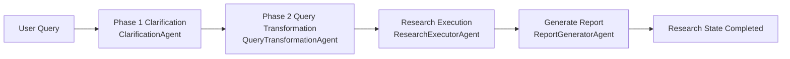

# Deep Research System Architecture

## Overview

The production codebase implements a four-agent research pipeline coordinated by
`ResearchWorkflow` (`src/core/workflow.py`). The workflow combines a two-phase
clarification flow, structured query transformation, LLM-driven research
synthesis, and report generation. Every agent is built on
Pydantic-AI primitives through `BaseResearchAgent` (`src/agents/base.py`), and they
exchange data through a shared `ResearchState`/`ResearchMetadata` object.

Key traits visible in the repository:

- **Two-phase clarification** using the redesigned multi-question clarification
  models (`src/models/clarification.py`) followed by an enhanced query
  transformation agent that emits a `SearchQueryBatch` and `ResearchPlan`.
- **Circuit-breaker orchestration** in `ResearchWorkflow._run_agent_with_circuit_breaker`
  that wraps each stage invocation and records stage events through
  `core.events`.
- **Typed dependency injection** with `ResearchDependencies` so each agent receives the
  shared HTTP client, API keys, research state, and per-agent context (for example
  transformed queries for the research executor).
- **Streaming-compatible event bus** (`src/core/events.py`) that surfaces
  `StageStarted`, `StageCompleted`, `StreamingUpdate`, and error events to both the
  CLI and HTTP interfaces.

## Pipeline Stages

The runtime pipeline is linear with explicit stage markers on the `ResearchStage`
enum (`src/models/core.py`).

1. **Clarification (Phase 1)** – `ClarificationAgent` evaluates whether the query
   lacks critical information. The agent emits a `ClarifyWithUser` object with a
   multi-question `ClarificationRequest` when needed. Responses are stored in
   `ResearchMetadata.clarification`.
2. **Query Transformation (Phase 2)** – Once clarification is finished or skipped,
   `QueryTransformationAgent` produces a `TransformedQuery` whose
   `search_queries` payload is cached in metadata and rehydrated for later stages.
3. **Research Execution** – The workflow passes the `SearchQueryBatch` to the
   research executor. `ResearchExecutorAgent` orchestrates tool calls for
   extraction, clustering, contradiction analysis, and quality scoring before
   emitting a structured `ResearchResults` object stored on the
   `ResearchState`.
4. **Report Generation** – `ReportGeneratorAgent` assembles the final
   `ResearchReport` using the synthesized results (findings, clusters,
   contradictions, executive summary) and formats citations for downstream
   consumption.

## Orchestration Layer

- `ResearchWorkflow.run()` orchestrates the end-to-end process, initializes
  `ResearchState`, and manages stage transitions. It emits events through the
  event bus for streaming clients.
- The two-phase clarification flow is implemented in
  `_execute_two_phase_clarification`, which first runs the clarification agent and
  then, regardless of outcome, executes the query transformation agent.
- `_execute_research_stages` executes the remaining agents sequentially and stores
  intermediate artifacts (`findings`, `compressed_findings`, `final_report`) on the
  `ResearchState` instance.
- Circuit breaker settings live in `_create_agent_configs`, with per-agent retry
  thresholds and timeout windows.

## Agent Implementations

### Clarification Agent

- Uses the redesigned prompt defined in `clarification_system_redesign.md` and
  injected via `@self.agent.instructions`.
- Returns `ClarifyWithUser`, guaranteeing that a request is populated whenever
  clarification is required.
- Stores an assessment rationale and missing-dimension taxonomy so downstream
  agents can tailor research scopes.

### Query Transformation Agent

- Generates `TransformedQuery` records with typed search queries, objectives, and
  methodology information (`src/models/query_transformation.py`).
- Persists serialized output into `ResearchMetadata.query.transformed_query` for
  consumption by the research executor and report generator.

### Research Executor Agent

- Provides helper functions for extracting hierarchical findings, clustering
  themes, detecting contradictions, and computing synthesis metrics using the
  service layer (`src/services`).
- Currently instantiated as a compatibility wrapper exposing
  `execute_research(query, search_results, **kwargs)`. The workflow integration for
  invoking it as a `BaseResearchAgent` is still under construction, so the stage is
  a known gap in the pipeline. The remediation plan in
  `docs/research_executor_remediation_plan.md` tracks the outstanding work.

### Report Generator Agent

- Builds on the base agent infrastructure, injecting a templated system prompt and
  instructions derived from current research metadata.
- Provides structured tools to organize content into report sections and craft
  executive summaries.

## Shared Infrastructure

- **Research State & Metadata** – `ResearchState` maintains stage progress and holds
  findings, compressed artifacts, and final reports. `ResearchMetadata` captures
  clarification sessions, transformed queries, and compression snapshots.
- **Dependencies Container** – `ResearchDependencies` bundles shared services
  (HTTP client, API keys, event streaming callbacks, and search batches) passed to
  agents by the factory.
- **Event Bus** – `core.events` defines immutable event dataclasses and manages
  subscriptions with strong references. HTTP and CLI layers subscribe to the same
  bus for progress streaming.
- **Agent Factory** – `AgentFactory` maps `AgentType` enums to concrete agent
  classes, enabling centralized configuration and future registration of custom
  agents.

## Interfaces

- **CLI** – Commands in `src/cli` run the workflow directly, presenting Rich
  output and handling clarification responses interactively.
- **HTTP API** – `src/api/main.py` exposes FastAPI endpoints for kicking off
  research, streaming progress via SSE, and retrieving final artifacts. API keys are
  loaded through `APIConfig` (`src/core/config.py`).

## Supporting Services

- **Search Orchestrator** – `src/services/search_orchestrator.py` implements a
  deterministic query executor with caching and retry logic. It is available for
  future integration with the research executor to guarantee execution fidelity.
- **Synthesis Utilities** – Modules such as `synthesis_engine`,
  `contradiction_detector`, `pattern_recognizer`, and `metrics_collector` provide
  non-LLM analytics leveraged by the research executor helpers.
- **Optimization & Caching** – `optimization_manager` and `cache_manager` expose
  adaptive throttling and TTL caching strategies that agents can opt into via their
  dependencies.

## Resilience & Observability

- Circuit breaker metrics are tracked per agent through `PerformanceMetrics` on the
  base agent class.
- `ResearchEvent` streams capture lifecycle milestones, error conditions, and
  streaming status updates for external observers.
- Structured logging is standardized on Logfire throughout the workflow, agents,
  and services for consistent telemetry.

## Known Gaps

- The research executor stage is only partially integrated. The current
  compatibility wrapper lacks the `run()` interface required by the workflow, so
  end-to-end research execution will fail until Phase 1 of the remediation plan is
  delivered.
- The compression agent expects populated `ResearchState.findings`. Until the
  research executor is wired up, compression runs with placeholder data in tests.
- Work toward the four-agent architecture is tracked separately; once delivered,
  this document will be updated to remove the compression stage entirely.
- The architecture documentation should be revisited once the 4-agent migration in
  `docs/four_agent_architecture_implementation.md` is implemented; this document
  reflects the present five-agent pipeline.
