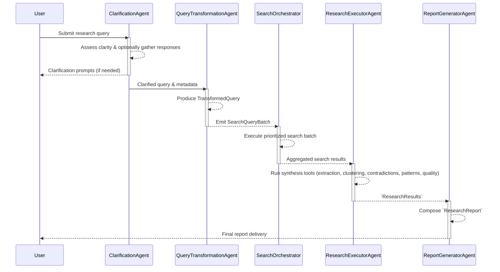

# Deep Research System Architecture

## Overview

The production workflow is a four-agent pipeline orchestrated by `ResearchWorkflow`
(`src/core/workflow.py`). The workflow coordinates clarification, query transformation,
search execution, synthesis, and report writing while streaming progress events to the CLI
and HTTP interfaces. Agents are implemented with Pydantic AI through `BaseResearchAgent`
(`src/agents/base.py`) and exchange strongly typed data via `ResearchState` and
`ResearchMetadata` (`src/models/core.py`, `src/models/metadata.py`).

Key characteristics visible in the implementation:

- **Streamlined four-stage pipeline** – Clarification, query transformation, research execution,
  and report generation are the only runtime stages (`ResearchStage`).
- **Typed cross-agent state** – `ResearchMetadata` captures clarification sessions, the
  `TransformedQuery`, execution diagnostics, and reserves a report namespace for future enrichments,
  giving agents a consistent location for shared context.
- **Deterministic query execution** – `SearchQueryBatch` outputs from the transformation agent
  are executed through `SearchOrchestrator` with caching, retry, and priority handling.
- **Centralized agent execution guard** – `_run_agent_with_circuit_breaker` channels all agent
  calls, applies per-agent "critical" flags, and returns predefined fallbacks for non-critical
  failures. A `CircuitBreaker` instance and per-agent `CircuitBreakerConfig` objects are prepared
  even though automatic retry windows are not yet wired into the runtime.
- **Granular streaming events** – Stage lifecycle and status updates are emitted through
  `core.events`, enabling both CLI Rich rendering and HTTP SSE clients to observe progress.

## Runtime Pipeline

`ResearchWorkflow.run()` drives the runtime pipeline, starting in `ResearchStage.CLARIFICATION`
and advancing through the remaining stages until `ResearchStage.COMPLETED`.

The workflow is intentionally linear—each stage is a single top-level agent invocation and
there are no subordinate agent trees or runtime delegation. `AgentFactory` only registers the
four agents shown above, so `ResearchWorkflow` simply chains them together while reusing shared
`ResearchDependencies`. When additional computation is needed (for example, clustering or
contradiction analysis), the owning agent calls helper tools or services rather than spawning
nested agents.

### Stage Responsibilities

1. **Clarification** (`ResearchStage.CLARIFICATION`)
   - `ClarificationAgent` evaluates query readiness and can trigger an interactive clarification
     flow handled by `interfaces/clarification_flow.handle_clarification_with_review` when
     additional user input is required.
   - Results populate `ResearchMetadata.clarification` with the assessment, outstanding
     questions, and user responses.

2. **Query Transformation** (`ResearchStage.QUERY_TRANSFORMATION`)
   - `QueryTransformationAgent` converts the clarified request into a `TransformedQuery`
     (`src/models/research_plan_models.py`), combining a prioritized `SearchQueryBatch` and a
     structured `ResearchPlan` with objectives, methodology, and success metrics.
   - The transformed query is stored at `research_state.metadata.query.transformed_query` for
     downstream use.

3. **Research Execution** (`ResearchStage.RESEARCH_EXECUTION`)
   - `_execute_research_stages` first calls `_execute_search_queries` to hand the
     `SearchQueryBatch` to `SearchOrchestrator`, which fans out requests through
     `_orchestrated_search` into `WebSearchService` providers (e.g., Tavily) while respecting
     priorities, max parallelism, caching, and retry policies.
   - The aggregated search results are attached to `ResearchDependencies.search_results`, allowing
     the research executor to reason over real web content without repeating external calls.
   - `ResearchExecutorAgent` then treats synthesis as a multi-step ML/analytics problem: hierarchical
     extraction uses the LLM to build structured findings, clustering applies the pattern
     recognizer to group semantically related insights, contradiction detection calls the
     `ContradictionDetector` heuristics to score claim agreement, pattern analysis surfaces emerging
     trends and divergences, and the quality assessor quantifies coverage/completeness. These tool calls are
     orchestrated in-code (not via sub-agents) and culminate in a `ResearchResults` object that is
     stored on `research_state.research_results` for downstream consumers.

4. **Report Generation** (`ResearchStage.REPORT_GENERATION`)
   - `ReportGeneratorAgent` reads the synthesized results, metadata, and the populated
     source repository to craft a `ResearchReport` with executive summaries, key findings,
     recommendations, and inline `[Sx]` citations. The completed report is persisted to
     `research_state.final_report`, and the report model itself carries section/citation metadata
     for downstream consumers.

## Orchestration Layer

- `ResearchWorkflow.run()` initializes `ResearchState`, creates `ResearchDependencies`, emits
  `ResearchStarted` events, and ensures agents are registered via `AgentFactory`.
- `_execute_two_phase_clarification` encapsulates the clarification ➔ query transformation flow,
  updating metadata, streaming status messages, and enforcing recovery semantics if
  clarification fails.
- `_execute_research_stages` issues search requests, runs the research executor and report
  generator, advances the stage machine, and emits `StageCompleted` events with lightweight
  payloads.
- `_execute_search_queries` converts canonical `SearchQueryBatch` records into orchestrator
  `QueryExecutionPlan` instances, maps priorities (`models/priority.py`), and writes execution
  results to `ResearchMetadata.execution` for diagnostics.
- `resume_research` enables workflows to resume from persisted `ResearchState` instances, rerunning
  pending stages and emitting `ResearchCompletedEvent` updates upon success or failure.

## Agent Implementations

### Clarification Agent (`src/agents/clarification.py`)

- Runs under a detailed system prompt that classifies ambiguity, scopes, and audience needs.
- Emits structured assessments (`needs_clarification`, `missing_dimensions`, `reasoning`) and
  generates multi-question `ClarificationRequest` objects when extra information is required.
- Integration with the CLI review flow ensures answers can be edited before advancing.

### Query Transformation Agent (`src/agents/query_transformation.py`)

- Incorporates clarification context, conversation history, and transformation exemplars to
  produce 10–15 prioritized search queries plus a `ResearchPlan` describing objectives,
  methodology, and success criteria.
- Ensures primary objectives have associated queries and documents assumptions, potential gaps,
  and confidence scores for the downstream stages.

### Research Executor Agent (`src/agents/research_executor.py`)

- Supplies dynamic instructions summarizing the active query, search queries, and fetched search
  results to the Pydantic AI agent.
- Registers tool bindings that delegate to `extract_hierarchical_findings`, `identify_theme_clusters`,
  `detect_contradictions`, `analyze_patterns`, `assess_synthesis_quality`, and
  `generate_executive_summary` in `src/agents/research_executor_tools.py`.
- Combines tool outputs into a `ResearchResults` object containing hierarchical findings, clusters,
  contradictions, synthesis quality scores, and a decision-ready executive summary.

### Report Generator Agent (`src/agents/report_generator.py`)

- Tailors instructions using the research topic, audience, generated findings, and
  `summarize_sources_for_prompt` output from the source repository.
- Enforces citation contracts (`[Sx]` markers) and produces sectioned reports matching the
  executive summary, introduction, main body, and recommendation blueprint.
- Returns a `ResearchReport` whose embedded metadata captures section breakdowns, citation audits,
  and source summaries; `ResearchWorkflow` stores this report on `research_state.final_report` for
  downstream access.

## Shared Infrastructure

- **Research State & Metadata** – `ResearchState` (`src/models/core.py`) tracks the pipeline stage,
  timestamps, research artifacts, and errors. `ResearchMetadata` namespaces data for each agent:
  clarification and query slots are actively populated, execution metadata captures search
  diagnostics, and the report namespace remains available for future enrichments. Legacy fields such
  as `metadata.brief` remain for backward compatibility but are not populated by the current
  pipeline.
- **Dependencies Container** – `ResearchDependencies` bundles the shared async HTTP client,
  `APIKeys`, accumulated search results, optional `source_repository`, and helper accessors (e.g.,
  `get_transformed_query()`, `get_search_query_batch()`). Agents receive this container at
  instantiation time via `AgentFactory`.
- **Source Repository** – `InMemorySourceRepository` (`src/services/source_repository.py`) stores
  fetched sources so agents can retrieve enriched metadata when generating findings or citations.
- **Agent Factory** – `AgentFactory` (`src/agents/factory.py`) maps `AgentType` enumerations to
  concrete agent classes and supplies default `AgentConfiguration` instances when none are
  provided.

## Search Execution Services

- `SearchOrchestrator` (`src/services/search_orchestrator.py`) manages deterministic query
  execution with priority queues, caching, retry backoff, and execution traces that feed into
  diagnostic reports.
- `_orchestrated_search` bridges orchestrator queries to `WebSearchService` (`src/services/search.py`),
  which in turn manages concrete providers such as Tavily via typed `SearchProvider` classes.
- Search responses are normalized to dictionaries so both the research executor and report writer
  can access titles, URLs, snippets, confidence scores, and provider metadata.

## Events & Interfaces

- `core/events.py` defines immutable event dataclasses (`StageStarted`, `StageCompleted`,
  `StreamingUpdate`, `ResearchCompletedEvent`, etc.) and an async event bus.
- Both the CLI (`src/cli`) and HTTP API (`src/api/main.py`) subscribe to the event bus to render
  live progress. CLI interactions use Rich panels for clarification reviews, while the HTTP layer
  exposes FastAPI endpoints with server-sent events for streaming updates.

## Resilience & Observability

- A `CircuitBreaker` (`src/core/circuit_breaker.py`) and per-agent configs are instantiated, and
  `_run_agent_with_circuit_breaker` uses the `critical` markers together with predefined fallbacks to
  decide whether to propagate failures. Automated open/half-open retry cycles are planned but not yet
  enabled.
- `PerformanceMetrics` on `BaseResearchAgent` reserve slots for timing, retries, and usage data,
  supporting future telemetry aggregation.
- Logfire instrumentation is applied throughout the workflow, agents, and services to capture
  operational metrics, search execution details, and error traces for debugging.

## Comparison with LangChain Open Deep Research

LangChain's [Open Deep Research](https://github.com/langchain-ai/open_deep_research) couples
LangGraph with a supervisor/sub-agent design. The compiled graph (`src/open_deep_research/deep_researcher.py`)
spawns a lead supervisor that breaks work into `ConductResearch` tasks, dispatches them to parallel
researcher subgraphs, and iterates until the supervisor chooses `ResearchComplete`. Each researcher
loops through tool calling, MCP-compatible search, and compression passes before handing results
back for aggregation. That control flow yields a branching, feedback-driven research tree rather than
our single-pass chain.

**Pros of our linear workflow**
- Deterministic stage ordering simplifies reasoning, testing, and recovery; each stage runs once with
  predictable inputs/outputs.
- Shared `ResearchDependencies` and typed metadata reduce context-management overhead compared to
  coordinating per-branch state objects.
- Circuit-breaker policy and fallbacks are straightforward because agent lifetimes are short and
  serialized.
- Resource usage is easier to bound—no concurrent researcher fan-out or dynamic tool loops run unless
  explicitly triggered inside a stage.

**Trade-offs versus the LangChain design**
- Lacks hierarchical delegation: we do not dynamically spawn specialized researchers, so coverage depth
  depends entirely on the single research executor pass.
- Limited opportunity for iterative critique or self-refinement; there is no supervisor deciding to
  re-run sub-tasks when evidence is weak or contradictory.
- Concurrency is restricted to search batching; LangChain's approach can perform multiple research
  strands in parallel and merge them under the supervisor loop.
- Less configurable at runtime: swapping models or search tooling requires touching configuration code,
  whereas LangGraph exposes per-node overrides through configuration surfaces described in the LangChain
  blog.
- Benchmark integrations (e.g., Deep Research Bench harnesses shipped with Open Deep Research) are not
  bundled here, so comparative evaluation needs to be wired in separately.
