```mermaid
flowchart TD
    A[User Query] --> B["1 PENDING<br/>- Request ID generated<br/>- Research state initialized<br/><i>Initial setup</i>"]

    B --> C["2 CLARIFICATION<br/>🔄 Three-Phase System<br/>- Phase 1: Assessment Analysis<br/>- Phase 2: Query Transformation<br/>- Phase 3: Enhanced Brief Generation"]
    C -- "Interactive CLI" --> C
    C -- "HTTP Pause" --> WAIT["⏸ Awaiting HTTP Response"]
    WAIT --> C

    C --> D["3 BRIEF GENERATION<br/>✅ Completed in Phase 3<br/>- Comprehensive research plan<br/>- Key research areas identified<br/>- Methodology defined"]

    D --> E["4 RESEARCH EXECUTION<br/>- Parallel search execution<br/>- Source evaluation & findings<br/>- Concurrent processing<br/>- Circuit breaker protection"]

    E --> F["5 COMPRESSION<br/>- Finding synthesis<br/>- Theme identification<br/>- Contradiction detection<br/>- Statistical analysis"]

    F --> G["6 REPORT GENERATION<br/>- Structured report creation<br/>- Citation compilation<br/>- Recommendation generation"]

    G --> H["7 COMPLETED<br/>- Final report available<br/>- Research state finalized<br/>- Event cleanup"]

    %% Enhanced flow connectors
    C -.->|"Clarification Enhancement"| D
    D -.->|"Research Plan"| E
    E -.->|"Raw Findings"| F
    F -.->|"Structured Insights"| G
    G -.->|"Final Output"| H
```

# Deep Research System Architecture

## Executive Summary

The Deep Research System is a sophisticated AI-powered research automation platform built with **Pydantic-AI**, featuring an innovative **three-phase clarification system** that dramatically improves research quality through intelligent query enhancement. The system orchestrates specialized AI agents through a resilient pipeline with concurrent processing, circuit breaker patterns, and memory-safe event handling.

**Key Architectural Innovations:**
- **Three-Phase Clarification System**: Assessment → Transformation → Enhanced Brief Generation
- **Circuit Breaker Resilience**: Automatic error recovery and system stability
- **Memory-Safe Event Bus**: WeakRef patterns preventing memory leaks in long-running processes
- **Centralized Agent Registry**: Type-safe coordination eliminating circular import issues
- **Concurrent Processing**: Semaphore-controlled parallel execution with timeout handling

**Pipeline Overview**: 6-stage research workflow (Pending → Clarification → Brief Generation → Research Execution → Compression → Report Generation → Completed) supporting both web interfaces (SSE streaming) and CLI operations (direct and HTTP client modes).

> **📖 For detailed implementation patterns, code examples, and production deployment guidance, see [Implementation Design](./implementation_design.md)**

## Core Design Principles

### 1. Three-Phase Intelligence
Advanced clarification system that transforms broad queries into precise research objectives through systematic assessment, transformation, and enhanced brief generation. *For detailed implementation patterns and code examples, see [Implementation Design](./implementation_design.md#three-phase-clarification-implementation)*

### 2. Circuit Breaker Resilience
Automatic failure recovery with configurable thresholds, timeout-based reset, and graceful degradation. *For implementation details and configuration examples, see [Implementation Design](./implementation_design.md#circuit-breaker-implementation)*

### 3. Memory-Safe Coordination
WeakRef-based event system with automatic cleanup, bounded history, and user isolation patterns. *See [Implementation Design](./implementation_design.md#memory-safe-event-system) for WeakRef patterns and code examples.*

### 4. Type-Safe Agent Registry
Centralized coordination with Pydantic-AI integration, tool registration, and output validation patterns. *For agent development patterns and tool registration examples, see [Implementation Design](./implementation_design.md#pydantic-ai-agent-patterns)*

### 5. Concurrent Processing
Semaphore-controlled parallel execution with timeout management and performance monitoring for optimal resource utilization and system stability.

## System Component Overview

## Research Pipeline Flow

The system features a **6-stage pipeline** with integrated three-phase clarification:

### Stage Details

**Stage 1-3: Three-Phase Clarification System**
Integrated assessment, transformation, and brief generation phases that convert broad queries into actionable research plans. *See [Implementation Design](./implementation_design.md#three-phase-clarification-implementation) for detailed phase implementations.*

**Stage 4: Research Execution**
- Parallel web searches with circuit breaker protection
- Source credibility evaluation and finding extraction
- Real-time progress updates via event bus

**Stage 5: Compression**
- Finding synthesis and theme identification
- Contradiction detection and resolution
- Statistical analysis and confidence scoring

**Stage 6: Report Generation**
- Structured report creation with executive summaries
- Citation compilation and bibliography generation
- Actionable recommendations based on findings

## Integration Interfaces

### CLI Interface
- **Direct Mode**: Native workflow execution with Rich terminal formatting
- **HTTP Client Mode**: Connects to running FastAPI server with SSE streaming
- **Interactive Clarification**: Real-time question/answer flow

### Web API Interface
- **FastAPI Integration**: High-performance async HTTP server
- **Server-Sent Events**: Real-time progress streaming to web clients
- **RESTful Endpoints**: Standard HTTP patterns for research management

### Event System
- **Memory-Safe Architecture**: WeakRef-based handler management
- **User Isolation**: Scoped events preventing cross-user data leakage
- **Multiple Consumers**: Unlimited concurrent event observers

## Technology Stack

### Core Technology Stack
- **Pydantic-AI Framework**: Type-safe AI agents with structured outputs
- **FastAPI + Rich CLI**: High-performance async interfaces
- **Python 3.12+**: Modern language features and type safety
- **Anthropic Claude**: Primary language model (claude-3-5-sonnet-20241022)
- **Observability**: Logfire structured logging with real-time monitoring
- **Production**: Docker/Kubernetes deployment with comprehensive testing

*For detailed technology choices, configuration patterns, and deployment guides, see [Implementation Design](./implementation_design.md#production-deployment)*

## Data Flow Architecture

### Input Processing
1. **Query Reception**: User input via CLI or HTTP API
2. **Three-Phase Enhancement**: Assessment → Transformation → Brief Generation
3. **Research Planning**: Methodology selection and scope definition

### Research Execution
1. **Parallel Processing**: Concurrent search and analysis operations
2. **Circuit Breaker Protection**: Automatic failure recovery and stability
3. **Real-Time Updates**: Event-driven progress notifications

### Output Generation
1. **Finding Compression**: Synthesis and contradiction resolution
2. **Report Structuring**: Executive summaries and detailed analysis
3. **Citation Management**: Comprehensive source attribution

## Production Considerations

### System Reliability
- **Memory Safety**: WeakRef patterns with automatic cleanup and user isolation
- **Error Resilience**: Circuit breaker protection with graceful degradation
- **Security**: Rate limiting, input validation, and authentication patterns
- **Scalability**: Kubernetes integration with comprehensive monitoring

*For detailed production deployment guides, security configurations, and monitoring setups, see [Implementation Design](./implementation_design.md#production-deployment)*

## Architectural Design Decisions

### Sequential Pipeline vs. Graph-Based Approaches
Our linear pipeline with event bus architecture optimizes for:
- **Simplicity**: Predictable execution flow and easier debugging
- **Client Resilience**: Stateful reconnection and progress recovery
- **Production Stability**: Server fault tolerance with persistent state
- **Multiple Consumers**: Event-driven updates to unlimited clients

This approach trades dynamic routing flexibility for operational simplicity and production robustness, making it ideal for research workflows where linear progression with clarification pauses is the primary pattern.

## System Extensibility

The architecture supports extension through:
- **Agent Development**: Plugin system with Pydantic-AI tool registration
- **Data Model Extension**: Type-safe Pydantic models with custom validation
- **Integration Patterns**: Event subscriptions and API extensions

*For detailed extension patterns, code examples, and development guides, see [Implementation Design](./implementation_design.md#development-patterns)*

---

**Next Steps:**
- Review [Implementation Design](./implementation_design.md) for detailed code patterns and examples
- Explore [Getting Started Guide](./getting_started.md) for development setup
- Check [Production Deployment Guide](./production_deployment.md) for operational guidance

---

*This architecture documentation provides a high-level overview of system design and principles. For implementation details, code examples, and production patterns, refer to the companion [Implementation Design](./implementation_design.md) document.*
