# Deep Research System Architecture

## Executive Summary

The Deep Research System is a sophisticated AI-powered research automation platform built with **Pydantic-AI**, featuring an innovative **three-phase clarification system** that dramatically improves research quality through intelligent query enhancement. The system orchestrates specialized AI agents through a resilient pipeline with concurrent processing, circuit breaker patterns, and memory-safe event handling.

**Key Architectural Innovations:**
- **Three-Phase Clarification System**: Assessment → Transformation → Enhanced Brief Generation
- **Circuit Breaker Resilience**: Automatic error recovery and system stability
- **Memory-Safe Event Bus**: WeakRef patterns preventing memory leaks in long-running processes
- **Centralized Agent Registry**: Type-safe coordination eliminating circular import issues
- **Concurrent Processing**: Semaphore-controlled parallel execution with timeout handling

**Pipeline Overview**: 6-stage research workflow (Pending → Clarification → Brief Generation → Research Execution → Compression → Report Generation → Completed) supporting both web interfaces (SSE streaming) and CLI operations (direct and HTTP client modes).

> **📖 For detailed implementation patterns, code examples, and production deployment guidance, see [Implementation Design](./implementation_design.md)**

## Core Design Principles

### 1. Three-Phase Intelligence
Advanced clarification system that transforms broad queries into precise research objectives through:
- **Assessment**: Algorithmic query breadth analysis with missing dimension detection
- **Transformation**: Context-aware query enhancement with specificity scoring
- **Enhanced Brief Generation**: Comprehensive research planning with methodology suggestions

### 2. Circuit Breaker Resilience
Built-in failure recovery with automatic circuit opening/closing and error tracking:
- **Error Threshold Management**: Configurable failure limits per agent type
- **Automatic Recovery**: Timeout-based circuit reset with test request validation
- **Graceful Degradation**: Fallback behavior when circuits are open

### 3. Memory-Safe Coordination
WeakRef-based event system preventing memory leaks in distributed environments:
- **WeakSet Collections**: Automatic handler cleanup when objects go out of scope
- **Bounded History**: Limited event storage with automatic cleanup triggers
- **User Isolation**: Scoped event handling preventing cross-user data leakage

### 4. Type-Safe Agent Registry
Centralized coordination eliminating circular imports with compile-time safety:
- **Pydantic-AI Integration**: Native structured outputs with automatic validation
- **Tool Registration**: `@agent.tool` decorators for seamless capability addition
- **Output Validation**: `@agent.output_validator` ensures quality and consistency

### 5. Concurrent Processing
Semaphore-controlled parallel execution with timeout management and task isolation:
- **Concurrency Limits**: Configurable semaphore-based task throttling
- **Timeout Protection**: Per-task timeout with automatic cancellation
- **Performance Monitoring**: Real-time metrics for optimization

## System Component Overview

## Research Pipeline Flow

The system features a **6-stage pipeline** with integrated three-phase clarification:

```mermaid
flowchart TD
    A[User Query] --> B["1 PENDING<br/>- Request ID generated<br/>- Research state initialized<br/><i>Initial setup</i>"]

    B --> C["2 CLARIFICATION<br/>🔄 Three-Phase System<br/>- Phase 1: Assessment Analysis<br/>- Phase 2: Query Transformation<br/>- Phase 3: Enhanced Brief Generation"]
    C -- "Interactive CLI" --> C
    C -- "HTTP Pause" --> WAIT["⏸ Awaiting HTTP Response"]
    WAIT --> C

    C --> D["3 BRIEF GENERATION<br/>✅ Completed in Phase 3<br/>- Comprehensive research plan<br/>- Key research areas identified<br/>- Methodology defined"]

    D --> E["4 RESEARCH EXECUTION<br/>- Parallel search execution<br/>- Source evaluation & findings<br/>- Concurrent processing<br/>- Circuit breaker protection"]

    E --> F["5 COMPRESSION<br/>- Finding synthesis<br/>- Theme identification<br/>- Contradiction detection<br/>- Statistical analysis"]

    F --> G["6 REPORT GENERATION<br/>- Structured report creation<br/>- Citation compilation<br/>- Recommendation generation"]

    G --> H["7 COMPLETED<br/>- Final report available<br/>- Research state finalized<br/>- Event cleanup"]

    %% Enhanced flow connectors
    C -.->|"Clarification Enhancement"| D
    D -.->|"Research Plan"| E
    E -.->|"Raw Findings"| F
    F -.->|"Structured Insights"| G
    G -.->|"Final Output"| H
```

### Stage Details

**Stage 1-3: Three-Phase Clarification System**
- **Assessment**: Analyzes query breadth, missing dimensions, generates clarification questions
- **Transformation**: Converts broad queries into specific, actionable research questions
- **Enhanced Brief**: Creates comprehensive research plans with methodology suggestions

**Stage 4: Research Execution**
- Parallel web searches with circuit breaker protection
- Source credibility evaluation and finding extraction
- Real-time progress updates via event bus

**Stage 5: Compression**
- Finding synthesis and theme identification
- Contradiction detection and resolution
- Statistical analysis and confidence scoring

**Stage 6: Report Generation**
- Structured report creation with executive summaries
- Citation compilation and bibliography generation
- Actionable recommendations based on findings

## Integration Interfaces

### CLI Interface
- **Direct Mode**: Native workflow execution with Rich terminal formatting
- **HTTP Client Mode**: Connects to running FastAPI server with SSE streaming
- **Interactive Clarification**: Real-time question/answer flow

### Web API Interface
- **FastAPI Integration**: High-performance async HTTP server
- **Server-Sent Events**: Real-time progress streaming to web clients
- **RESTful Endpoints**: Standard HTTP patterns for research management

### Event System
- **Memory-Safe Architecture**: WeakRef-based handler management
- **User Isolation**: Scoped events preventing cross-user data leakage
- **Multiple Consumers**: Unlimited concurrent event observers

## Technology Stack

### Core Framework
- **Pydantic-AI**: Type-safe AI agent framework with structured outputs
- **FastAPI**: High-performance async web framework
- **Python 3.12+**: Modern Python with advanced type hints

### AI & Search
- **Anthropic Claude**: Primary language model (claude-3-5-sonnet-20241022)
- **Exa Search**: Advanced web search with semantic understanding
- **Structured Validation**: Pydantic models for all AI outputs

### Observability & Monitoring
- **Logfire**: Structured logging and observability
- **Rich**: Beautiful terminal interfaces and progress tracking
- **Circuit Breaker Metrics**: Real-time system health monitoring

### Development & Deployment
- **uv**: Modern Python package management
- **Pytest**: Comprehensive testing framework
- **Docker & Kubernetes**: Container-based production deployment

## Data Flow Architecture

### Input Processing
1. **Query Reception**: User input via CLI or HTTP API
2. **Three-Phase Enhancement**: Assessment → Transformation → Brief Generation
3. **Research Planning**: Methodology selection and scope definition

### Research Execution
1. **Parallel Processing**: Concurrent search and analysis operations
2. **Circuit Breaker Protection**: Automatic failure recovery and stability
3. **Real-Time Updates**: Event-driven progress notifications

### Output Generation
1. **Finding Compression**: Synthesis and contradiction resolution
2. **Report Structuring**: Executive summaries and detailed analysis
3. **Citation Management**: Comprehensive source attribution

## Security & Production Considerations

### Memory Safety
- **WeakRef Patterns**: Automatic cleanup of event handlers and observers
- **Bounded Collections**: Limited history storage with automatic pruning
- **User Isolation**: Scoped data handling preventing information leakage

### Error Resilience
- **Circuit Breaker Pattern**: Automatic failure detection and recovery
- **Graceful Degradation**: Fallback behavior during service failures
- **Timeout Management**: Per-operation timeout with cancellation

### API Security
- **Rate Limiting**: Configurable request throttling per client
- **Input Validation**: Comprehensive sanitization and constraint checking
- **Authentication**: JWT-based user sessions and API key validation

### Production Deployment
- **Kubernetes Integration**: Scalable container orchestration
- **Health Monitoring**: Comprehensive system health checks
- **Performance Metrics**: Prometheus-compatible monitoring endpoints

## Comparison with Alternative Approaches

### vs. LangGraph
**Our Sequential + Event Bus Approach:**
- ✅ **Simplicity**: Linear flow easier to understand and debug
- ✅ **Client Resilience**: Disconnect/reconnect capability
- ✅ **Multiple Consumers**: Unlimited concurrent observers
- ✅ **Production Robustness**: Server crashes don't lose progress

**LangGraph's Graph-Based Approach:**
- ✅ **Dynamic Routing**: Conditional workflow branching
- ✅ **Human-in-the-Loop**: Built-in interruption patterns
- ✅ **State Checkpointing**: Rollback capabilities
- ⚠️ **Complexity**: More complex execution model

**When to Use Each:**
- **Use Our Approach**: Linear research pipelines, maximum client resilience, simple testing
- **Use LangGraph**: Complex branching workflows, human intervention, dynamic modification

## System Extension Points

### Agent Development
- **Plugin System**: Dynamic agent registration with dependency checking
- **Custom Tools**: `@agent.tool` decorator for capability extension
- **Output Validation**: Quality assurance through `@agent.output_validator`

### Data Model Extension
- **Pydantic Models**: Type-safe data structures with validation
- **Custom Fields**: Domain-specific field types and constraints
- **Cross-Field Validation**: Complex business rule enforcement

### Integration Patterns
- **Event Subscription**: Custom handlers for system events
- **API Extensions**: Additional HTTP endpoints for specialized features
- **Search Provider Integration**: Pluggable search backend systems

---

**Next Steps:**
- Review [Implementation Design](./implementation_design.md) for detailed code patterns and examples
- Explore [Getting Started Guide](./getting_started.md) for development setup
- Check [Production Deployment Guide](./production_deployment.md) for operational guidance

---

*This architecture documentation provides a high-level overview of system design and principles. For implementation details, code examples, and production patterns, refer to the companion [Implementation Design](./implementation_design.md) document.*
